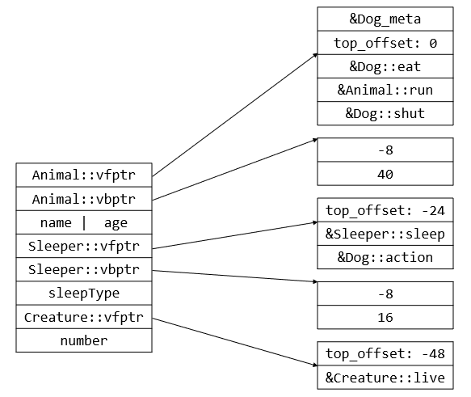

#### sizeof空类

- sizeof空类的结果为1，因为c++要求每个对象具有不同的地址，如果在某个调用里，连续声明了两个某空类的对象，如果空类的对象占0字节，则这两个对象将拥有相同地址。所以空类的对象不能占0字节，只占1字节当然是出于节省内存的考虑。

  ```cpp
  struct empty_t {};
  void fn() {
    empty_t a;
    empty_t b;
    void* addrA = &a;
    void* addrB = &b;
    assert(addrA + 1 == addrB);
  }
  ```

#### this指针调整

- 调用父类方法时，执行父类方法的函数体内，this指针会被修改为父类对象所在的地址

```cpp
struct A {
  int a;
  A() { printf("'A::A()': this=%p\n", this); }
  void fnA() { printf("'A::fnA()': this=%p\n", this); }
};

struct B {
  int b;
  B() { printf("'B::B()': this=%p\n", this); }
  void fnB() { printf("'B::fnB()': this=%p\n", this); }
};

struct C : public A, public B {
  int c;
  C() { printf("'C::C()': this=%p\n", this); }
  void fnB() { printf("'C::fnB()': this=%p\n", this); }
  void fnC() { printf("'C::fnC()': this=%p\n", this); }
};

/**
 * 某次输出如下：
 * 'A::A()'  : this=0x7ffd9ac2aadc
 * 'B::B()'  : this=0x7ffd9ac2aae0
 * 'C::C()'  : this=0x7ffd9ac2aadc
 * 'A::fnA()': this=0x7ffd9ac2aadc
 * 'B::fnB()': this=0x7ffd9ac2aae0
 * 'C::fnB()': this=0x7ffd9ac2aadc
 * 'C::fnC()': this=0x7ffd9ac2aadc
 */
int main() {
  C c;
  c.fnA();
  c.B::fnB();
  c.fnB();
  c.fnC();
  return 0;
}
```

#### 单继承无重写(linux g++)

```cpp
class Animal {
 public:
  virtual void eat() {}
  virtual void run() {}

 private:
  int name;
  int age;
};
class Dog : public Animal {
 public:
  virtual void shout() {}
  virtual void stand() {}
};
```


#### 单继承重写(linux g++)

- 若子类重写了父类的虚函数，则子类虚函数将覆盖虚表中对应的父类虚函数(注意子类与父类拥有各自的一个虚函数表)

- 若子类并无重写父类虚函数，而是声明了自己新的虚函数，则该虚函数地址将扩充到虚函数表的最后。

```cpp
class Animal {
 public:
  virtual void eat() {}
  virtual void run() {}

 private:
  int name;
  int age;
};
class Dog : public Animal {
 public:
  virtual void eat() {}
  virtual void shout() {}
};
```


#### 多继承无重写(linux g++)

```cpp
class Animal {
 public:
  virtual void eat() {}
  virtual void run() {}

 private:
  int name;
  int age;
};
class Sleeper {
 public:
  virtual void sleep() {}
  virtual void action() {}

 private:
  int sleepType;
};
class Dog : public Animal, public Sleeper {
 public:
  virtual void shout() {}
  virtual void stand() {}
};
```


#### 多继承重写(linux g++)

- 子类的虚函数被放在声明的第一个基类的虚函数表中。

- 子类重写时，所有基类的该虚函数都被子类函数覆盖。

- 内存布局中，父类按照其继承时的声明顺序排列。

```cpp
class Animal {
 public:
  virtual void eat() {}
  virtual void run() {}

 private:
  int name;
  int age;
};
class Sleeper {
 public:
  virtual void sleep() {}
  virtual void action() {}

 private:
  int sleepType;
};
class Dog : public Animal, public Sleeper {
 public:
  virtual void eat() {}
  virtual void action() {}
  virtual void shut() {}
};

```


#### 虚继承

```cpp
class Base { int x; };
class Derive0 : public Base {};
class Derive1 : public Base {};
class Final : public Derive0, Derive1 {};
```

- 上述代码中，Final类中有两个x成员，容易引起歧义，一种解决方法是访问x的时候使用Derive0::x和Derive1::x进行区分。另一种解决方法是采用虚拟继承。

- 虚继承在g++和visual c++中的实现方式是不一样的。

- g++和visual c++虚继承时子类都会生成一个新的虚函数表指针

- visual c++在类的实例对象中新增了虚基类指针，而g++没有

```cpp
class Creature {
 public:
  virtual void live() {}

 private:
  int number;
};
class Animal : public virtual Creature {
 public:
  virtual void eat() {}
  virtual void run() {}

 private:
  int name;
  int age;
};
class Sleeper : public virtual Creature {
 public:
  virtual void sleep() {}
  virtual void action() {}

 private:
  int sleepType;
};
class Dog : public Animal, public Sleeper {
 public:
  virtual void eat() {}
  virtual void action() {}
  virtual void shut() {}
};
```

- g++中的内存布局: 大小为48字节

  - vb_offset代表祖父类在对象中的首地址(Creature::vptr)与该虚函数表所对应的虚函数表指针所在地址的偏移量。例如，Animal::vptr和Creature::vptr的偏移为32，则vb_offset=32

  - top_offset代表虚函数表指针与对象首地址之间的偏移量。例如Animal::vptr与首地址之间的偏移为0，则top_offset=0，Sleeper::vptr与首地址之间的偏移为-16，则top_offset=-16

  - Dog类继承Animal和Sleeper虽然都不是虚继承，但Dog类重写了Animal类的eat函数，则重写会覆盖到Animal::ptr指向的虚函数表，Dog类重写的其他父类的函数和Dog类新生成的虚函数，也都会追加到第一个父类的虚函数表中。其他虚函数表中该项用thunk技术代替。

  - 如果继承是虚继承，首先子类会新开一个虚函数表，其次如果子类重写了父类的虚函数，重写会追加到新开的虚函数表中，而子类的表项中该项使用thunk代替。子类新增加的虚函数会追加到新开的虚函数表中。

  - 注意继承之后覆盖父类的虚函数表项修改的不是父类的虚函数表，Dog继承Animal和Sleeper时，会把Animal和Sleeper的虚函数表复制一份，作为Dog类的虚函数表。修改的是这里。

  

- visual c++中的内存布局: 大小为64字节

  - 与g++不同，对象内部实现由虚基类表指针，虚基类表指针指向一个数组，该数组的0号元素代表这个虚基类表对应的虚基类指针的地址与该虚基类表指针的直接归属对象（Animal和Sleeper）在Dog对象中的首地址之间的偏移，后面的元素依次代表这个虚基类表对应的虚基类指针的地址与各个继承的父类在对象中的首地址之间的偏移。

  - top_offset含义相同

  - Dog类新增加的虚函数会追加到继承的第一个父类的虚函数表中，重写的虚函数，原来在哪个父类的虚函数表中，就覆盖到哪个父类的虚函数表，不使用chunk技术。

  - 如果继承是虚继承，首先子类会新开一个虚函数表，其次如果子类重写了父类的虚函数，与g++不同，visual c++会把重写存储到某个另外的地方，而子类的表项中该项使用thunk代替。子类新增加的虚函数会追加到新开的虚函数表中。

  - 注意继承之后覆盖父类的虚函数表项修改的不是父类的虚函数表，Dog继承Animal和Sleeper时，会把Animal和Sleeper的虚函数表复制一份，作为Dog类的虚函数表。修改的是这里。

  

#### 内存布局的查看方式

- g++: g++ -fdump-lang-class *.cpp

- visual c++: cl /EHsc /d1 reportAllClassLayout *.cpp