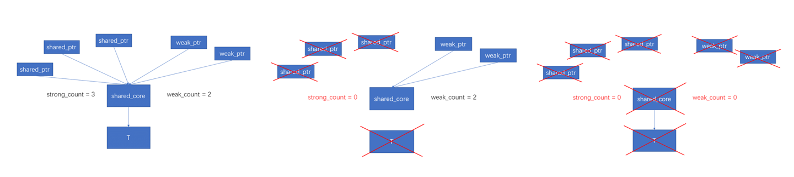

#### nullptr

- NULL的问题

  ```cpp
  #define NULL (void*)0
  // C语言中，考虑下面两个重载函数  
  void foo(int i);  
  void foo(char* p)  
    
  foo(NULL); // compile error
  ```

- nullptr

  ```c
  // 这里C++ 中的NULL如果和C语言一样也是(void *)0指针，而C++ 却又不允许void*隐式转换成其它指针类型，那还怎么用NULL来表示空指针呢，岂不是尴尬了。
  // 因而在C++中，NULL却被明确定义为整常数0，以保证兼容，用nullptr表示空指针
  #ifndef NULL
      #ifdef __cplusplus
          #define NULL 0
      #else
          #define NULL ((void *)0)
      #endif
  #endif
  
  // nullptr是一个c++关键字，也是一个常量，nullptr的类型由编译器指定，其类型重载了：
  // operator T*()       类外部指针强制转换
  // operator T C::*()   类内部指针强制转换
  // operator &()=delete 禁止取地址
  // operator bool()     bool转换
  // operator==()        比较
  // operator!=()        比较
  typdef decltype(nullptr) nullptr_t;
  ```

#### final & override

- *final* 用于修饰一个类，表示禁止该类进一步派生和虚函数的进一步重载

- *override* 用于修 饰派生类中的成员函数，标明该函数重写了基类函数

#### default

- 用于声明构造函数为默认构造函数

#### delete

- 禁用默认生成的类成员函数（拷贝构造，赋值等）

#### explicit

- 专用于修饰构造函数，表示只能显式构造，不可以被隐式转换

#### const 与 constexpr

- 两者都代表可读，*const* 只表示 *read only* 的语义，只保证了运行时不可以被修改，但它修饰的仍然有可能是个动态变量

- *constexpr* 修饰的才是真正的常量，它会在编译期间就会被计算出来，整个运行过程中都不可以被改变

- *constexpr* 可以用于修 饰函数，这个函数的返回值会尽可能在编译期间被计算出来当作一个常量，但是如果编译期间此函数不能被计算出来，那它就 会当作一个普通函数被处理。

#### enum class

- *enum class* 枚举必须带有类作用域：

  ```cpp
  enum class A { A_a, A_b };
  A_a;	// error
  A::A_a;	// passed
  ```

- *enum class* 枚举禁止不同的枚举类之间的比较

#### static_assert

```cpp
static_assert(true/false, message);
```

- 用于在编译期间检查，如果第一个参数值为 *false*，则打印 *message*，编译失败。

#### 正则表达式

- 头文件 \<regex>

#### chrono

- duration：表示一段时间

- time_point：表示时间点

- clocks：表示时钟类型

  - steady_clock：稳定时钟

  - system_clock：系统时钟

  - high_resolution_clock：高精度时钟，稳定时钟或系统时钟的其中一种，不同系统定义不同

#### auto与decltype

- ***auto***：自动推导变量类型

  - 规则1：在不声明为引用或指针时，*auto* 会忽略等号右边的引用类型、*const* 属性和 *volatile* 属性
  
  - 规则2：在声明为引用或者指针时，*auto* 会保留等号右边的引用类型、*const* 属性和 *volatile* 属性
  
  - 规则3：*auto &&* 遵循万能引用规则

  ```cpp
  int i = 0;
  auto *a = &i; 	// a 是 int *
  auto &b =  i; 	// b 是 int&
  auto c  =  b;	// c 是 int  ==> 规则1
  auto &d =  b;	// d 是 int& ==> 规则2
  auto&&e =  d;	// e 是 int& ==> 规则3
  ```

- ***decltype***：自动推导表达式类型

  - *exp* 是表达式，*decltype(exp)* 和 *exp* 类型相同
  - *exp* 是函数调用，*decltype(exp)* 和函数返回值类型相同
  - 其它情况，若 *exp* 是左值，*decltype(exp)* 是 *exp* 类型的左值引用

  ```cpp
    int a = 0, b = 0;
    decltype(a + b) c = 0;   // c 是 int，因为(a+b)返回一个右值
    decltype(a += b) d = c;  // d 是 int&，因为(a+=b)返回一个左值
    decltype((a)) e = c;	   // e 是 int&，因为(a)返回一个左值
  ```

- ***auto*** 和 ***decltype*** 配合使用：返回类型后置

  ```cpp
  template <typename T, typename U>
  auto add(T t, U u) -> decltype(t + u) {
    return t + u;
  }
  ```

#### 智能指针

- auto_ptr: 已经被废弃了

- unique_ptr: 禁用了赋值语义，使用make_unique初始化

  - unique_ptr::get: 获取裸指针，这个函数是为了向下兼容陈旧的库，因为它们的输入可能并不是智能指针

  - unique_ptr::release: 释放指针的管理权，并返回指针，之后用户需要自行管理返回的指针

  - unique_ptr::reset: 删除现在的内存，重新接管reset函数的参数所指向的新的内存

  ```cpp
  template <class T, class Del>
  class unique_ptr {
   public:
    // 获取裸指针视图
    T* get() const;
    // 获取删除器
    Del& get_deleter() noexcept;
    const Del& get_deleter() const noexcept;
    // bool转换，判断指针是否为nullpr
    explicit operator bool() const noexcept;
    // 重载解引用操作符
    T& operator*() const;
    // 重载箭头操作符
    T* operator->() const noexcept;
    // 移动赋值函数
    unique_ptr& operator=(unique_ptr&& __u) noexcept;
    // 获取裸指针，并释放管理权
    T* release();
    // 重置指针，即释放原有内存，并接管新的内存
    void reset(pointer p = pointer()) noexcept;
    // 交换
    void swap(unique_ptr& u) noexcept;
  };

  // 数组的特化，因为delete与delete[]的语义不同
  template <class T, class Del>
  class unique_ptr<T[], Del> {
   public:
    // 特化版本没有解引用和箭头操作符的重载
    // 特化版本新增[]操作符重载
    T& operator[](size_t i) const;
    // 特化版本reset参数只能为nullptr_t
    void reset(std::nullptr_t = nullptr);
  };

  // 使用示例
  // 在堆中申请int变量，赋值为10，（c++17开始，std::unique_ptr<T>的模板参数可以自动推导
  std::unique_ptr ptr = std::make_unique<int>(10);
  // 在堆中申请int数组，数组长度为10，值未定义（可能是任意的，该性质与new操作符一致，见c++基础知识::自动初始化）
  std::unique_ptr arr = std::make_unique<int[]>(10);
  ```

- shared_ptr: 未禁用赋值语义，允许共享，使用make_shared初始化

  - shared_ptr的实现原理是引用计数，引用计数分强引用计数和弱引用计数

  - 三张图解释为什么 std::shared_ptr 需要保存弱引用计数 weak_count

    

  ```cpp
  std::shared_ptr ptr = std::make_shared<int>(10);
  std::shared_ptr arr = std::make_shared<int[]>(10);
  ```

- weak_ptr: shared_ptr的语义补充，目的是解决shared_ptr循环引用的bug

  - 循环引用示例: a和b都不会释放内存，导致内存泄漏

    ```cpp
    struct B;
    
    struct A {
      shared_ptr<B> b;
    };
    struct B {
      shared_ptr<A> a;
    };

    int main() {
      shared_ptr a = make_shared<A>(); // a.use_cnt = 1
      shared_ptr b = make_shared<B>(); // b.use_cnt = 1
      a->b = b; // b.use_cnt = 2
      b->a = a; // a.use_cnt = 2
      return 0;
    }
    ```

  - 使用weakptr破环

    ```cpp
    struct B;
    
    struct A {
      shared_ptr<B> b;
    };
    struct B {
      weak_ptr<A> a;
    };

    int main() {
      shared_ptr a = make_shared<A>(); // a.use_cnt = 1
      shared_ptr b = make_shared<B>(); // b.use_cnt = 1
      a->b = b; // b.use_cnt = 2
      b->a = a; // a.use_cnt = 2
      return 0;
    }
    ```

  - weak_ptr成员函数

  | 成员函数          | 功能                                                         |
  | ----------------- | ------------------------------------------------------------ |
  | ***operator=()*** | 重载 = 赋值运算符，***weak_ptr*** 指针可以直接被 ***weak_ptr*** 或 ***shared_ptr*** 类型指针赋值。 |
  | ***swap(x)***     | 该函数可以互换 2 个同类型 ***weak_ptr*** 指针的内容。        |
  | ***reset()***     | 将当前 ***weak_ptr*** 指针置为空指针。                       |
  | ***use_count()*** | 查看指向和当前 ***weak_ptr*** 指针相同的 ***shared_ptr*** 指针的数量。 |
  | ***expired()***   | 判断当前 ***weak_ptr*** 指针为否过期。                       |
  | ***lock()***      | 如果当前 ***weak_ptr*** 已经过期，则该函数会返回一个空的 ***shared_ptr*** 指针；反之，该函数返回一个和当前 ***weak_ptr*** 指向相同的 ***shared_ptr*** 指针。 |

- enable_shared_from_this

  ```cpp
  class Foo {
  public:
    std::shared_ptr<Foo> GetSPtr() {
      return std::shared_ptr<Foo>(this);
    }
  };

  auto sptr1 = std::make_shared<Foo>();
  assert(sptr1.use_count() == 1); // OK
  auto sptr2 = sptr1->GetSPtr();
  assert(sptr1.use_count() == 1); // OK
  assert(sptr2.use_count() == 1); // OK
  ```

  - 上面的代码其实会生成两个独立的 shared_ptr，他们的控制块是独立的，最终导致一个 Foo 对象会被 delete 两次。

  - 成员函数获取 this 的 shared_ptr 的正确的做法是继承 std::enable_shared_from_this。

  - 通过 *shared_from_this()* 返回 *this* 指针，不要把 *this* 指针作为 *shared_ptr* 返回出来，因为 *this* 指针本质就 是裸指针，通过 *this* 返回可能会导致重复析构，不能把 this 指针交给智能指针管理。

  - *shared_from_this()* 其实就是通过 *weak_ptr* 返回的 *this* 指针。

  - enable_shared_from_this 类的实现原理：enable_shared_from_this 类内部有一个weak_ptr, 在 Bar 对象构造结束时，这个 weak_ptr 等价于 nullptr。Bar 对象构造结束后，在 shared_ptr<Bar> 的构造函数中，首先 shared_ptr<Bar> 自己有1个强引用计数和1个弱引用计数，然后调用了 _M_enable_shared_from_this_with(T* p) 这个函数，该函数具有普通版本和特化版本，普通版本啥都不做，特化版本需要类型T继承自 enable_shared_from_this 类，特化版本会将 p 向下转型为 enable_shared_from_this<T>* 类型，然后将其中的 weak_ptr 赋值（这里就是将 shared_ptr<Bar> 有1个强引用计数和1个弱引用计数的控制块作为自己的控制块，然后将弱引用计数加1）。外部调用 shared_from_this 函数时，通过这个 weak_ptr 构造一个 shared_ptr 然后返回。

  ```cpp
  template<typename _Yp, typename _Deleter, typename = _SafeConv<_Yp>>
	__shared_ptr(_Yp* __p, _Deleter __d)
	: _M_ptr(__p), _M_refcount(__p, std::move(__d))
	{
	  static_assert(__is_invocable<_Deleter&, _Yp*&>::value,
	      "deleter expression d(p) is well-formed");
	  _M_enable_shared_from_this_with(__p);
	}
  ```

  ```cpp
  class Bar : public std::enable_shared_from_this<Bar> {
  public:
    std::shared_ptr<Bar> GetSPtr() {
      return shared_from_this();
    }
  };

  auto sptr1 = std::make_shared<Bar>();
  assert(sptr1.use_count() == 1);
  auto sptr2 = sptr1->GetSPtr();
  assert(sptr1.use_count() == 2);
  assert(sptr2.use_count() == 2);
  ```

- unique_ptr和shared_ptr的简单实现 (shared_ptr不支持enable_shared_from_this)

  - [unique_ptr](../手写组件/unique_ptr.cpp)

  - [shared_ptr](../手写组件/shared_ptr.cpp)

#### std::function

- 可调用对象：

  - 函数指针

  - 是一个具有 *operator()* 成员函数的类对象（仿函数）

  - *lambda* 表达式

  - 是一个可被转换为函数指针的类对象

  - 是一个类成员(函数)指针

  - *bind* 表达式或其它函数对象

- *std::function*：可调用对象的封装器，头文件：*\<functional>*

- *std::bind*：可以将可调用对象和参数一起绑定，绑定后的结果使用 *std::function* 进行保存，并延迟调用到任何我们需要的时候。

  - 可以将可调用对象与参数一起绑定为另一个 *std::function* 供调用

  - 将 *n* 元可调用对象转成 *m(m < n)* 元可调用对象，绑定一部分参数，这里需要使用 *std::placeholders*

#### lambda 表达式


- 语法形式：*[ capture-list ] ( params ) mutable(optional) exception(optional) attribute(optional) -> ret(optional) { body }*

  - *capture-list*：捕获列表。

    - []不捕获任何变量
  
    - [&]引用捕获，捕获外部作用域所有变量，在函数体内当作引用使用
  
    - [=]值捕获，捕获外部作用域所有变量，在函数内内有个副本使用
  
    - [=, &a]值捕获外部作用域所有变量，按引用捕获 a 变量
  
    - [a]只值捕获 a 变量，不捕获其它变量
  
    - [this]捕获当前类中的 this 指针
  
  - *params*：和普通函数一样的参数。
  
  - *mutable*：只有这个 *Lambda* 表达式是 *mutable* 的才允许修改按值捕获的参数。
  
  - *exception*：异常标识。
  
  - *attribute*：属性标识。
  
  - *ret*：返回值类型，可以省略，让编译器通过 return 语句自动推导。
  
  - *body*：函数的具体逻辑。

- *lambda* 表达式就相当于是一个仿函数，仿函数是一个 有 *operator()* 成员函数的类对象，这个 *operator()* 默认是 *const* 的，所以不能修改成员变量，而加了 *mutable*，就是去掉 *const* 属性。

- 如果可以推导出返回值类型，则可以省略 箭头和 *ret*

  ```cpp
  auto f = [](int i){ return 2 * i; };
  ```

- 没有参数列表时，参数列表是可以省略的

  ```cpp
  auto f = [] { return 1; };
  ```

- std::invoke

  - 使用示例

    ```cpp
    #include <functional>
    #include <iostream>
    #include <type_traits>

    struct Foo {
      Foo(int num) : num_(num) {}
      void print_add(int i) const { std::cout << num_ + i << '\n'; }
      int num_;
    };

    int print_num(int i) {
      std::cout << i << '\n';
      return 2;
    }

    struct PrintNum {
      void operator()(int i) const { std::cout << i << '\n'; }
    };

    int main() {
      // 调用自由函数
      auto ret = std::invoke(print_num, -9);

      // 调用 lambda
      std::invoke([](int x) { print_num(x); }, 42);

      // 调用成员函数
      const Foo foo(314159);
      std::invoke(&Foo::print_add, foo, 1);

      // 调用（访问）数据成员
      std::cout << "num_: " << std::invoke(&Foo::num_, foo) << '\n';

      // 调用函数对象
      std::invoke(PrintNum(), 18);

      return 0;
    }
    ```

  - 实现原理

    ```cpp
    namespace detail {
    template <class>
    constexpr bool is_reference_wrapper_v = false;
    template <class U>
    constexpr bool is_reference_wrapper_v<std::reference_wrapper<U>> = true;

    template <class C, class Pointed, class T1, class... Args>
    constexpr decltype(auto) invoke_memptr(Pointed C::*f, T1&& t1, Args&&... args) {
      if constexpr (std::is_function_v<Pointed>) {
        if constexpr (std::is_base_of_v<C, std::decay_t<T1>>)
          return (std::forward<T1>(t1).*f)(std::forward<Args>(args)...);
        else if constexpr (is_reference_wrapper_v<std::decay_t<T1>>)
          return (t1.get().*f)(std::forward<Args>(args)...);
        else
          return ((*std::forward<T1>(t1)).*f)(std::forward<Args>(args)...);
      } else {
        static_assert(std::is_object_v<Pointed> && sizeof...(args) == 0);
        if constexpr (std::is_base_of_v<C, std::decay_t<T1>>)
          return std::forward<T1>(t1).*f;
        else if constexpr (is_reference_wrapper_v<std::decay_t<T1>>)
          return t1.get().*f;
        else
          return (*std::forward<T1>(t1)).*f;
      }
    }
    }  // namespace detail

    template <class F, class... Args>
    constexpr auto invoke(F&& f, Args&&... args) {
      if constexpr (std::is_member_pointer_v<std::decay_t<F>>)
        return detail::invoke_memptr(f, std::forward<Args>(args)...);
      else
        return std::forward<F>(f)(std::forward<Args>(args)...);
    }
    ```

- std::apply：在invoke的基础上，可以自动拆包tuple

  - 使用示例

    ```cpp
    #include <iostream>
    #include <tuple>
    #include <functional>

    int f(int, int) {
      printf("f\n");
      return 0;
    }
    int g(std::tuple<int, int>) {
      printf("g\n");
      return 0;
    }

    std::tuple<int, int> tup(1, 2);

    int main() {
      std::invoke(f, 1, 2);  // calls f(1, 2)
      std::invoke(g, tup);   // calls g(tup)

      std::apply(f, tup);    // calls f(1, 2)
      std::apply(g, tup);    // error
      return 0;
    }
    ```

  - 实现原理

    ```cpp
    namespace detail {
    template <class F, class Tuple, std::size_t... I>
    constexpr auto apply_impl(F&& f, Tuple&& t, std::index_sequence<I...>) {
      return std::invoke(std::forward<F>(f),
                        std::get<I>(std::forward<Tuple>(t))...);
    }
    }  // namespace detail

    template <class F, class Tuple>
    constexpr auto apply(F&& f, Tuple&& t) {
      return detail::apply_impl(
          std::forward<F>(f), std::forward<Tuple>(t),
          std::make_index_sequence<
              std::tuple_size_v<std::remove_reference_t<Tuple>>>{});
    }
    ```

#### 左右引用

- 左值与右值

  - 可以放到等号左边的东西叫左值。 不可以放到等号左边的东西就叫右值。

  - 可以取地址并且有名字的东西就是左值。不能取地址的没有名字的东西就是右值。

- 左值举例

  - 函数名和变量名

  - 左值引用

  - 右值引用

  - 前置自增自减表达式++i、--i

  - 由赋值表达式或赋值运算符连接的表达式(a=b, a += b 等)

  - 解引用表达式 *p

  - 字符串字面值 "abcd"

- 右值举例

  - 除字符串字面值外的字面值（1、1.2、'c'、...）
  - 返回非引用类型的函数调用
  - 后置自增自减表达式 i++、i--
  - 算术表达式(a+b, a*b, a&&b, a==b 等)
  - 取地址表达式等(&a)

- 左值引用与右值引用

  - 左值引用就是对左值进行引用的类型，右值引用就是对右值进行引用的类型。

  - 他们都是引用，都是对象的一个别名，并不拥有所绑定对象的堆存，所以都必须立即初始化。

  - 如果使用右值引用，那表达式等号右边的值需要是右值，可以使用 *std::move* 函数强制把左值转换为右值。
  
  - **左值引用和右值引用本身是左值**

- 移动语义与移动构造函数

- 引用折叠

  - *T*  +  *&*  ==>  *T &*

  - *T*  +  *&&*  ==>  *T &&*
  
  - *T &*  +  *&*  ==>  *T &*
  
  - *T &*  +  *&&*  ==>  *T &*
  
  - *T &&*  +  *&*  ==>  *T &*
  
  - *T &&*  +  *&&*  ==>  *T &&*

- 万能引用

  - 模板

    - 如果我们给 *func* 传递了左值，那么 *T* 被推导为该左值的类型的左值引用，万能引用 *T &&* 就变成了左值引用

    - 如果我们给 *func* 传递了右值，那么 *T* 被推导为该右值的实际类型，万能引用 *T &&* 就变成了右值引用
    
    - 注意：*T &&* 才是万能引用，*T* 不是万能引用
    
    - 不定参数模板的万能引用：*Args &&...*

      ```cpp
      template <typename T>
      void func(T &&val);                               // T && 为万能引用
      
      template <typename Callable, typename... Args>
      void func(Callable &&f, Args &&... args);         // Callable &&、Args &&... 为万能引用
      ```
  - ***auto***

    - 如果右边变量为左值，那么 *auto* 被推导为该左值的类型的左值引用，万能引用就变成了左值引用

    - 如果右边变量为右值，那么 *auto* 被推导为该右值的实际类型，万能引用就变成了右值引用

    - 注意：*auto &&* 才是万能引用，*auto* 不是万能引用

      ```cpp
      #include <iostream>
      using namespace std;
      
      int integer = 10;
      int &int_ref = integer;
      const int const_int = integer;
      const int &const_int_ref = integer;
      int int_arr[10];
      int *int_ptr;
      int &&int_rref = 100;
      
      int main() {
        auto &&a1 = integer;        // a1: int &
        auto &&a2 = int_ref;        // a2: int &
        auto &&a3 = const_int;      // a3: int const&
        auto &&a4 = const_int_ref;  // a4: int const&
        auto &&a5 = int_arr;        // a5: int (&) [10]
        auto &&a6 = int_ptr;        // a6: int* &
        auto &&a7 = 100;            // a7: int &&
        auto &&a8 = int_rref;       // a8: int &
        return 0;
      }
      ```

  - 模板类型推断

    ```cpp
    #include <boost/type_index.hpp>
    #include <iostream>
    using namespace std;
    
    template <typename T>
    void func_t(T val) {
      cout << "*****************************" << endl;
      using boost::typeindex::type_id_with_cvr;
      cout << "T   = " << type_id_with_cvr<T>().pretty_name() << endl;
      cout << "val = " << type_id_with_cvr<decltype(val)>().pretty_name() << endl;
      cout << "*****************************" << endl;
    }
    
    template <typename T>
    void func_tr(T &val) {
      cout << "*****************************" << endl;
      using boost::typeindex::type_id_with_cvr;
      cout << "T   = " << type_id_with_cvr<T>().pretty_name() << endl;
      cout << "val = " << type_id_with_cvr<decltype(val)>().pretty_name() << endl;
      cout << "*****************************" << endl;
    }
    
    template <typename T>
    void func_ctr(const T &val) {
      cout << "*****************************" << endl;
      using boost::typeindex::type_id_with_cvr;
      cout << "T   = " << type_id_with_cvr<T>().pretty_name() << endl;
      cout << "val = " << type_id_with_cvr<decltype(val)>().pretty_name() << endl;
      cout << "*****************************" << endl;
    }
    
    template <typename T>
    void func_trr(T &&val) {
      cout << "*****************************" << endl;
      using boost::typeindex::type_id_with_cvr;
      cout << "T   = " << type_id_with_cvr<T>().pretty_name() << endl;
      cout << "val = " << type_id_with_cvr<decltype(val)>().pretty_name() << endl;
      cout << "*****************************" << endl;
    }
    
    int integer = 10;
    int &int_ref = integer;
    const int const_int = integer;
    const int &const_int_ref = integer;
    int int_arr[10];
    int *int_ptr;
    int &&int_rref = 100;
    
    void test_func_t() {
      func_t(integer);        // T: int, val: int
      func_t(int_ref);        // T: int, val: int
      func_t(const_int);      // T: int, val: int
      func_t(const_int_ref);  // T: int, val: int
      func_t(int_arr);        // T: int*, val: int*
      func_t(int_ptr);        // T: int*, val: int*
      func_t(100);            // T: int, val: int
      func_t(int_rref);       // T: int, val: int
    }
    
    void test_func_tr() {
      func_tr(integer);        // T: int, val: int &
      func_tr(int_ref);        // T: int, val: int &
      func_tr(const_int);      // T: int const, val: int const&
      func_tr(const_int_ref);  // T: int const, val: int const&
      func_tr(int_arr);        // T: int [10], val: int (&)[10]
      func_tr(int_ptr);        // T: int*, val: int* &
      // func_tr(100);         // compile error
      func_tr(int_rref);       // T: int, val: int &
    }
    
    void test_func_ctr() {
      func_ctr(integer);        // T: int, val: int const&
      func_ctr(int_ref);        // T: int, val: int const&
      func_ctr(const_int);      // T: int, val: int const&
      func_ctr(const_int_ref);  // T: int, val: int const&
      func_ctr(int_arr);        // T: int [10], val: int const (&) [10]
      func_ctr(int_ptr);        // T: int*, val: int* const&
      func_ctr(100);            // T: int, val: int const&
      func_ctr(int_rref);       // T: int, val: int const&
    }
    
    void test_func_trr() {
      /**
       * T: int &, val: int &
       * integer 是一个左值，万能引用输入为左值时，T 被推断为左值类型的左值引用，T 被推断为 int &，
       * 而 val 的类型为 T &&，即 int & &&，根据引用折叠，val 的类型为 int &
       */
      func_trr(integer);

      /**
       * T: int &, val: int &
       * int_ref 是一个左值引用，int_ref 本身是一个左值，万能引用输入为左值时，T 被推断为左值类型的左值引用，
       * 而 int_ref 这个左值的类型为 int &，则 T 被推断为 int & &，再根据引用折叠，T 最终为 int &，
       * 而 val 的类型为 T &&，即 int & &&，根据引用折叠，val 的类型为 int &
       */
      func_trr(int_ref); 
      

      /**
       * T: int const&, val: int const&
       * const_int 是一个左值，万能引用输入为左值时，T 被推断为左值类型的左值引用，T 被推断为 int const&，
       * 而 val 的类型为 T &&，即 int const& &&，根据引用折叠，val 的类型为 int const&
       */
      func_trr(const_int);      
      
      /**
       * T: int const&, val: int const&
       * const_int_ref 是一个左值引用，const_int_ref 本身是一个左值，万能引用输入为左值时，T 被推断为左值类型的左值引
       * 用，而 const_int_ref 这个左值的类型为：int const&，则 T 被推断为 int const& &，再根据引用折叠，T 最终为
       * int const&，而 val 的类型为 T &&，即 int const& &&，根据引用折叠，val 的类型为 int const&
       */
      func_trr(const_int_ref);
      
      /**
       * T: int (&) [10], val: int (&) [10]
       * int_arr 是一个左值，万能引用输入为左值时，T 被推断为左值类型的左值引用，而 int_arr 这个左值的类型为 int [10],
       * 则 T 被推断为 int (&) [10]，而 val 的类型为 T &&，即 int (& &&) [10]，
       * 再根据引用折叠，val 的类型为 int (&)[10]
       */
      func_trr(int_arr);


      /**
       * T: int* &, val: int* &
       * int_ptr 是一个左值，，万能引用输入为左值时，T 被推断为左值类型的左值引用，而 int_ptr 这个左值的类型为 int*，
       * 则 T 被推断为 int* &，而 val 的类型为 T &&，即 int* & &&，根据引用折叠，val 的类型为 int *&
       */  
      func_trr(int_ptr);
      
      /**
       * T: int, val: int &&
       * 100 是一个右值，万能引用输入为右值时，T 被推断为该右值的实际类型，而 100 这个立即数的类型为 int，则 T 被推断为
       * int，而 val 的类型为 T &&，即 int &&，根据引用折叠，val 的类型为 int &&
       */
      func_trr(100);
      
      /**
       * T: int &, val: int &
       * int_rref 是一个右值引用，int_rref 本身是一个左值，万能引用输入为左值时，T 被推断为左值类型的左值引用，
       * 而 int_rref 这个左值的类型为 int &&，则 T 被推断为 int && &，再根据引用折叠，T 最终为 int &
       * 而 val 的类型为 T &&，即 int & &&，根据引用折叠，val 的类型为 int &
       */
      func_trr(int_rref);
    }
    
    int main() {
      test_func_t();
      test_func_tr();
      test_func_ctr();
      test_func_trr();
      return 0;
    }
    ```

- 右值引用强制转换:std::move

- 完美转发:std::forward

  - 完美转发指可以写一个接受任意实参的函数模板，并转发到其它函数，目标函数会收到与转发函数完全相同的实参，转发函数实参是左值那目标函数实参也是左值，转发函数实参是右值那目标函数实参也是右值。

  - 实现方式：*std::forward*

  - *std::forward\<T>(a)* 的 最终类型为 *T &&*，并遵循引用折叠

    ```cpp
    void PrintV(int &t) { cout << "lvalue" << endl; }
    void PrintV(int &&t) { cout << "rvalue" << endl; }
    template <typename T>
    void Test(T &&t) {
      PrintV(t);
      PrintV(std::forward<T>(t));
      PrintV(std::move(t));
    }
    
    int a = 1;
    int &&b = 1;
    
    int main() {
      Test(1);                        // lvalue rvalue rvalue
      Test(a);                        // lvalue lvalue rvalue
      Test(b);                        // lvalue lvalue rvalue
      Test(std::forward<int>(1));     // lvalue rvalue rvalue
      Test(std::forward<int>(a));     // lvalue rvalue rvalue
      Test(std::forward<int &>(a));   // lvalue lvalue rvalue
      Test(std::forward<int &&>(a));  // lvalue rvalue rvalue
      return 0;
    }
    ```

- std::move和std::forward的实现原理

  - *std::remove_reference\<T>*：用于移除 *T* 的左引用/右引用属性

    ```cpp
    // 泛化类
    template <typename T>
    struct remove_reference {
      using type = T;
    };
    
    // 偏特化：左引用类型
    template <typename T>
    struct remove_reference<_Ty&> {
      using type = T;
    };
    
    // 偏特化：右引用类型
    template <typename T>
    struct remove_reference<_Ty&&> {
      using type = T;
    };
    
    int main() {
      using type_a = remove_reference<int>::type;     // 匹配到泛化版本，type_a = int
      using type_b = remove_reference<int &>::type;   // 匹配到左引用特化版本，type_b = int
      using type_c = remove_reference<int &&>::type;  // 匹配到右引用特化版本，type_c = int
      
      // 如果没有这两个特化版本，则 type_a = int, type_b = int &, type_c = int &&, 
      // 无法获取 T 类型去除引用后的类型
      return 0;
    }
    ```

  - *std::move* 实现原理：通过 *remove_reference*，得到去除引用的类型，最后将变量强制转换为去除引用后的类型的右引用并返回

    ```cpp
    template <typename T>
    typename remove_reference<T>::type &&move(T &&t) {
      return static_cast<typename remove_reference<T>::type &&>(t);
    }
    ```

  - *std::forward* 实现原理：通过 *remove_reference*，得到去除引用的类型，分别实现接收左值和右值的重载函数，强制转换 *static_cast<T &&>* 时， *T &&* 遵循引用折叠规则

    ```cpp
    template <typename T>
    T &&forward(typename std::remove_reference<T>::type &t) {
      return static_cast<T &&>(t);
    }
    
    template <typename T>
    T &&forward(typename std::remove_reference<T>::type &&t) {
      return static_cast<T &&>(t);
    }
    ```

#### std::initialzer_list

- std::initialzer_list作为初始化列表使用

- auto l = {1, 2, 3}; // l的类型会被推导为std::initialzer_list\<int>

- std::vector\<int> v = {1, 2, 3}; // v调用的是输入为initialzer_list的构造函数

#### 模板元编程

- 默认模板参数：对于类模板，默认模板参数必须从右到左，对于函数模板，没有限制

- 模板泛化，全特化，偏特化

  - 类模板泛化

    ```cpp
    template <typename T, typename U>
    class A {
        A() { cout << "泛化" << endl; }
        ~A() {};
    };
    ```

  - 类模板全特化

    ```cpp
    template <>
    class A<int, double> {
        A() { cout << "int, double 全特化" << endl; }
        ~A() {};
    };
    ```

  - 类模板偏特化: 参数数量偏特化

    ```cpp
    template <typename T>
    class A<T, double> {
        A() { cout << "T, double 偏特化" << endl; }
        ~A() {};
    };
    ```

  - 类模板偏特化: 参数类型偏特化

    ```cpp
    template <typename T>
    class A {
        A() { cout << "泛化" << endl; }
        ~A() {};
    };

    template <typename T>
    class A<const T> {
        A() { cout << "const 特化" << endl; }
        ~A() {};
    };

    template <typename T>
    class A<T *> {
        A() { cout << "指针特化" << endl; }
        ~A() {};
    };

    template <typename T>
    class A<T &> {
        A() { cout << "左引用特化" << endl; }
        ~A() {};
    };

    template <typename T>
    class A<T &&> {
        A() { cout << "右引用特化" << endl; }
        ~A() {};
    };

    int main() {
        A<int>          a; // 泛化
        A<const int>    b; // const 特化
        A<int *>        c; // 指针特化
        A<const int *>  d; // 指针特化
        A<int * const>  e; // const 特化
        A<int &>        f; // 左引用特化
        A<int &&>       g; // 右引用特化
    }
    ```

  - 函数模板泛化

    ```cpp
    template <typename T, typename U>
    void func(T a, U b) {
      cout << "泛化" << endl;
    }
    ```

  - 函数模板全特化

    ```cpp
    template <>
    void func<>(int a, double b) {
      cout << "int, double 全特化" << endl;
    }
    ```

  - 函数模板偏特化: 参数数量偏特化：无法偏特化

    ```cpp
    template <typename T>
    void func<T, double>(T a, double b) { // compile error
      cout << "T, double 偏特化" << endl;
    }

    template <typename T>
    void func(T a, double b) { // 这是另一个函数模板，并非泛化版本的特化版本
      cout << "int, double 全特化" << endl;
    }
    ```

  - 函数模板偏特化: 参数类型偏特化：无法偏特化

- 模板函数重载的匹配规则

  - 不允许出现多个精确匹配的模板重载函数，此时会编译报错。

  - 不允许出现多个精确匹配的非模板重载函数，此时会编译报错。

  - 可以同时出现一个精确匹配的非模板函数和一个精确匹配的模板函数，此时会优先匹配到非模板函数。

  - 模板函数要么能够精确匹配，要么匹配失败，不存在不精确匹配的情况。

  - 若精确匹配失败，则仅允许出现一个不精确匹配的非模板函数，或者出现一个不精确匹配的非模板函数和一个不定参数的非模板函数，此时会优先匹配到不精确匹配的非模板函数。

- 可变参模板

  - 可变参函数模板

    ```cpp
    #include <iostream>
    using namespace std;

    template <typename... U>
    void func() { cout << "receive end..." << endl; }

    template <typename T, typename... U>
    void func(const T &firstArg, const U &...otherArgs) {
      cout << "received: " << firstArg << endl;
      func(otherArgs...);
    }

    /**
    * 输出：
    * received: 1
    * received: 1.1
    * received: hello
    * receive end...
    */
    int main() {
      func(1, 1.1, "hello");
      return 0;
    }
    ```

  - 可变参类模板：实现方法1 —— 使用递归继承

    ```cpp
    #include <iostream>
    using namespace std;

    template <typename... Args>
    class A {};

    template <>
    class A<> {
    public:
      A() { cout << "A<>::A() called..." << endl; }
    };

    template <typename _First, typename... _Others>
    class A<_First, _Others...> : private A<_Others...> {
    public:
      A(_First first, _Others... others) : m_i(first), A<_Others...>(others...) {
        cout << "A::A(first, others) called..., m_i = " << m_i << endl;
      }
      _First m_i;
    };

    /**
     * 输出：
    * A<>::A() called...
    * A::A(first, others) called..., m_i = 3.14
    * A::A(first, others) called..., m_i = 2.1
    * A::A(first, others) called..., m_i = 1
    */
    int main() {
      A<int, float, double> myc(1, 2.1f, 3.14);
      return 0;
    }
    ```

  - 可变参类模板：实现方法2 —— 使用递归组合

    ```cpp
    #include <iostream>
    using namespace std;

    template <typename... Args>
    class A {};

    template <>
    class A<> {
    public:
      A() { cout << "A<>::A() called..." << endl; }
    };

    template <typename _First, typename... _Others>
    class A<_First, _Others...> {
    public:
      A(_First first, _Others... others) : m_i(first), m_o(others...) {
        cout << "A::A(first, others) called..., m_i = " << m_i << endl;
      }
      _First m_i;
      A<_Others...> m_o;
    };

    /**
     * 输出：
    * A<>::A() called...
    * A::A(first, others) called..., m_i = 3.14
    * A::A(first, others) called..., m_i = 2.1
    * A::A(first, others) called..., m_i = 1
    */
    int main() {
      A<int, float, double> myc(1, 2.1f, 3.14);
      return 0;
    }
    ```
  
- 可变模板参数的万能引用

  ```cpp
  template <typename Callable, typename... Args>
  void func(Callable &&f, Args &&... args); // Callable &&、Args &&... 为万能引用
  ```

- 在非可变模板参数的类 / 函数中使用多参数

  ```cpp
  #include <iostream>
  using namespace std;

  /**
   * is_arithetic<T> 是一个类模板，接收固定参数，Args... 为可变模板参数，
   * disjunction_v<Args...> 是一个模板，接收可变参数。
   * forward<T>(t) 是一个函数模板，接收固定参数，Args... 为可变模板参数，
   * args... 为可变参数，printf 是一个接收可变参数的函数。
   */
  template <class Callable, class... Args>
  void func(Callable &&fn, Args &&...args) {
    cout << disjunction_v<is_arithmetic<Args>...> << endl;
    fn(forward<Args>(args)...);
  }

  /**
   * 输出: 
   * 1
   * there're 1, 1.200000, cplusplus 
   */
  int main(int argc, char *argv[]) {
    func(printf, "there're %d, %lf, %s\n", 1, 1.2, "cplusplus");
    return 0;
  }
  ```

- 模板模板参数

  ```cpp
  #include <iostream>
  #include <vector>
  using namespace std;

  template <typename T>
  using myvector = vector<T, allocator<T>>;

  template <typename T, template <typename> typename Container>
  class A {
    Container<T> c;

  public:
    void push_back(const T &val) { c.push_back(val); }
    void print() const {
      for (auto &item : c) {
        cout << item << ' ';
      }
      cout << endl;
    }
  };

  int main() {
    A<int, myvector> ivc;
    ivc.push_back(3);
    ivc.push_back(4);
    ivc.push_back(5);
    ivc.print();
    return 0;
  }
  ```

#### type traits

- Integral_constant

  ```cpp
  template <class T, T val>
  struct integral_constant {
    static constexpr T value = val;

    using value_type = T;
    using type = integral_constant;

    constexpr operator value_type() const noexcept { return (value); }	// 类型转换
    constexpr value_type operator()() const noexcept { return (value); }	// 仿函数
  };
  ```

- bool_constant

  ```cpp
  template <bool val>
  using bool_constant = integral_constant<bool, val>;

  using true_type = bool_constant<true>;
  using false_type = bool_constant<false>;
  ```

- enable_if

  ```cpp
  template <bool test, class T = void>
  struct enable_if {};

  template <class T>
  struct enable_if<true, T> { using type = T; };

  template <bool test, class T = void>
  using enable_if_t = typename enable_if<test, T>::type;
  ```

- conditional

  ```cpp
  template <bool test, class T, class U>
  struct conditional {
    using type = U;
  };

  template <class T, class U>
  struct conditional<true, T, U> {
    using type = T;
  };

  template <bool test, class T, class U>
  using conditional_t = typename conditional<test, T, U>::type;
  ```

- is_same

  ```cpp
  template <class T, class U>
  struct is_same : false_type {};

  template <class T>
  struct is_same<T, T> : true_type {};

  template <class T, class U>
  inline constexpr bool is_same_v = is_same<T, U>::value;
  ```

- remove_const

  ```cpp
  template <class T>
  struct remove_const {
    using type = T;
  };

  template <class T>
  struct remove_const<const T> {
    using type = T;
  };

  template <class T>
  using remove_const_t = typename remove_const<T>::type;
  ```

- remove_volatile

  ```cpp
  template <class T>
  struct remove_volatile {
    using type = T;
  };

  template <class T>
  struct remove_volatile<volatile T> {
    using type = T;
  };

  template <class T>
  using remove_volatile_t = typename remove_volatile<T>::type;
  ```

- remove_cv

  ```cpp
  template <class T>
  struct remove_cv {
    using type = T;
  };

  template <class T>
  struct remove_cv<const T> {
    using type = T;
  };

  template <class T>
  struct remove_cv<volatile T> {
    using type = T;
  };

  template <class T>
  struct remove_cv<const volatile T> {
    using type = T;
  };

  template <class T>
  using remove_cv_t = typename remove_cv<T>::type;
  ```

- is_integral

  ```cpp
  template <class T>
  struct _Is_integral : false_type {};

  template <>
  struct _Is_integral<bool> : true_type {};

  template <>
  struct _Is_integral<char> : true_type {};

  // ...

  template <>
  struct _Is_integral<long long> : true_type {};

  template <class T>
  struct is_integral : _Is_integral<remove_cv_t<T>>::type {};

  template <class T>
  inline constexpr bool is_integral_v = is_integral<T>::value;
  ```

- is_floating_point

  ```cpp
  template <class T>
  struct _Is_floating_point : false_type {};

  template <>
  struct _Is_floating_point<float> : true_type {};

  template <>
  struct _Is_floating_point<double> : true_type {};

  template <>
  struct _Is_floating_point<long double> : true_type {};

  template <class T>
  struct is_floating_point : _Is_floating_point<remove_cv_t<T>>::type {};

  template <class T>
  inline constexpr bool is_floating_point_v = is_floating_point<T>::value;
  ```

- is_arithmetic

  ```cpp
  template <class T>
  struct is_arithmetic : bool_constant<is_integral_v<T> || is_floating_point_v<T>> {};

  template <class T>
  inline constexpr bool is_arithmetic_v = is_arithmetic<T>::value;
  ```

- remove_reference

  ```cpp
  template <class T>
  struct remove_reference {
    using type = T;
  };

  template <class T>
  struct remove_reference<T&> {
    using type = T;
  };

  template <class T>
  struct remove_reference<T&&> {
    using type = T;
  };

  template <class T>
  using remove_reference_t = typename remove_reference<T>::type;
  ```

- conjunction：所有模板类的 value 均为 true，则 conjunction::value 为 true，否则为 false。逻辑与函数。

  ```cpp
  template <bool _First_value, class _First, class... _Rest>
  struct _Conjunction {  // handle false trait or last trait
    using type = _First;
  };

  template <class _True, class _Next, class... _Rest>
  struct _Conjunction<true, _True, _Next,
                      _Rest...> {  // the first trait is true, try the next one
    using type = typename _Conjunction<_Next::value, _Next, _Rest...>::type;
  };

  template <class... _Traits>
  struct conjunction : true_type {  // If _Traits is empty, true_type
  };

  template <class _First, class... _Rest>
  struct conjunction<_First, _Rest...>
      : _Conjunction<_First::value, _First, _Rest...>::
            type {  // Otherwise, if any of _Traits are false, the first false
                    // trait Otherwise, the last trait in _Traits
  };

  template <class... _Traits>
  inline constexpr bool conjunction_v = conjunction<_Traits...>::value;
  ```

- disjunction：所有模板类的 value 均为 false，则 conjunction::value 为 false，否则为 true。逻辑或函数。

  ```cpp
  template <bool _First_value, class _First,
            class... _Rest>
  struct _Disjunction {  // handle true trait or last trait
    using type = _First;
  };

  template <class _False, class _Next, class... _Rest>
  struct _Disjunction<false, _False, _Next,
                      _Rest...> {  // first trait is false, try the next trait
    using type = typename _Disjunction<_Next::value, _Next, _Rest...>::type;
  };

  template <class... _Traits>
  struct disjunction : false_type {  // If _Traits is empty, false_type
  };

  template <class _First, class... _Rest>
  struct disjunction<_First, _Rest...>
      : _Disjunction<_First::value, _First, _Rest...>::
            type {  // Otherwise, if any of _Traits are true, the first true trait
                    // Otherwise, the last trait in _Traits
  };

  template <class... _Traits>
  _INLINE_VAR constexpr bool disjunction_v = disjunction<_Traits...>::value;
  ```

- negation：模板类的 value 为 false，则 negation::value 为 true，否则为 false。逻辑非函数。

  ```cpp
  template <class _Trait>
  struct negation : bool_constant<!static_cast<bool>(_Trait::value)> {};

  template <class _Trait>
  inline constexpr bool negation_v = negation<_Trait>::value;
  ```

- _Is_any_of_v：第 2~n 个模板类是否有至少一个类与第一个类是相同的类，如果是，则 _Is_any_of_v 为 true，否则为 false。

  ```cpp
  template <class _Ty, class... _Types>
  inline constexpr bool _Is_any_of_v = disjunction_v<is_same<_Ty, _Types>...>;
  ```

- std::move

  ```cpp
  template <typename T>
  typename remove_reference<T>::type &&move(T &&t) {
    return static_cast<typename remove_reference<T>::type &&>(t);
  }
  ```

- std::forward

  ```cpp
  template <typename T>
  T &&forward(typename std::remove_reference<T>::type &t) {
    return static_cast<T &&>(t);
  }

  template <typename T>
  T &&forward(typename std::remove_reference<T>::type &&t) {
    return static_cast<T &&>(t);
  }
  ```

- type_traits 实例：判断一个类的对象是否可以直接 cout

  ```cpp
  #include <iostream>
  #include <type_traits>
  using namespace std;

  // 类A：支持 cout 操作
  struct A {
    int value;
    friend ostream &operator<<(ostream &os, const A &obj);
  };
  ostream &operator<<(ostream &os, const A &obj) { return os << obj.value; }

  // 类B：不支持 cout 操作
  struct B {};

  template <class T>
  struct opt_override {
    // 默认函数，输入参数为可变参数类型
    constexpr static bool hascout(...) { return false; }
    
    // 重载函数1，输入参数为 U*，且要求存在类型U的输出操作符重载
    template <class U, ostream &(*)(ostream &, const U &) = (operator<<)>
    constexpr static bool hascout(U *) {
      return true;
    }
      
    // 重载函数2，输入参数为 U*，且要求类型U必须为基本数据类型
    template <class U, class enable_if_t<is_arithmetic_v<U>>>
    constexpr static bool hascout(U *) {
      return true;
    }
    
    constexpr static bool cout = hascout((T *)0);
  };

  int main(int argc, char *argv[]) {
    cout << opt_override<A>::cout << endl;             // 1
    cout << opt_override<B>::cout << endl;             // 0
    cout << opt_override<int>::cout << endl;           // 1
    cout << opt_override<double>::cout << endl;        // 1
    cout << opt_override<std::string>::cout << endl;   // 1
    return 0;
  }
  ```

#### concept

```cpp
template <class T>
concept Dispable = requires(T t) {
  std::cout << t;
};

template <class T>
concept UnDispable = !Dispable<T>;

template <class T>
struct has_cout : std::false_type {};

template <Dispable T>
struct has_cout<T> : std::true_type {};

template <class T>
inline constexpr bool has_cout_v = has_cout<T>::value;
```

#### 并发支持

- 见并发编程

#### sstream

- stringstream

  ```cpp
  template <class out_type, class in_value>
  out_type convert(const in_value& t) {
    stringstream stream;
    stream << t;  //向流中传值
    out_type result;  //这里存储转换结果
    stream >> result;  //向result中写入值
    return result;
  }

  int main() {
    double d;
    string salary;
    string s = "12.56";
    d = convert<double>(s);            // d等于12.56
    salary = convert<string>(9000.0);  // salary等于”9000”
  }
  ```

- istringstream

  ```cpp
  int main() {
    int a;
    double b;
    istringstream ism("1 3.14");
    ism >> a >> b;  // a = 1; b = 3.14
  }
  ```

- ostringstream

  ```cpp
  #include <iostream>
  #include <sstream>
  using namespace std;

  template <class T>
  void to_string(string& result, const T& t) {
    ostringstream oss;   //创建一个流
    oss << t;            //把值传递如流中
    result = oss.str();  //获取转换后的字符转并将其写入result
  }

  int main() {
    string str;
    to_string(str, 10.5);  // double到string
    cout << str << endl;
  }
  ```

#### fstream

- ifstream：该数据类型表示输入文件流，用于从文件读取信息。

- ofstream：该数据类型表示输出文件流，用于创建文件并向文件写入信息。

- fstream：该数据类型通常表示文件流，且同时具有 ofstream 和 ifstream 两种功能，这意味着它可以创建文件，向文件写入信息，从文件读取信息。

- open成员函数：

  ```cpp
  ofstream outfile;
  outfile.open("file.dat", ios::out | ios::trunc);
  // equals with following
  ofstream outfile("file.dat", ios::out | ios::trunc);
  ```

- close 函数：关闭文件流

- 文件打开模式

  |  模式标志   |                             描述                             |
  | :---------: | :----------------------------------------------------------: |
  |  ios::app   |             追加模式。所有写入都追加到文件末尾。             |
  |  ios::ate   |                  文件打开后定位到文件末尾。                  |
  |   ios::in   |                      打开文件用于读取。                      |
  |  ios::out   |                      打开文件用于写入。                      |
  | ios::trunc  | 如果该文件已经存在，其内容将在打开文件之前被截断，即把文件长度设为 0。 |
  | ios::binary |                  以二进制方式对文件进行操作                  |

- 写入文件

  - 方式1：operator <<

  - 方式2：ostream &put(char c)

  - 方式3：ostream &write(const char *str, std::streamsize count)

    ```cpp
    void file_write() {
      ofstream outfile("test.txt"); // 以写的方式打开文件
      outfile.put('c'); // 向文件写入一个字符'c'
      outfile.write("hello world", 5); // 向文件写入长度为n的字符串
      outfile << "hehe"; // 向文件写入字符串
      outfile.close(); // 关闭文件
    }
    ```

- 读取文件

  - 方式1：operator >>

  - 方式2：get 函数

  - 方式3：read 函数

    ```cpp
    void file_read() {
      ifstream infile("test.txt");
      char c;
      string str;
      char *buf = new char[1024];
      infile.get(c);	// 'h'

      infile.seekg(0, ios::end);
      int length = infile.tellg();
      infile.seekg(0, ios::beg);
      infile.read(buf, length);	// "hello world"
      
      infile.seekg(0, ios::beg);
      infile >> str;	// "hello"
      delete[] buf;
    }
    ```

- tellg 与 tellp

  - tellg：返回读取偏移

  - tellp：返回写入偏移

- seekg 与 seekp

  - seekg：设置读取偏移

  - seekp：设置写入偏移

- getline函数

  - istream &getline(istream &in, string &str)：从输入流 in 读取一行到 str

  - istream &getline(istream &in, string &str, char elem)：从输入流读取内容到 str，遇到 elem 终止读取

#### std::string_view

- C++17 中我们可以使用 std::string_view 来获取一个字符串的视图

- 字符串视图并不真正的创建或者拷贝字符串，而只是拥有一个字符串的查看功能。

- std::string_view 比 std::string 的性能要高很多，因为每个 std::string 都独自拥有一份字符串的拷贝，而std::string_view 只是记录了自己对应的字符串的指针和偏移位置。

- 当我们在只是查看字符串的函数中可以直接使用 std::string_view 来代替 std::string。

  ```cpp
  #include <chrono>
  #include <iostream>
  #include <string>
  #include <string_view>

  // 计时器
  class Timer {
  private:
    std::string title;
    std::chrono::high_resolution_clock::time_point m_start, m_stop;

  public:
    Timer(const std::string& title) : title(title) {
      m_start = std::chrono::high_resolution_clock::now();
    }
    ~Timer() { stop(); }

    void stop() {
      m_stop = std::chrono::high_resolution_clock::now();
      std::chrono::milliseconds ms =
          std::chrono::duration_cast<std::chrono::milliseconds>(m_stop - m_start);
      std::cout << title << " " << (ms.count()) * 0.001 << "s\n";
    }
  };

  void FunctionWithString(const std::string& string) {}
  void FunctionWithString(const std::string_view& stringView) {}

  // 输出：
  // std::string 0.223s
  // std::string_view 0.008s
  int main() {
    {
      Timer timer("std::string");
      for (int i = 0; i < 1000000; i++) {
        std::string name = "Horse Dog";
        std::string firstName = name.substr(0, 5);
        std::string lastName = name.substr(6, -1);
        FunctionWithString(firstName);
        FunctionWithString(lastName);
      }
    }

    {
      Timer timer("std::string_view");
      for (int i = 0; i < 1000000; i++) {
        const char* name = "Horse Dog";
        std::string_view firstName = std::string_view(name, 5);
        std::string_view lastName = std::string_view(name + 6, 3);
        FunctionWithString(firstName);
        FunctionWithString(lastName);
      }
    }
    return 0;
  }
  ```

#### std::tuple和std::pair

```cpp
#include <iostream>
#include <tuple>
using namespace std;

int main(int argc, char *argv[]) {
  std::tuple<int, double, std::string> t = {2, 3.14, "hello"};
  auto x0 = std::get<0>(t);
  auto x1 = std::get<1>(t);
  auto x2 = std::get<2>(t);
  cout << x0 << endl;
  cout << x1 << endl;
  cout << x2 << endl;

  std::pair<int, std::string> pr = {3, "hello"};
  auto y0 = pr.first;
  auto y1 = pr.second;
  cout << y0 << endl;
  cout << y1 << endl;
  return 0;
}
```

#### std::optional

```cpp
std::optional<std::string> tItem::findShortName() {
  if (hasShortName) {
    return mShortName;
  }
  return std::nullopt;
}
// 使用
std::optional<std::string> shortName = item->findShortName();
if (shortName) {
  PRITNT(*shortName);
}
```

#### 协程支持

- 协程有何优势

  - 极高的执行效率：因为子程序切换不是线程切换，而是由程序自身控制，因此，没有线程切换的开销，和多线程比，线程数量越多，协程的性能优势就越明显

  - 不需要多线程的锁机制：因为只有一个线程，也不存在同时写变量冲突，在协程中控制共享资源不加锁，只需要判断状态就好了，所以执行效率比多线程高很多。

- 协程的缺点

  - 无法利用多核资源：协程的本质是个单线程,它不能同时将 单个CPU 的多个核用上,协程需要和进程配合才能运行在多CPU上.当然我们日常所编写的绝大部分应用都没有这个必要，除非是cpu密集型应用。

  - 进行阻塞（Blocking）操作（如阻塞型IO时）会阻塞掉整个程序

- CPU密集型代码(各种循环处理、计算等等)：不需要频繁的切换线程，所以多线程是一个不错的选择。

- IO密集型代码(文件处理、网络爬虫等)：尤其是高并发时。为了保证公平，时间片的分配会越来越小，切换越发频繁。资源也就被浪费在了上下文切换中。为了解决 I/O 密集型运算内核在资源调度上的缺陷，所以引入了协程（coroutine）的概念。

- C++20协程只是提供协程机制，而不是提供协程库。C++20的协程是无栈协程，无栈协程是一个可以挂起/恢复的特殊函数，是函数调用的泛化，且只能被线程调用，本身并不抢占内核调度。

- C++20协程关键字

  - co_yield some_value: 保存当前协程的执行状态并挂起，返回some_value给调用者
  
  - co_await some_awaitable: 如果some_awaitable没有ready，就保存当前协程的执行状态并挂起
  
  - co_return some_value: 彻底结束当前协程，返回some_value给协程调用者

- 协程相关的对象

  - 协程帧(coroutine frame)：当 caller 调用一个协程的时候会先创建一个协程帧，协程帧会构建 promise 对象，再通过 promise 对象产生 return object。协程帧中主要包含有协程参数、局部变量和 promise 对象。这些内容在协程恢复运行的时候需要用到，caller 通过协程帧的句柄 std::coroutine_handle 来访问协程帧。

  - promise_type：promise_type 是 promise 对象的类型。promise_type 用于定义一类协程的行为，包括协程创建方式、协程初始化完成和结束时的行为、发生异常时的行为、如何生成 awaiter 的行为以及 co_return 的行为等等。promise 对象可以用于记录/存储一个协程实例的状态。每个协程桢与每个 promise 对象以及每个协程实例是一一对应的。promise_type里的接口需要我们实现，promise_type里的接口是给编译器调用的。

    | promise_type接口 | 功能 |
    | --- | --- |
    | initial_suspend() | 控制协程初始化完成后是否挂起 |
    | final_suspend()	| 控制协程执行完后是否挂起 |
    | get_return_object()	| 返回给 caller 一个对象 |
    | unhandled_exception()	| 处理异常 |
    | return_void()	| 调用co_return；时或者协程执行完后被调用 |
    | return_value(T)	| 保存协程返回值。调用co_return xxx；的时候被调用，保存协程返回值 |
    | yield_value()	| 调用co_yield xxx;的时候，会调用，保存协程返回值 |
    | await_transform()	| 用于定制协程body中co_await xxx;语句的行为。定义该方法后，编译器会将出现在协程主体中的每个co_await xxx;转换为co_await promise.await_transform(xxx) |

  - coroutine return object：它是promise.get_return_object()方法创建的，一种常见的实现手法会将 coroutine_handle 存储到 coroutine object 内，使得该 return object 获得访问协程的能力。

  - std::coroutine_handle：协程帧的句柄，主要用于访问底层的协程帧、恢复协程和释放协程帧。程序员可通过调用 std::coroutine_handle::resume() 唤醒协程。coroutine_handle的接口不需要我们实现，可以直接调用。

    | coroutine_handle接口 | 作用 |
    | --- | --- |
    | from_promise() | 从promise对象创建一个coroutine_handle |
    | done() | 检查协程是否运行完毕 |
    | operator bool | 检查当前句柄是否是一个coroutie |
    | operator() | 恢复协程的执行 |
    | resume | 恢复协程的执行（同上）|
    | destroy | 销毁协程 |
    | promise | 获取协程的promise对象 |
    | address | 返回coroutine_handle的指针 |
    | from_address | 从指针导入一个coroutine_handle |

  - co_await、awaiter、awaitable：co_await expr(expr是表达式) 通常用于表示等待一个任务(可能是 lazy 的，也可能不是)完成。co_await expr 时，expr 的类型需要是一个 awaitable，而该 co_await表达式的具体语义取决于根据该 awaitable 生成的 awaiter。

- 协程的分类

  - 有栈协程和无栈协程：比如，libco就是有栈协程, 每个协程创建的时候都会获得一块128k的堆内存，协程运行的时候就是使用这块堆内存当作运行栈使用，切换时候保存/恢复运行栈和相应寄存器，而无栈协程不需要这些，因为无栈协程的实现原理并不是通过切换时保存/恢复运行栈和寄存器实现的，由于协程的每个中断点都是确定，那其实只需要将函数的代码再进行细分，保存好局部变量，做好调用过程的状态变化。这样的实现相对于有栈协程而言使用的内存更少，因为有栈协程的运行栈由堆获得，必须要保证运行栈充足，然而很多时候用不到这么多的内存，会造成内存浪费。

  - 对称和非对称：boost.coroutine2和libco这类属于非对称协程，这类协程的特点是存在调用链，有调用和返回的关系

- 协程示例1：

  ```cpp
  #include <coroutine>
  #include <iostream>
  #include <thread>

  namespace Coroutine {
  struct task {
    struct promise_type {
      promise_type() {
        std::cout << "1.task-promise_type():create promise object\n";
      }

      task get_return_object() {
        std::cout << "2.task-get_return_object():create coroutine return object, "
                    "and the coroutine is created now\n";
        return {std::coroutine_handle<task::promise_type>::from_promise(*this)};
      }

      // initial_suspend()决定协程初始化后，是继续直接继续执行协程，还是挂起协程返回caller
      // 返回std::suspend_never，表示不挂起协程，会继续执行协程函数体(coroutine
      // body) 返回std::suspend_always，表示挂起协程，不会去执行coroutine
      // body，程序的执行返回到caller那里
      std::suspend_never initial_suspend() {
        std::cout << "3.task-initial_suspend():do you want to susupend the "
                    "current coroutine?\n";
        std::cout
            << "4.task-initial_suspend():don't suspend because return "
              "std::suspend_never, so continue to execute coroutine body\n";
        return {};
      }

      // 调用完void return_void()或者void return_value(T
      // v)后，就会调用final_suspend()
      // 如果final_suspend返回std::suspend_never表示不挂起协程，那么协程就会自动销毁，先后销毁promise,
      // 协程帧上得参数和协程帧；
      // 如果返回std::suspend_always则不会自动销毁协程，需要用户手动去删除协程。
      std::suspend_never final_suspend() noexcept {
        std::cout << "15.task-final_suspend():coroutine body finished, do you "
                    "want to susupend the current coroutine?\n";
        std::cout << "16.task-final_suspend():don't suspend because return "
                    "std::suspend_never, and the continue will be automatically "
                    "destroyed, bye\n";
        return {};
      }

      // 如果协程是void没有返回值，那么就需要定义void return_void()
      // 如果有返回值那么就定义void return_value(T v),用来保存协程的返回值
      // return_value或者return_void，这两个方法只允许存在一个
      void return_void() {
        std::cout << "14.task-return_void():coroutine don't return value, so "
                    "return_void is called\n";
      }

      void unhandled_exception() {}
    };

    std::coroutine_handle<task::promise_type> handle_;
  };

  struct awaiter {
    // 调用co_wait awaiter{};时调用await_ready()
    // 表示是否准备好，要不要挂起协程
    // await_ready()返回false一般表示要挂起协程，并执行await_suspend
    // 返回true说明协程已经执行完了，这时候调用await_resume返回协程的结果。
    bool await_ready() {
      std::cout << "6.await_ready():do you want to suspend current coroutine?\n";
      std::cout << "7.await_ready():yes, suspend becase awaiter.await_ready() "
                  "return false\n";
      return false;
    }

    // await_suspend 的返回值来决定是返回 caller 还是继续执行。
    // 返回void：协程执行权交还给当前协程的caller。当前协程在未来某个时机被resume之后，然后执行协程函数中co_await下面的语句
    // 返回true：同返回void。
    // 返回false：直接执行await_resume
    void await_suspend(std::coroutine_handle<task::promise_type> handle) {
      std::cout << "8.await_suspend(std::coroutine_handle<task::promise_type> "
                  "handle):execute awaiter.await_suspend()\n";
      std::thread([handle]() mutable {
        std::cout << "11.lambada():resume coroutine to execute coroutine body\n";
        handle();  // 等价于handle.resume();
        std::cout << "17.lambada():over\n";
      }).detach();
      std::cout
          << "9.await_suspend(std::coroutine_handle<task::promise_type> "
            "handle):a new thread lauched, and will return back to caller\n";
    }

    // 调用完await_resume后直接执行协程函数中co_await下面的语句
    void await_resume() { std::cout << "12.await_resume()\n"; }
  };

  task test() {
    std::cout << "5.test():begin to execute coroutine body, the thread id="
              << std::this_thread::get_id()
              << ",and call co_await awaiter{};\n";  // #1
    co_await awaiter{};
    std::cout << "13.test():coroutine resumed, continue execute coroutine body "
                "now, the thread id="
              << std::this_thread::get_id() << "\n";  // #3
  }

  template <typename T>
  struct lazy {
  public:
    struct promise_type;

    lazy(std::coroutine_handle<promise_type> handle) : m_handle(handle) {
      std::cout << "3.lazy(std::coroutine_handle<promise_type> handle):Construct "
                  "a lazy object"
                << std::endl;
    }

    ~lazy() {
      std::cout << "15.~lazy():Destruct a lazy object " << std::endl;
      m_handle.destroy();
    }

    T get() {
      std::cout << "6.lazy.get():I want to execute the coroutine now. call "
                  "m_handle.resume()"
                << std::endl;
      if (!m_handle.done()) {
        m_handle.resume();
      }
      std::cout << "13.lazy.get():We got the return value...:"
                << m_handle.promise().value << std::endl;
      return m_handle.promise().value;
    }

    struct promise_type {
      T value = {};

      promise_type() {
        std::cout << "1.lazy-promise_type():Promise created" << std::endl;
      }

      ~promise_type() {
        std::cout << "16.lazy- ~promise_type():Promise died" << std::endl;
      }

      auto get_return_object() {
        std::cout << "2.lazy-get_return_object():create coroutine return object, "
                    "and the coroutine is created now"
                  << std::endl;
        return lazy<T>{std::coroutine_handle<promise_type>::from_promise(*this)};
      }

      auto initial_suspend() {
        std::cout << "4.lazy-initial_suspend():Started the coroutine"
                  << std::endl;
        return std::suspend_always{};
      }

      auto final_suspend() noexcept {
        std::cout << "12.lazy-final_suspend():Finished the coroutine"
                  << std::endl;
        return std::suspend_always{};
      }

      void return_value(T v) {
        std::cout << "11.lazy-return_value(T v):Got coroutine result " << v
                  << std::endl;
        value = v;
      }

      void unhandled_exception() { std::exit(1); }

      // 协程体中调用co_yield xxx;的时候调用yield_value(T val)
      auto yield_value(T val) {
        std::cout << "9.lazy-yield_value(T val): " << val << std::endl;
        value = val;

        // 后续不再挂起协程，继续执行
        return std::suspend_never();

        //                //后续继续挂起协程
        //                return std::suspend_always();
      }
    };

    std::coroutine_handle<promise_type> m_handle;
  };

  lazy<int> my_coroutine() {
    std::cout << "7.my_coroutine():Execute the coroutine function body"
              << std::endl;
    std::cout << "8.my_coroutine():call---co_yield 66;" << std::endl;
    co_yield 66;
    std::cout << "10.my_coroutine():call---co_return 88;" << std::endl;
    co_return 88;
  }
  }  // namespace Coroutine

  int main() {
    Coroutine::test();
    std::cout << "10.main():come back to caller becuase of co_await awaiter\n";
    std::this_thread::sleep_for(std::chrono::seconds(1));

    std::cout << "-----------------------------------" << std::endl;

    auto coro = Coroutine::my_coroutine();
    std::cout << "5.main():call coro.get()" << std::endl;
    auto result = coro.get();
    std::cout << "14.main():The coroutine result: " << result << std::endl;

    std::cout << "main():Second call coro.get()  " << std::endl;
    result = coro.get();
    std::cout << "main():The coroutine result2: " << result << std::endl;

    return 0;
  }
  ```

  - 协程示例2：
    
  ```cpp
  #include <coroutine>
  #include <iostream>
  using namespace std;

  template <class T>
  struct Generator {
    struct Promise {
      suspend_never initial_suspend() { return {}; }
      suspend_always final_suspend() noexcept { return {}; }
      Generator<T> get_return_object() {
        return {std::coroutine_handle<Generator<T>::promise_type>::from_promise(
            *this)};
      }
      void unhandled_exception() { std::terminate(); }
      suspend_always yield_value(T v) {
        _current = std::move(v);
        return {};
      }
      void return_void() {}
      T _current;
    };

    using promise_type = Promise;
    struct iterator_end_sentinel {};
    struct iterator {
      template <class>
      using iterator_category = std::input_iterator_tag;
      using value_type = T;
      T operator*() { return _promise->_current; }
      void operator++() {
        coroutine_handle<Promise>::from_promise(*_promise).resume();
      }
      bool operator!=(iterator_end_sentinel) {
        return !coroutine_handle<Promise>::from_promise(*_promise).done();
      }

      iterator(Promise* promise) : _promise(promise) {}
      Promise* _promise;
    };

    Generator(std::coroutine_handle<Promise> hdr) : _handle(hdr) {}
    ~Generator() { _handle.destroy(); }
    Generator(const Generator& other) = delete;
    Generator& operator=(const Generator& other) = delete;
    Generator& operator=(Generator&& other) noexcept = delete;

    iterator begin() { return {&(_handle.promise())}; }
    iterator_end_sentinel end() { return {}; }

    std::coroutine_handle<Promise> _handle;
  };

  Generator<int> func() {
    for (int i = 0; i < 10; i++) {
      co_yield i;
    }
  }

  int main() {
    for (auto i : func()) {
      std::cout << i << " ";
    }
    std::cout << std::endl;
    return 0;
  }
  ```