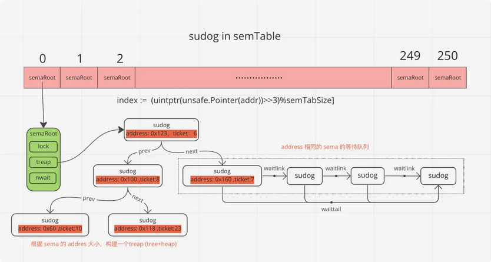

## defer

- 规则一：延迟函数的参数在defer语句出现时就已经确定。注意：对于指针类型参数，规则仍然适用，只不过延迟函数的参数是一个地址值，这种情况下，defer后面的语句对变量的修改可能会影响延迟函数

- 规则二：延迟函数执行按后进先出顺序执行，即先出现的defer最后执行

- 规则三：延迟函数可能操作主函数的具名返回值

- 申请资源后立即使用defer关闭资源是好习惯

- 有一个事实必须要了解，关键字return不是一个原子操作，实际上return只代理汇编指令ret，即将跳转程序执行。比如语句 return i，实际上分两步进行，即将i值存入栈中作为返回值，然后执行跳转，而defer的执行时机正是跳转前，所以说defer执行时还是有机会操作返回值的。

    ```go

    // print: 0
    func a() {
        i := 0
        defer fmt.Println(i)
        i++
        return
    }

    // equals to:
    // ret = 0
    // ret++
    // return
    func foo() (ret int) {
        defer func() {
            ret++
        }()

        return 0
    }
    ```

- defer 数据结构

    ```go
    type _defer struct {
        sp    uintptr // 函数栈指针
        pc    uintptr // 程序计数器
        fn   *funcval // 函数地址
        link * _defer // 指向自身结构的指针，用于链接多个defer
    }

    type g struct {
        // ...
        _defer    *_defer
        // ...
    }
    ```

    - defer后面一定要接一个函数的，所以defer的数据结构跟一般函数类似，也有栈地址、程序计数器、函数地址等等。

    - 一个goroutine可能连续调用多个函数，进入函数时添加defer，离开函数时取出defer，所以即便调用多个函数，也总是能保证defer是按FIFO方式执行的。

    - deferproc() 函数： 在声明defer处调用，其将defer函数存入goroutine的链表中。

    - deferreturn() 函数：在return指令，准确的讲是在ret指令前调用，其将defer从goroutine链表中取出并执行。

## select

- scase

    ```go
    type scase struct {
        c       *hchan  // chan
        kind    uint16
        elem    unsafe.Pointer // data element
    }
    ```

    - scase.c为当前case语句所操作的channel指针，这也说明了一个case语句只能操作一个channel

    - scase.kind表示该case的类型，分为读channel、写channel和default, 三种类型分别由常量定义

        - caseRecv：case语句中尝试读取scase.c中的数据

        - caseSend：case语句中尝试向scase.c中写入数据

        - caseDefault： default语句

    - scase.elem表示缓冲区地址，跟据scase.kind不同，有不同的用途

        - scase.kind == caseRecv ： scase.elem表示读出channel的数据存放地址

        - scase.kind == caseSend ： scase.elem表示将要写入channel的数据存放地址

- select实现逻辑

    - select语句采用的多路复用思想，本质上是为了达到通过一个协程同时处理多个IO请求（Channel读写事件）

    - select的基本用法：

        - 对于空的 select 语句，程序会被阻塞，确切的说是当前协程被阻塞，同时 Go 自带死锁检测机制，当发现当前协程再也没有机会被唤醒时，则会发生 panic
        
        - 通过多个case监听多个Channel的读写操作，任何一个case可以执行则选择该case执行，否则执行default
        
        - 如果没有default，且所有的case均不能执行，则当前的goroutine阻塞

    - 编译器会对select有不同的case的情况进行优化以提高性能, 尤其是避免对channel的加锁

        - 若 select没有 case：运行时调用 block 函数

        - 若 select 只有一个 case：运行时调用 chansend 和 chanrecv 函数

        - 若 select 只有一个 case 和 一个 default：运行时调用 selectnbsend 和 selectnbrecv 函数
        
        - 若 select 有多个 case：运行时调用 selectgo 函数

    - selectgo函数的执行分为四个步骤
        
        - 首先，随机生成一个遍历case的轮询顺序 pollorder 并根据 channel 地址生成加锁顺序 lockorder，随机顺序能够避免channel饥饿，保证公平性，加锁顺序 lockorder 会去重防止对channel加锁时重复加锁, 能够避免死锁
        
        - 然后，根据 pollorder 的顺序查找 scases 是否有可以立即收发的channel，如果有则获取case索引进行处理
        
        - 再次，如果pollorder顺序上没有可以直接处理的case，则将当前 goroutine 加入各 case 的 channel 对应的收发队列上并等待其他 goroutine 的唤醒
        
        - 最后，当调度器唤醒当前 goroutine 时，会再次按照 lockorder 遍历所有的case，从中查找需要被处理的case索引进行读写处理，同时从所有case的发送接收队列中移除掉当前goroutine

        - 对于读channel的case来说，如 case elem, ok := <-chan1:, 如果channel有可能被其他协程关闭的情况下，一定要检测读取是否成功，因为close的channel也有可能返回，此时ok == false

        ```go
        // cas0为scase数组的首地址，selectgo()就是从这些scase中找出一个返回
        // order0为一个两倍cas0数组长度的buffer，保存scase随机序列pollorder和scase中channel地址序列lockorder
        //  - pollorder：每次selectgo执行都会把scase序列打乱，以达到随机检测case的目的
        //  - lockorder：所有case语句中channel序列，以达到去重防止对channel加锁时重复加锁的目的
        // ncases表示scase数组的长度
        // 函数返回值：
        //  - int： 选中case的编号，这个case编号跟代码一致
        //  - bool: 是否成功从chan中读取了数据，如果选中的case是从channel中读数据，则该返回值表示是否读取成功
        func selectgo(cas0 *scase, order0 *uint16, ncases int) (int, bool) {
            // 1. 锁定scase语句中所有的channel
            // 2. 按照随机顺序检测scase中的channel是否ready
            //  2.1 如果case可读，则读取channel中数据，解锁所有的channel，然后返回(case index, true)
            //  2.2 如果case可写，则将数据写入channel，解锁所有的channel，然后返回(case index, false)
            //  2.3 所有case都未ready，则解锁所有的channel，然后返回（default index, false）
            // 3. 所有case都未ready，且没有default语句
            //  3.1 将当前协程加入到所有channel的等待队列
            //  3.2 当将协程转入阻塞，等待被唤醒
            // 4. 唤醒后返回channel对应的case index
            //  4.1 如果是读操作，解锁所有的channel，然后返回(case index, true)
            //  4.2 如果是写操作，解锁所有的channel，然后返回(case index, false)
        }
        ```

## range

- 实现原理

    ```go
    // Arrange to do a loop appropriate for the type. We will produce
    // for INIT ; COND ; POST {
    //      ITER_INIT
    //      INDEX = INDEX_TEMP
    //      VALUE = VALUE_TEMP // If there is a value
    //      original statements
    // }
    ```

- range for slice: 

    ```go
    // The loop we generate:
    //   for_temp := range
    //   len_temp := len(for_temp)
    //   for index_temp = 0; index_temp < len_temp; index_temp++ {
    //      value_temp = for_temp[index_temp]
    //      index = index_temp
    //      value = value_temp
    //      original body
    //   }
    ```

    - 遍历slice前会先获以slice的长度len_temp作为循环次数，循环体中，每次循环会先获取元素值，如果for-range中接收index和value的话，则会对index和value进行一次赋值

    - 由于循环开始前循环次数就已经确定了，所以循环过程中新添加的元素是没办法遍历到的

    - 另外，数组与数组指针的遍历过程与slice基本一致

- range for map

    ```go
    // The loop we generate:
    //   var hiter map_iteration_struct
    //   for mapiterinit(type, range, &hiter); hiter.key != nil; mapiternext(&hiter) {
    //      index_temp = *hiter.key
    //      value_temp = *hiter.val
    //      index = index_temp
    //      value = value_temp
    //      original body
    //   }
    ```

    - 遍历map时没有指定循环次数，循环体与遍历slice类似
    
    - 由于map底层实现与slice不同，map底层使用hash表实现，插入数据位置是随机的，所以遍历过程中新插入的数据不能保证遍历到

- range for channel

    ```go
    // The loop we generate:
    //   for {
    //      value_temp, ok_temp = <-range
    //      if !ok_temp {
    //          break
    //      }
    //      value = value_temp
    //      original body
    //  }

    func main() {
        c := make(chan int, 2)

        c <- 123
        c <- 456

        close(c) // 没有 close 会 deadlock.

        for v := range c {
            fmt.Println(v)
        }
    }
    ```

    - channel遍历是依次从channel中读取数据,读取前是不知道里面有多少个元素的

    - 如果channel中没有元素，则会阻塞等待，如果channel已被关闭，则会解除阻塞并退出循环

- Slice遍历过程中每次迭代会对index和value进行赋值，如果数据量大或者value类型为string时，对value的赋值操作可能是多余的，可以在for-range中忽略value值，使用slice[index]引用value值

- Map遍历中for-range语句中只获取key值，然后跟据key值获取value值，虽然看似减少了一次赋值，但通过key值查找value值的性能消耗可能高于赋值消耗。能否优化取决于map所存储数据结构特征、结合实际情况进行

- 循环内改变切片的长度，不影响循环次数，循环次效在循环开始前就已经确定了

## mutex

```go
type Mutex struct {
    state int32     // 互斥锁的状态，比如是否被锁定等
    sema  uint32    // 信号量，协程阻塞等待该信号量，解锁的协程释放信号量从而唤醒等待信号量的协程
}
```

- state 32 bit 分布：

    - Locked (1 bit): 表示该Mutex是否已被锁定，0：没有锁定 1：已被锁定

    - Woken (1 bit): 表示是否有协程已被唤醒，0：没有协程唤醒 1：已有协程唤醒，正在加锁过程中

    - Starving (1 bit): 表示该Mutex是否处理饥饿状态， 0：没有饥饿 1：饥饿状态，说明有协程阻塞了超过1ms

    - Waiter (1 bit): 表示阻塞等待锁的协程个数，协程解锁时根据此值来判断是否需要释放信号量

- 加锁过程

    - 把Locked位置1 (Atomic.Add)，代表加锁成功

    - 加锁时，锁已被其他协程占用了, 增加 Waiter 计数

- 解锁过程

    - 没有其他协程阻塞等待加锁时，解锁时只需要把Locked位置为0即可，不需要释放信号量

    - 否则，一是把Locked位置0，二是查看到Waiter>0，所以释放一个信号量，唤醒一个阻塞的协程，被唤醒的协程B把Locked位置1，于是协程B获得锁

- 自旋过程

    - 加锁时，如果当前Locked位为1，说明该锁当前由其他协程持有，尝试加锁的协程并不是马上转入阻塞，而是会持续的探测Locked位是否变为0，这个过程即为自旋过程

    - 自旋条件: 加锁时程序会自动判断是否可以自旋，无限制的自旋将会给CPU带来巨大压力, 自旋必须满足以下所有条件

        - 自旋次数要足够小，通常为4，即自旋最多4次

        - CPU核数要大于1，否则自旋没有意义，因为此时不可能有其他协程释放锁

        - 协程调度机制中的Process数量要大于1，比如使用GOMAXPROCS()将处理器设置为1就不能启用自旋

        - 协程调度机制中的可运行队列必须为空，否则会延迟协程调度

- 自旋的问题: 如果自旋过程中获得锁，那么之前被阻塞的协程将无法获得锁，如果加锁的协程特别多，每次都通过自旋获得锁，那么之前被阻塞的进程将很难获得锁，从而进入饥饿状态

- Mutex模式

    - normal模式: 默认情况下，Mutex的模式为normal, 该模式下，协程如果加锁不成功不会立即转入阻塞排队，而是判断是否满足自旋的条件，如果满足则会启动自旋过程，尝试抢锁。

    - starvation模式: 自旋过程中能抢到锁，一定意味着同一时刻有协程释放了锁，我们知道释放锁时如果发现有阻塞等待的协程，还会释放一个信号量来唤醒一个等待协程，被唤醒的协程得到CPU后开始运行，此时发现锁已被抢占了，自己只好再次阻塞，不过阻塞前会判断自上次阻塞到本次阻塞经过了多长时间，如果超过1ms的话，会将Mutex标记为”饥饿”模式 (设置Starving位)，然后再阻塞。处于饥饿模式下，不会启动自旋过程，也即一旦有协程释放了锁，那么一定会唤醒协程，被唤醒的协程将会成功获取锁，同时也会把等待计数减1

- Woken状态

    - Woken状态用于加锁和解锁过程的通信，举个例子，同一时刻，两个协程一个在加锁，一个在解锁，在加锁的协程可能在自旋过程中，此时把Woken标记为1，用于通知解锁协程不必释放信号量了，好比在说：你只管解锁好了，不必释放信号量，我马上就拿到锁了

- 为什么重复解锁要panic: 

    - Unlock过程分为将Locked置为0，然后判断Waiter值，如果值>0，则释放信号量

    - 如果多次Unlock()，那么可能每次都释放一个信号量，这样会唤醒多个协程，多个协程唤醒后会继续在Lock()的逻辑里抢锁，势必会增加Lock()实现的复杂度，也会引起不必要的协程切换

## rwmutex

- 数据结构

    ```go
    type RWMutex struct {
        w           Mutex
        writerSem   uint32
        readerSem   uint32
        readerCount atomic.Int32
        readerWait  atomic.Int32
    }
    ```

    - 字段 w：复用互斥锁提供的能力

    - 字段 readerCount：记录当前 reader 的数量（以及是否有 writer 竞争锁）

    - 字段 readerWait：记录 writer 请求锁时需要等待 read 完成的 reader 的数量

    - 字段 writerSem 和 readerSem：都是为了阻塞设计的信号量，分别用于写等待读和读等待写

- 读锁

    ```go
    func (rw *RWMutex) RLock() {
        if rw.readerCount.Add(1) < 0 {
		    // rw.readerCount 是负值时, 意味着此时有writer等待请求锁, 因为writer优先级高, 所以把后来的reader阻塞休眠
		    runtime_SemacquireRWMutexR(&rw.readerSem, false, 0)
	    }
    }

    func (rw *RWMutex) RUnlock() {
        if r := rw.readerCount.Add(-1); r < 0 {
            rw.rUnlockSlow(r) // 有等待的writer
        }
    }

    func (rw *RWMutex) rUnlockSlow(r int32) {
        if rw.readerWait.Add(-1) == 0 {
            // 最后一个reader了, writer 终于有机会获得锁了
            runtime_Semrelease(&rw.writerSem, false, 1)
        }
    }
    ```

- 写锁

    ```go
    func (rw *RWMutex) Lock() {
        // 首先解决其他writer竞争问题.
        rw.w.Lock()
        // 反转readerCount, 告诉reader有writer竞争锁
        r := rw.readerCount.Add(-rwmutexMaxReaders) + rwmutexMaxReaders
        // 如果当前有reader持有锁, 那么需要等待.
        if r != 0 && rw.readerWait.Add(r) != 0 {
            runtime_SemacquireRWMutex(&rw.writerSem, false, 0)
        }
    }

    func (rw *RWMutex) Unlock() {
        // 告诉reader没有活跃的writer了
        r := rw.readerCount.Add(rwmutexMaxReaders)
        // 唤醒阻塞的reader们
        for i := 0; i < int(r); i++ {
            runtime_Semrelease(&rw.readerSem, false, 0)
        }
        // 释放内部的互斥锁
        rw.w.Unlock()
    }
    ```


## runtime.mutex

- 在Go的runtime包中封装了一个 mutux ，这个mutex被runtime包中大量组件使用，比如 channel、netpoll、检查活跃的定时器 等等。

- ync.Mutex和runtime.mutext区别：简单说就是sync.Mutex是用户层的锁，Lock抢锁失败会造成goroutine阻塞（会调用gopark）。runtime.mutex 是给 runtime使用的锁，Lock抢锁失败，会造成m阻塞（线程阻塞，底层调用的futex）。

- Futex

    - Futex是Fast Userspace Mutexes的缩写。是一个在Linux上实现锁定和构建高级抽象锁如信号量和POSIX互斥的基本工具。

    - Futex由一块能够被多个进程共享的内存空间（一个对齐后的整型变量）组成；这个整型变量的值能够通过汇编语言调用CPU提供的原子操作指令来增加或减少，并且一个进程可以等待直到那个值变成正数。Futex的操作几乎全部在用户空间完成；只有当操作结果不一致从而需要仲裁时，才需要进入操作系统内核空间执行。这种机制允许使用Futex的锁定原语有非常高的执行效率：由于绝大多数的操作并不需要在多个进程之间进行仲裁，所以绝大多数操作都可以在应用程序空间执行，而不需要使用（相对高代价的）内核系统调用。

    - futex的基本思想是竞争态总是很少发生的，只有在竞争态才需要进入内核，否则在用户态即可完成。futex的两个目标是：

        - 1. 尽量避免系统调用

        - 2. 避免不必要的上下文切换（导致的TLB失效等）

    - 简单一句话总结就是：futex基于mmap来映射一段内存记录锁的状态，使用mmap有两个好处，1）支持跨进程同步锁状态。2）用户态和内核态可以共用一块内存（zero copy也是说的这个），这样在用户态可以直接修改锁状态不用切换到内核态。futex加锁和解锁，都是先通过CAS（这个CPU支持的指令CMPXCHGQ，不需要系统调用）尝试设置状态，如果设置成功了，就正常返回，如果CAS失败，就会进行系统调用（切换到内核）。伪代码如下：

        ```c
        /**
         * val 0: unlock
         * val 1: lock, no waiters
         * val 2: lock , one or more waiters
         */
        int val = 0;
        void lock()
        {
            int c
            if ((c = cmpxchg(val, 0, 1)) != 0) {
                if (c != 2)
                    c = xchg(val, 2);
                while (c != 0) {
                    futex_wait((&val, 2); // 系统调用
                    c = xchg(val, 2);
                }
            }
        }   
            
        void unlock()
        {   
            if (atomic_dec(val) != 1){
                val = 0;    
                futex_wake(&val, 1); // 系统调用
            }
        }

        //uaddr指向一个地址，val代表这个地址期待的值，当*uaddr==val时，才会进行wait（阻塞线程）
        int futex_wait(int *uaddr, int val);
        //唤醒n个在uaddr指向的锁变量上挂起等待的进程
        int futex_wake(int *uaddr, int n);
        ```

    - Sync.Mutex和runtime.mutex也有类似的操作，一般都会有fastpath和slowpath，fastpath就是先尝试自旋n次CAS方式加锁，CAS成功就立即返回，否则就返回

- procyield: 执行n次PAUSE指令，n是函数调用传入的参数. PAUSE指令的功能: 主要是提高自旋的性能. 

    ```s
    TEXT runtime·procyield(SB),NOSPLIT,$0-0
        MOVL    cycles+0(FP), AX
    again:
        PAUSE
        SUBL    $1, AX
        JNZ    again
        RET
    ```

- osyield: 做了个系统调用sched_yield, 主要功能是：让当前线程放弃CPU执行权限，把线程移到队列尾部，让优先执行其他线程。

    ```s
    #define SYS_sched_yield     24

    TEXT runtime·osyield(SB),NOSPLIT,$0
        MOVL    $SYS_sched_yield, AX
        SYSCALL
        RET
    ```

- futexsleep 和 futexwakeup

    ```go
    // 如果 *addr == val { 当前线程进入sleep状态 } ；不会阻塞超过ns，ns<0表示永远休眠
    futexsleep(addr *uint32, val uint32, ns int64)
    //如果任何线程阻塞在addr上，则唤醒至少cnt个阻塞的任务
    futexwakeup(addr *uint32, cnt uint32) 
    ```

- mutex 结构

    ```go
    type mutex struct {
        // Empty struct if lock ranking is disabled, otherwise includes the lock rank
        lockRankStruct
        // Futex-based impl treats it as uint32 key,
        // while sema-based impl as M* waitm.
        // Used to be a union, but unions break precise GC.
        key uintptr
    }
    ```

    - lockRankStruct这个是给runtime做死锁检测用的，只有设置了GOEXPERIMENT=staticlockranking, lockRankStruct才会有具体实现，否则的话这个结构体只会是个空Struct，空的Struct只要不是最后一个字段是不会占用任何空间的. lookrank主要通过加锁顺序 来判断是否会死锁，如果加锁顺序不符合预期就会throw异常（注意这个不是panic不能被recover）

    - lock 实现: macOS和Windows上runtime.mutex基于 lock_sema, 而在Linux上lock是基于futex来实现的, 以 linux 为例

    ```go
    func lock(l *mutex) {
        lockWithRank(l, getLockRank(l))
    }

    func lockWithRank(l *mutex, rank lockRank) {
        lock2(l)
    }

    func lock2(l *mutex) {
        gp := getg() // 获取当前的 goroutine

        if gp.m.locks < 0 {
            throw("runtime·lock: lock count")
        }
        gp.m.locks++ // g绑定的m的lock数量加1

        // l.key 只有三种状态 mutex_unlocked、mutex_locked、mutex_sleeping
        // mutex_unlocked 表示无锁状态
        // mutex_locked 正常加锁状态
        // mutex_sleeping 表示有线程调用futexsleep阻塞了
        // 设置状态为 mutex_locked ，注意这里是直接设置，不是CAS
        v := atomic.Xchg(key32(&l.key), mutex_locked)
        if v == mutex_unlocked { // 之前的状态是 mutex_unlocked 表示加锁成功了
            return
        }

        // 走到这里，表示没有加锁成功
        // 这里 v 不是 mutex_unlocked 所以只能是 MUTEX_LOCKED 或 MUTEX_SLEEPING
        // 所以 wait 可能是 MUTEX_LOCKED 或 MUTEX_SLEEPING
        // 如果我们将 l->key 从 MUTEX_SLEEPING 更改为其他值，我们必须小心在返回之前将其更改回 MUTEX_SLEEPING
        wait := v

        // 多核情况下尝试自旋4次，单个就不用自旋了
        spin := 0
        if ncpu > 1 {
            spin = active_spin // active_spin = 4
        }
        for {
            for i := 0; i < spin; i++ { 
                    // 注意我们上面设置了 l.key = mutex_locked
                    // 这里如果 key = mutex_unlocked，表示肯定是其他持有锁的线程进行了锁的释放
                for l.key == mutex_unlocked {
                        // CAS 抢锁成功直接返回，否则再尝试自旋
                    if atomic.Cas(key32(&l.key), mutex_unlocked, wait) {
                        return
                    }
                }

                procyield(active_spin_cnt) // 执行 active_spin_cnt = 30 次 PAUSE指令
            }

            // passive_spin = 1 ，再尝试抢一次锁。
            for i := 0; i < passive_spin; i++ {
                for l.key == mutex_unlocked {
                    if atomic.Cas(key32(&l.key), mutex_unlocked, wait) {
                        return
                    }
                }
                osyield() // CAS 失败，系统调用`sched_yield`让出CPU
            }

            
            v = atomic.Xchg(key32(&l.key), mutex_sleeping)
            if v == mutex_unlocked {
                // 注意这里，如果是从 mutex_unlocked => mutex_sleeping 也认为是加锁成功，然后直接返回，不会走futexsleep阻塞当前线程。
                // 造成的影响就是，解锁的时候执行，执行 futexwakeup了，但是没有需要唤醒的线程（功能上应该没有影响）
                return 
            }
            wait = mutex_sleeping // 设置 wait 状态为 mutex_sleeping 下次循环会设置为 mutex_sleeping 状态
            // l.key == mutex_sleeping 就 sleep，直到被唤醒。
            // 不然继续循环
            futexsleep(key32(&l.key), mutex_sleeping, -1)
        }
    }

    func unlock(l *mutex) {
        unlockWithRank(l)
    }

    func unlockWithRank(l *mutex) {
        unlock2(l)
    }

    func unlock2(l *mutex) {
        // 设置 l.key = mutex_unlocked
        v := atomic.Xchg(key32(&l.key), mutex_unlocked)
        if v == mutex_unlocked {// 重复调用 unlock，直接抛出异常。
            throw("unlock of unlocked lock")
        }
        if v == mutex_sleeping { // 之前的状态是 mutex_sleeping，说明其他有线程在`sleep`，唤醒一个`sleep`的对象。
            futexwakeup(key32(&l.key), 1)
        }

        gp := getg()
        gp.m.locks--
        if gp.m.locks < 0 {
            throw("runtime·unlock: lock count")
        }
        if gp.m.locks == 0 && gp.preempt { // restore the preemption request in case we've cleared it in newstack
            gp.stackguard0 = stackPreempt
        }
    }
    ```

- 总结: runtime.mutex 主要是使用了CAS自旋配合procyield和osyield，最多尝试5次，自旋失败就使用futex系统调用来实现，整体代码逻辑比较简单易懂


## runtime.semaphore

- Treap: Binary Search Tree + Heap 的组合

    - Treap既是一棵二叉查找树，也是一个二叉堆。但是这两种数据结构貌是矛盾的存在，如果是二叉查找树，就不能是一个堆，如果是一个堆，那么必然不是二叉查找树

    - 所以Treap用了一个很巧妙的方式解决这个问题：给每个键值一个随机附加的优先级，让键值满足二叉查找树的结构，让优先级满足二叉堆的结构

    - Treap它的最大优点就是实现简单，没有太多复杂的操作，但是我们前面也说了，它是通过随机的priority来控制树的平衡的，那么它显然无法做到完美平衡，只能做到不落入最坏的情况

- x/sync/semaphore

    - Go的 X-Repositories 提供了一种带权重的信号量实现方式 sync.semaphore。这个跟runtime.semaphore其实没太大关系。主要是提供了个high-level的信号量给Go开发者使用。实现方式如下

        ```go
        type Weighted struct {
            size    int64 // 资源的总数，Acquire(n) 的时候会消耗这个资源，
            cur     int64 // 当前已申请资源数，Acquire(n)成功的话，cur=cur+n
            mu      sync.Mutex // 互斥锁，所有Acquire、Release 都要加锁
            waiters list.List // 阻塞的队列
        }

        type waiter struct {
            n     int64
            ready chan<- struct{} // 使用 channle 来通信
        }
        ```

    - Weighted就是一个权重的信号量，主要提供Acquire(n)和Release(n)两个操作。实现逻辑比较简单

    - Acquire(n)申请n个资源，申请成功的话会设置cur=cur+n，如果没有资源可以申请了，会new一个waiter，然后把这个waiter加到waiters这个等待的队列中，并阻塞在waiter.ready的读上面

    - Release(n)释放n个资源，然后设置cur=cur-n，在waiters这个等待的队列中，循环取出取waiters头部的waiter（直到s.size-s.cur < w.n终止），调用close(waiter.ready)，这样阻塞在waiter.ready读上的goroutine会被唤醒

        ```go
        func main() {
            var (
                wg  sync.WaitGroup
                ctx = context.Background()
            )

            cpuNum := runtime.GOMAXPROCS(0)
            sem := semaphore.NewWeighted(int64(cpuNum)) // 设置 goroutine 最大并发数 = cpuNum
            for i := 0; i < 100; i++ {
                wg.Add(1)
                err := sem.Acquire(ctx, 1)
                if err != nil {
                    panic(err)
                }

                go func(i int) {
                    fmt.Println("ng: ", runtime.NumGoroutine(), " i = ", i)
                    sem.Release(1)
                    wg.Done()
                }(i)
            }
            wg.Wait()
        }
        ```

- sudog

    - sudog表示为了一个等待队列中的goroutine，比如因为读写channel阻塞，或者Lock导致阻塞（Lock底层其实就是semaphore）等的goroutine，由于这些阻塞的goroutine不确定什么时候能被调度（取消阻塞比如unlock、读写channel），所以这种阻塞的goroutine不适合一直放在p的本地运行队列中，这个时候会把阻塞的gorutine打包成一个sudog里面会有一些这个g运行的上下文。然后存到另外一个地方，比如channel是存在 recvq 和 sendq 中，而阻塞在信号量上的goroutine是存在 semTable 中。

    - 从sodug结构体看出来，sudog里面的字段分别跟channel、semaphore、select几个场景有关。某些字段只有在特点场景才会用到

    ```go
    // sudog 代表一个处于等待队列的g，比如阻塞在读写 channle上 的 goroutine
    // sduog 和 g 是多对多的关系，一个 g 可以在多个 wait lists 上，所以一个 g 可以对应多个 sduog
    // sudogs 会有两级缓存，优先去p的sudogcache取，取不到则去全局的sudogcache取一批（直到本地容量达到50%）
    // sudogs 通过 acquireSudog 和 releaseSudog 去申请或释放
    type sudog struct {
        // 在channel的场景中sudog中所有字段都受hchan.lock保护
        g *g

        next *sudog // 双向链表，指向下一个 sduog
        prev *sudog // 双向链表，指向上一个 sduog
        
        // channel场景存的是，读写的数据。
        // semaphore 场景存的是信号量的地址。
        elem unsafe.Pointer 

        // 下面这些字段不会被并发访问
        // For channels, waitlink is only accessed by g.
        // For semaphores, 所有字段需要拿到semaRoot的lock才能访问

        acquiretime int64 // semaphore 场景使用的，记录获取信号量时间
        releasetime int64 // 释放时间
        ticket      uint32 // treap 里面堆用的随机的权重

        // 只在select 场景使用的字段，表明当前g是否被选中，然后唤醒
        isSelect bool

        // 只在channel场景使用的
        success bool

        // 只在 semaphore 场景使用
        parent   *sudog // semaRoot binary tree
        waitlink *sudog // semaRoot 节点对应的等待列表
        waittail *sudog // semaRoot 等待列表的尾部节点
        c        *hchan // 只在channel场景使用的，关联的channel
    }
    ```

- semtable

    - semTable 是一个长度为251的全局数组，每个semaRoot指向一个treap，主要用于存放阻塞在信号量(semaphore)上的sudog

    - semaRoot最早是双向链表，在某些场景下性能比较差，所以优化成了treap (sudog.ticket 的小根堆)

        ```go
        var semtable semTable

        // Prime to not correlate with any user patterns.
        const semTabSize = 251

        var semtable [semTabSize]struct {
            root semaRoot
            pad  [cpu.CacheLinePadSize - unsafe.Sizeof(semaRoot{})]byte // 防止 flase sharing
        }

        type semaRoot struct {
            lock  mutex
            treap *sudog        // root of balanced tree of unique waiters.
            nwait atomic.Uint32 // Number of waiters. Read w/o the lock.
        }
        ```

        

- mutex: 见 runtime.mutex

- 获取信号量: 

    - 1. 调用runtime_SemacquireMutex （比如sync.Mutex.Lock()场景）

    - 2. sync_runtime_SemacquireMutex

    - 3. semacquire1

    - 4. CAS(addr, v, v-1)状态成功就返回，失败继续往下

    - 5. 缓存池拿一个sudog，或者new一个sudog（acquireSudog）

    - 6. 把g相关的数据存到sudog中

    - 7. 循环

        - 对当前semaRoot加锁

        - nwait++

        - cansemacquire/CAS(addr, v, v-1)

        - sudog加到semaRoot的treap中/root.queue()

        - 可能要调整树的结构（左旋rotateRight/右旋rotateLeft）防止树退化为链表

        - goparkunlock让出当前g的执行

        - 被唤醒

        - CAS成功或者 s.ticket != 0（当前没有其他竞争者了） 认为成功

        - 否则继续循环

    - 8. 最后释放sudog/releaseSudog

    ```go
    func semacquire1(addr *uint32, lifo bool, profile semaProfileFlags, skipframes int) {
        gp := getg()
        if gp != gp.m.curg {// 判断下g是不是当前m绑定的g
            throw("semacquire not on the G stack")
        }

        // CAS(addr, v, v-1) 成功就直接成功否则一直循环，如果 *addr = 0 返回 false 走下面 slowpath
        if cansemacquire(addr) {
            return
        }
        
        // 走到这里表示当前g要阻塞
        // 下面逻辑，就是把g封装成sudog,然后存到semTable中。
        // 最后调用 gopark 让出当前g


        s := acquireSudog() // 这个先去 p.sudogcache 拿，没拿到去全局sudohgcache拿
        root := semroot(addr) // 根据sema的地址，算出用到semTable中哪个semaRoot
        t0 := int64(0)
        s.releasetime = 0
        s.acquiretime = 0
        s.ticket = 0
        if profile&semaBlockProfile != 0 && blockprofilerate > 0 {
            t0 = cputicks()
            s.releasetime = -1
        }
        if profile&semaMutexProfile != 0 && mutexprofilerate > 0 {
            if t0 == 0 {
                t0 = cputicks()
            }
            s.acquiretime = t0
        }
        for {
            lockWithRank(&root.lock, lockRankRoot) // 加锁，方面下面修改 semaRoot的属性
            // 对等待的计数加1，这样sema_release时候不会走快路径
            atomic.Xadd(&root.nwait, 1)
            // 看下是否有其他的goroutine调用了sema_release
            // 在尝试 CAS(addr, v, v-1) 试下
            if cansemacquire(addr) {
                atomic.Xadd(&root.nwait, -1)
                unlock(&root.lock)
                break
            }
            
            // 这里，就是这个新的 sudog 加到 semaTable中的
            root.queue(addr, s, lifo)
            goparkunlock(&root.lock, waitReasonSemacquire, traceEvGoBlockSync, 4+skipframes) // 这你会让出当前的goroutine
            
            
            // goroutine 被调度回来了，表示有 sema_release 以后唤醒了这个 sema
            // s.ticket != 0 表示是等待队列头部的 sudog，当前队列只有一个sudog了，所以直接结束
            // CAS(addr, v, v-1) 成功也结束
            if s.ticket != 0 || cansemacquire(addr) {
                break
            }
        }
        if s.releasetime > 0 {
            blockevent(s.releasetime-t0, 3+skipframes)
        }
        releaseSudog(s) // 释放 sudog
    }


    func cansemacquire(addr *uint32) bool {
        for {
            v := atomic.Load(addr)
            if v == 0 {
                return false
            }
            if atomic.Cas(addr, v, v-1) {
                return true
            }
        }
    }

    func acquireSudog() *sudog {
        // 设置禁止抢占
        mp := acquirem()
        pp := mp.p.ptr()
        //当前本地sudog缓存没有了，则去全局缓存中拉取一批
        if len(pp.sudogcache) == 0 {
            lock(&sched.sudoglock)
            // 首先尝试从全局缓存中获取sudog，直到本地容量达到50%
            for len(pp.sudogcache) < cap(pp.sudogcache)/2 && sched.sudogcache != nil {
                s := sched.sudogcache
                sched.sudogcache = s.next
                s.next = nil
                pp.sudogcache = append(pp.sudogcache, s)
            }
            unlock(&sched.sudoglock)
            // 如果全局缓存为空，则分配创建一个新的sudog
            if len(pp.sudogcache) == 0 {
                pp.sudogcache = append(pp.sudogcache, new(sudog))
            }
        }
        n := len(pp.sudogcache)
        s := pp.sudogcache[n-1]
        pp.sudogcache[n-1] = nil
        pp.sudogcache = pp.sudogcache[:n-1]
        if s.elem != nil {
            throw("acquireSudog: found s.elem != nil in cache")
        }
        //解除抢占限制
        releasem(mp)
        return s
    }
    ```

- 释放信号量

    - 1. 调用runtime_Semrelease，比如sync.Mutex.Unlock()场景

    - 2. sync_runtime_Semrelease

    - 3. semrelease1

    - 4. 原子*addr++

    - 5. nwait=0，表示没有阻塞在这个信号量上的g直接返回

    - 6. 有阻塞的g在semTable中找到对应的semaRoot，然后对semaRoot加锁

    - 7. 再次check下nwait=0，等于0直接返回

    - 8. 拿到sema的addres在semTable中对应的队列头部的seamRoot

    - 9. dequeue是否需要调整左旋rotateLeft或者右旋rotateRight调整树结构

    - 10. readyWithTime，调用goread唤醒sudog绑定的g

    - 11. goyield

    ```go
    func semrelease1(addr *uint32, handoff bool, skipframes int) {
        root := semroot(addr)
        atomic.Xadd(addr, 1)

        // 没有等待者直接返回
        if atomic.Load(&root.nwait) == 0 {
            return
        }

        //查找一个等待着并唤醒它
        lockWithRank(&root.lock, lockRankRoot)
        if atomic.Load(&root.nwait) == 0 {
            //计数已经被其他goroutine消费，所以不需要唤醒其他goroutine
            unlock(&root.lock)
            return
        }
        s, t0 := root.dequeue(addr) //查找第一个出现的addr
        if s != nil {
            atomic.Xadd(&root.nwait, -1)
        }
        unlock(&root.lock)
        if s != nil { // 可能比较慢 甚至被挂起所以先unlock
            acquiretime := s.acquiretime
            if acquiretime != 0 {
                mutexevent(t0-acquiretime, 3+skipframes)
            }
            if s.ticket != 0 {
                throw("corrupted semaphore ticket")
            }
            if handoff && cansemacquire(addr) {
                s.ticket = 1
            }
            //goready(s.g,5)标记runnable 等待被重新调度

            readyWithTime(s, 5+skipframes)
            if s.ticket == 1 && getg().m.locks == 0 {
                // 直接切换G
                // readyWithTime已经将等待的G作为runnext放到当前的P
                // 我们现在调用调度器可以立即执行等待的G
                // 注意waiter继承了我们的时间片：这是希望避免在P上无限得进行激烈的信号量竞争
                // goyield类似于Gosched，但是它是发送“被强占”的跟踪事件，更重要的是，将当前G放在本地runq
                // 而不是全局队列。
                // 我们仅在饥饿状态下执行此操作(handoff=true),因为非饥饿状态下，当我们yielding/scheduling时，
                // 其他waiter可能会获得信号量，这将是浪费的。我们等待进入饥饿状体，然后开始进行ticket和P的手递手交接
                // See issue 33747 for discussion.
                // https://go-review.googlesource.com/c/go/+/206180
                goyield()
            }
        }
    }
    ```

- 总结: 

    - 获取信号量操作主要尝试把sema地址CAS方式原子减1，成就直接返回，失败以后会把当前g打包成sudog然后保存到semTable，然后调用gopark让出当前的goroutine。

    - 释放信号量操作就是吧sema地址加1，然后看有没有等待中的g，没有直接返回，有的话去semaTable的等待队列取出然后调用goready唤醒对应的g。


## Cond

```go
type Cond struct {
	noCopy noCopy

	// L is held while observing or changing the condition
	L Locker

	notify  notifyList
	checker copyChecker
}

func NewCond(l Locker) *Cond {
	return &Cond{L: l}
}

func (c *Cond) Wait() {
	c.checker.check()
	t := runtime_notifyListAdd(&c.notify)
	c.L.Unlock()
	runtime_notifyListWait(&c.notify, t)
	c.L.Lock()
}

func (c *Cond) Signal() {
	c.checker.check()
	runtime_notifyListNotifyOne(&c.notify)
}

func (c *Cond) Broadcast() {
	c.checker.check()
	runtime_notifyListNotifyAll(&c.notify)
}

type notifyList struct {
	// wait is the ticket number of the next waiter. It is atomically
	// incremented outside the lock.
	wait atomic.Uint32

	// notify is the ticket number of the next waiter to be notified. It can
	// be read outside the lock, but is only written to with lock held.
	//
	// Both wait & notify can wrap around, and such cases will be correctly
	// handled as long as their "unwrapped" difference is bounded by 2^31.
	// For this not to be the case, we'd need to have 2^31+ goroutines
	// blocked on the same condvar, which is currently not possible.
	notify uint32

	// List of parked waiters.
	lock mutex
	head *sudog
	tail *sudog
}

func less(a, b uint32) bool {
	return int32(a-b) < 0
}

//go:linkname notifyListAdd sync.runtime_notifyListAdd
func notifyListAdd(l *notifyList) uint32 {
	// This may be called concurrently, for example, when called from
	// sync.Cond.Wait while holding a RWMutex in read mode.
	return l.wait.Add(1) - 1
}

//go:linkname notifyListWait sync.runtime_notifyListWait
func notifyListWait(l *notifyList, t uint32) {
	lockWithRank(&l.lock, lockRankNotifyList)

	// Return right away if this ticket has already been notified.
	if less(t, l.notify) {
		unlock(&l.lock)
		return
	}

	// Enqueue itself.
	s := acquireSudog()
	s.g = getg()
	s.ticket = t
	s.releasetime = 0
	t0 := int64(0)
	if blockprofilerate > 0 {
		t0 = cputicks()
		s.releasetime = -1
	}
	if l.tail == nil {
		l.head = s
	} else {
		l.tail.next = s
	}
	l.tail = s
	goparkunlock(&l.lock, waitReasonSyncCondWait, traceBlockCondWait, 3)
	if t0 != 0 {
		blockevent(s.releasetime-t0, 2)
	}
	releaseSudog(s)
}

//go:linkname notifyListNotifyAll sync.runtime_notifyListNotifyAll
func notifyListNotifyAll(l *notifyList) {
	// Fast-path: if there are no new waiters since the last notification
	// we don't need to acquire the lock.
	if l.wait.Load() == atomic.Load(&l.notify) {
		return
	}

	// Pull the list out into a local variable, waiters will be readied
	// outside the lock.
	lockWithRank(&l.lock, lockRankNotifyList)
	s := l.head
	l.head = nil
	l.tail = nil

	// Update the next ticket to be notified. We can set it to the current
	// value of wait because any previous waiters are already in the list
	// or will notice that they have already been notified when trying to
	// add themselves to the list.
	atomic.Store(&l.notify, l.wait.Load())
	unlock(&l.lock)

	// Go through the local list and ready all waiters.
	for s != nil {
		next := s.next
		s.next = nil
		readyWithTime(s, 4)
		s = next
	}
}

//go:linkname notifyListNotifyOne sync.runtime_notifyListNotifyOne
func notifyListNotifyOne(l *notifyList) {
	// Fast-path: if there are no new waiters since the last notification
	// we don't need to acquire the lock at all.
	if l.wait.Load() == atomic.Load(&l.notify) {
		return
	}

	lockWithRank(&l.lock, lockRankNotifyList)

	// Re-check under the lock if we need to do anything.
	t := l.notify
	if t == l.wait.Load() {
		unlock(&l.lock)
		return
	}

	// Update the next notify ticket number.
	atomic.Store(&l.notify, t+1)

	// Try to find the g that needs to be notified.
	// If it hasn't made it to the list yet we won't find it,
	// but it won't park itself once it sees the new notify number.
	//
	// This scan looks linear but essentially always stops quickly.
	// Because g's queue separately from taking numbers,
	// there may be minor reorderings in the list, but we
	// expect the g we're looking for to be near the front.
	// The g has others in front of it on the list only to the
	// extent that it lost the race, so the iteration will not
	// be too long. This applies even when the g is missing:
	// it hasn't yet gotten to sleep and has lost the race to
	// the (few) other g's that we find on the list.
	for p, s := (*sudog)(nil), l.head; s != nil; p, s = s, s.next {
		if s.ticket == t {
			n := s.next
			if p != nil {
				p.next = n
			} else {
				l.head = n
			}
			if n == nil {
				l.tail = p
			}
			unlock(&l.lock)
			s.next = nil
			readyWithTime(s, 4)
			return
		}
	}
	unlock(&l.lock)
}
```

- 使用示例:

```go
package main

import (
	"fmt"
	"sync"
	"time"
)

func logInfo(msg string) {
	fmt.Println(time.Now().Format("2006-01-02 15:04:05.000"), msg)
}

var is_ready = false

func worker(cv *sync.Cond, wg *sync.WaitGroup) {
	defer wg.Done()
	logInfo("Worker coroutine started.")
	time.Sleep(time.Second * 2)
	cv.L.Lock()
	defer cv.L.Unlock()
	is_ready = true
	cv.Signal()
}

func waiter(cv *sync.Cond, wg *sync.WaitGroup) {
	defer wg.Done()
	logInfo("Waiting for Worker finished.")
	cv.L.Lock()
	defer cv.L.Unlock()
	for !is_ready {
		cv.Wait()
	}
	logInfo("Worker coroutine finished.")
}

func main() {
	cv := &sync.Cond{L: &sync.Mutex{}}
	wg := &sync.WaitGroup{}
	wg.Add(2)
	go waiter(cv, wg)
	go worker(cv, wg)
	wg.Wait()
}
```