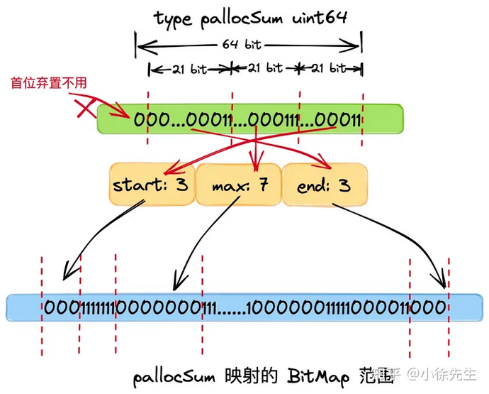

## Golang 内存模型

  

  - mheap: 全局的内存起源，访问要加全局锁

  - mcentral: 每种对象大小规格（全局共划分为 68 种）对应的缓存，锁的粒度也仅限于同一种规格以内

  - mcache: 每个 P（正是 GMP 中的 P）持有一份的内存缓存，访问时无锁

## 内存分配

  

  - page：最小的存储单元. Golang 借鉴操作系统分页管理的思想，每个最小的存储单元也称之为页 page，但大小为 8 KB.

  - mspan：最小的管理单元. mspan 大小为 page 的整数倍，且从 8B 到 32 KB 被划分为 67 种不同的规格，分配对象时，会根据大小映射到不同规格的 mspan，从中获取空间.


## 内存单元 mspan

```go
// runtime/mheap.go
type mspan struct {
  // 标识前后节点的指针 
  next *mspan     
  prev *mspan    
  // ...
  // 起始地址
  startAddr uintptr 
  // 包含几页，页是连续的
  npages    uintptr 


  // 标识此前的位置都已被占用 
  freeindex uintptr
  // 最多可以存放多少个 object
  nelems uintptr // number of object in the span.


  // bitmap 每个 bit 对应一个 object 块，标识该块是否已被占用
  allocCache uint64
  // ...
  // 标识 mspan 等级，包含 class 和 noscan 两部分信息
  spanclass             spanClass    
  // ...
}

// class  bytes/obj  bytes/span  objects  tail waste  max waste  min align
//     1          8        8192     1024           0     87.50%          8
//     2         16        8192      512           0     43.75%         16
//     3         24        8192      341           8     29.24%          8
//     4         32        8192      256           0     21.88%         32
//     5         48        8192      170          32     31.52%         16
//     6         64        8192      128           0     23.44%         64
//     7         80        8192      102          32     19.07%         16
//     8         96        8192       85          32     15.95%         32
//     9        112        8192       73          16     13.56%         16
//    10        128        8192       64           0     11.72%        128
//    11        144        8192       56         128     11.82%         16
//    12        160        8192       51          32      9.73%         32
//    13        176        8192       46          96      9.59%         16
//    14        192        8192       42         128      9.25%         64
//    15        208        8192       39          80      8.12%         16
//    16        224        8192       36         128      8.15%         32
//    17        240        8192       34          32      6.62%         16
//    18        256        8192       32           0      5.86%        256
//    19        288        8192       28         128     12.16%         32
//    20        320        8192       25         192     11.80%         64
//    21        352        8192       23          96      9.88%         32
//    22        384        8192       21         128      9.51%        128
//    23        416        8192       19         288     10.71%         32
//    24        448        8192       18         128      8.37%         64
//    25        480        8192       17          32      6.82%         32
//    26        512        8192       16           0      6.05%        512
//    27        576        8192       14         128     12.33%         64
//    28        640        8192       12         512     15.48%        128
//    29        704        8192       11         448     13.93%         64
//    30        768        8192       10         512     13.94%        256
//    31        896        8192        9         128     15.52%        128
//    32       1024        8192        8           0     12.40%       1024
//    33       1152        8192        7         128     12.41%        128
//    34       1280        8192        6         512     15.55%        256
//    35       1408       16384       11         896     14.00%        128
//    36       1536        8192        5         512     14.00%        512
//    37       1792       16384        9         256     15.57%        256
//    38       2048        8192        4           0     12.45%       2048
//    39       2304       16384        7         256     12.46%        256
//    40       2688        8192        3         128     15.59%        128
//    41       3072       24576        8           0     12.47%       1024
//    42       3200       16384        5         384      6.22%        128
//    43       3456       24576        7         384      8.83%        128
//    44       4096        8192        2           0     15.60%       4096
//    45       4864       24576        5         256     16.65%        256
//    46       5376       16384        3         256     10.92%        256
//    47       6144       24576        4           0     12.48%       2048
//    48       6528       32768        5         128      6.23%        128
//    49       6784       40960        6         256      4.36%        128
//    50       6912       49152        7         768      3.37%        256
//    51       8192        8192        1           0     15.61%       8192
//    52       9472       57344        6         512     14.28%        256
//    53       9728       49152        5         512      3.64%        512
//    54      10240       40960        4           0      4.99%       2048
//    55      10880       32768        3         128      6.24%        128
//    56      12288       24576        2           0     11.45%       4096
//    57      13568       40960        3         256      9.99%        256
//    58      14336       57344        4           0      5.35%       2048
//    59      16384       16384        1           0     12.49%       8192
//    60      18432       73728        4           0     11.11%       2048
//    61      19072       57344        3         128      3.57%        128
//    62      20480       40960        2           0      6.87%       4096
//    63      21760       65536        3         256      6.25%        256
//    64      24576       24576        1           0     11.45%       8192
//    65      27264       81920        3         128     10.00%        128
//    66      28672       57344        2           0      4.91%       4096
//    67      32768       32768        1           0     12.50%       8192

// alignment  bits  min obj size
//         8     3             8
//        16     4            32
//        32     5           256
//        64     6           512
//       128     7           768
//      4096    12         28672
//      8192    13         32768
```

- 除了上面谈及的根据大小确定的 mspan 等级外，每个 object 还有一个重要的属性叫做 nocan，标识了 object 是否包含指针，在 gc 时是否需要展开标记.

- 在 Golang 中，会将 span class + nocan 两部分信息组装成一个 uint8，形成完整的 spanClass 标识. 8 个 bit 中，高 7 位表示了上表的 span 等级（总共 67 + 1 个等级，8 个 bit 足够用了），最低位表示 nocan 信息.

```go
// runtime/mheap.go

type spanClass uint8

// uint8 左 7 位为 mspan 等级，最右一位标识是否为 noscan
func makeSpanClass(sizeclass uint8, noscan bool) spanClass {
    return spanClass(sizeclass<<1) | spanClass(bool2int(noscan))
}

func (sc spanClass) sizeclass() int8 {
    return int8(sc >> 1)
}

func (sc spanClass) noscan() bool {
    return sc&1 != 0
}
```

## 线程缓存 mcache

```go
// runtime/mcache.go
const numSpanClasses = 136
type mcache struct {
    // 微对象分配器相关
    tiny       uintptr
    tinyoffset uintptr
    tinyAllocs uintptr
    
    // mcache 中缓存的 mspan，每种 spanClass 各一个
    alloc [numSpanClasses]*mspan 
    // ...
}
```

- mcache 是每个 P 独有的缓存，因此交互无锁

- mcache 将每种 spanClass 等级的 mspan 各缓存了一个，总数为 2（nocan 维度） * 68（大小维度）= 136

- mcache 中还有一个为对象分配器 tiny allocator，用于处理小于 16B 对象的内存分配

## 中心缓存 mcentral

```go
// runtime/mcentral.go
type mcentral struct {
    // 对应的 spanClass
    spanclass spanClass
    // 有空位的 mspan 集合，数组长度为 2 是用于抗一轮 GC
    partial [2]spanSet 
    // 无空位的 mspan 集合
    full    [2]spanSet 
}
```

- 每个 mcentral 对应一种 spanClass

- 每个 mcentral 下聚合了该 spanClass 下的 mspan

- mcentral 下的 mspan 分为两个链表，分别为有空间 mspan 链表 partial 和满空间 mspan 链表 full

- 每个 mcentral 一把锁

## 全局堆缓存 mheap

```go
type mheap struct {
  // 堆的全局锁
  lock mutex

  // 空闲页分配器，底层是多棵基数树组成的索引，每棵树对应 16 GB 内存空间
  pages pageAlloc 

  // 记录了所有的 mspan. 需要知道，所有 mspan 都是经由 mheap，使用连续空闲页组装生成的
  allspans []*mspan

  // heapAreana 数组，64 位系统下，二维数组容量为 [1][2^22]
  // 每个 heapArena 大小 64M，因此理论上，Golang 堆上限为 2^22*64M = 256T
  arenas [1 << arenaL1Bits]*[1 << arenaL2Bits]*heapArena

  // ...
  // 多个 mcentral，总个数为 spanClass 的个数
  central [numSpanClasses]struct {
    mcentral mcentral
    // 用于内存地址对齐
    pad      [cpu.CacheLinePadSize - unsafe.Sizeof(mcentral{})%cpu.CacheLinePadSize]byte
  }

  // ...
}
```

- 对于 Golang 上层应用而言，堆是操作系统虚拟内存的抽象

- 以页（8KB）为单位，作为最小内存存储单元

- 负责将连续页组装成 mspan

- 全局内存基于 bitMap 标识其使用情况，每个 bit 对应一页，为 0 则自由，为 1 则已被 mspan 组装

- 通过 heapArena 聚合页，记录了页到 mspan 的映射信息

- 建立空闲页基数树索引 radix tree index，辅助快速寻找空闲页

- 是 mcentral 的持有者，持有所有 spanClass 下的 mcentral，作为自身的缓存

- 内存不够时，向操作系统申请(mmap)，申请单位为 heapArena（64M）

## 空闲页索引 pageAlloc

  

- mheap 会基于 bitMap 标识内存中各页的使用情况，bit 位为 0 代表该页是空闲的，为 1 代表该页已被 mspan 占用

- 每棵基数树聚合了 16 GB 内存空间中各页使用情况的索引信息，用于帮助 mheap 快速找到指定长度的连续空闲页的所在位置

- mheap 持有 2^14 棵基数树，因此索引全面覆盖到 2^14 * 16 GB = 256 T 的内存空间.

- 基数树中，每个节点称之为 PallocSum，是一个 uint64 类型，体现了索引的聚合信息，包含以下四部分：

  - start：最右侧 21 个 bit，标识了当前节点映射的 bitMap 范围中首端有多少个连续的 0 bit（空闲页），称之为 start；

  - max：中间 21 个 bit，标识了当前节点映射的 bitMap 范围中最多有多少个连续的 0 bit（空闲页），称之为 max；

  - end：左侧 21 个 bit，标识了当前节点映射的 bitMap 范围中最末端有多少个连续的 0 bit（空闲页），称之为 end.

  - 最左侧一个 bit，弃置不用.

  

- 每个父 pallocSum 有 8 个子 pallocSum

- 根 pallocSum 总览全局，映射的 bitMap 范围为全局的 16 GB 空间（其 max 最大值为 2^21，因此总空间大小为 2^21*8KB=16GB）；

- 从首层向下是一个依次八等分的过程，每一个 pallocSum 映射其父节点 bitMap 范围的八分之一，因此第二层 pallocSum 的 bitMap 范围为 16GB/8 = 2GB，以此类推，第五层节点的范围为 16GB / (8^4) = 4 MB，已经很小

- 聚合信息时，自底向上. 每个父 pallocSum 聚合 8 个子 pallocSum 的 start、max、end 信息，形成自己的信息，直到根 pallocSum，坐拥全局 16 GB 的 start、max、end 信息

- mheap 寻页时，自顶向下. 对于遍历到的每个 pallocSum，先看起 start 是否符合，是则寻页成功；再看 max 是否符合，是则进入其下层孩子 pallocSum 中进一步寻访；最后看 end 和下一个同辈 pallocSum 的 start 聚合后是否满足，是则寻页成功.

## heapArena

- 每个 heapArena 包含 8192 个页，大小为 8192 * 8KB = 64 MB

- heapArena 记录了页到 mspan 的映射. 因为 GC 时，通过地址偏移找到页很方便，但找到其所属的 mspan 不容易. 因此需要通过这个映射信息进行辅助.

- heapArena 是 mheap 向操作系统申请内存的单位（64MB）

## 对象分配流程

- new(T)

- &T{}

- make(xxxx)

- Golang 中，依据 object 的大小，会将其分为下述三类：

  - tiny 微对象: 0～16B

  - small 小对象: 16B～32KB

  - large 大对象: 32KB~无穷大

```go
func mallocgc(size uintptr, typ *_type, needzero bool) unsafe.Pointer {
    // ...    
    // 获取 m
    mp := acquirem()
    // 获取当前 p 对应的 mcache
    c := getMCache(mp)
    var span *mspan
    var x unsafe.Pointer
    // 根据当前对象是否包含指针，标识 gc 时是否需要展开扫描
    noscan := typ == nil || typ.ptrdata == 0
    // 是否是小于 32KB 的微、小对象
    if size <= maxSmallSize {
    // 小于 16 B 且无指针，则视为微对象
        if noscan && size < maxTinySize {
        // tiny 内存块中，从 offset 往后有空闲位置
          off := c.tinyoffset
          // 如果大小为 5 ~ 8 B，size 会被调整为 8 B，此时 8 & 7 == 0，会走进此分支
          if size&7 == 0 {
                // 将 offset 补齐到 8 B 倍数的位置
                off = alignUp(off, 8)
                // 如果大小为 3 ~ 4 B，size 会被调整为 4 B，此时 4 & 3 == 0，会走进此分支  
           } else if size&3 == 0 {
           // 将 offset 补齐到 4 B 倍数的位置
                off = alignUp(off, 4)
                // 如果大小为 1 ~ 2 B，size 会被调整为 2 B，此时 2 & 1 == 0，会走进此分支  
           } else if size&1 == 0 {
            // 将 offset 补齐到 2 B 倍数的位置
                off = alignUp(off, 2)
           }
            // 如果当前 tiny 内存块空间还够用，则直接分配并返回
            if off+size <= maxTinySize && c.tiny != 0 {
            // 分配空间
                x = unsafe.Pointer(c.tiny + off)
                c.tinyoffset = off + size
                c.tinyAllocs++
                mp.mallocing = 0
                releasem(mp)  
                return x
            } 
            // 分配一个新的 tiny 内存块
            span = c.alloc[tinySpanClass]    
            // 从 mCache 中获取
            v := nextFreeFast(span)        
            if v == 0 {
            // 从 mCache 中获取失败，则从 mCentral 或者 mHeap 中获取进行兜底
                v, span, shouldhelpgc = c.nextFree(tinySpanClass)
            }   
            // 分配空间      
            x = unsafe.Pointer(v)
           (*[2]uint64)(x)[0] = 0
           (*[2]uint64)(x)[1] = 0
           size = maxTinySize
        } else {
          // 根据对象大小，映射到其所属的 span 的等级(0~66）
          var sizeclass uint8
          if size <= smallSizeMax-8 {
              sizeclass = size_to_class8[divRoundUp(size, smallSizeDiv)]
          } else {
              sizeclass = size_to_class128[divRoundUp(size-smallSizeMax, largeSizeDiv)]
          }        
          // 对应 span 等级下，分配给每个对象的空间大小(0~32KB)
          size = uintptr(class_to_size[sizeclass])
          // 创建 spanClass 标识，其中前 7 位对应为 span 的等级(0~66)，最后标识表示了这个对象 gc 时是否需要扫描
          spc := makeSpanClass(sizeclass, noscan) 
          // 获取 mcache 中的 span
          span = c.alloc[spc]  
          // 从 mcache 的 span 中尝试获取空间        
          v := nextFreeFast(span)
          if v == 0 {
          // mcache 分配空间失败，则通过 mcentral、mheap 兜底            
             v, span, shouldhelpgc = c.nextFree(spc)
          }     
          // 分配空间  
          x = unsafe.Pointer(v)
          // ...
       }      
       // 大于 32KB 的大对象      
   } else {
       // 从 mheap 中获取 0 号 span
       span = c.allocLarge(size, noscan)
       span.freeindex = 1
       span.allocCount = 1
       size = span.elemsize         
       // 分配空间   
        x = unsafe.Pointer(span.base())
   }  
   // ...
   return x
}
```