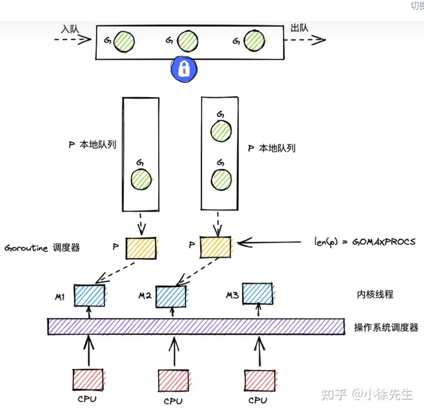

## GMP 模型

  

- gmp = goroutine + machine + processor 

- g

    - g 即goroutine，是 golang 中对协程的抽象；

    - g 有自己的运行栈、状态、以及执行的任务函数（用户通过 go func 指定）；

    - g 需要绑定到 p 才能执行，在 g 的视角中，p 就是它的 cpu.

- p 

    - p 即 processor，是 golang 中的调度器；

    - p 是 gmp 的中枢，借由 p 承上启下，实现 g 和 m 之间的动态有机结合；

    - 对 g 而言，p 是其 cpu，g 只有被 p 调度，才得以执行；

    - 对 m 而言，p 是其执行代理，为其提供必要信息的同时（可执行的 g、内存分配情况等），并隐藏了繁杂的调度细节；

    - p 的数量决定了 g 最大并行数量，可由用户通过 GOMAXPROCS 进行设定（超过 CPU 核数时无意义）.

- m

    - m 即 machine，是 golang 中对线程的抽象；

    - m 不直接执行 g，而是先和 p 绑定，由其实现代理；

    - 借由 p 的存在，m 无需和 g 绑死，也无需记录 g 的状态信息，因此 g 在全生命周期中可以实现跨 m 执行.

- M 是线程的抽象；G 是 goroutine；P 是承上启下的调度器；

- M调度G前，需要和P绑定；

- 全局有多个M和多个P，但同时并行的G的最大数量等于P的数量；

- G的存放队列有三类：P的本地队列；全局队列；和wait队列（io阻塞就绪态goroutine队列）；

- M调度G时，优先取P本地队列，其次取全局队列，最后取wait队列；这样的好处是，取本地队列时，可以接近于无锁化，减少全局锁竞争；

- 为防止不同P的闲忙差异过大，设立work-stealing机制，本地队列为空的P可以尝试从其他P本地队列偷取一半的G补充到自身队列.

## G

```go
type g struct {
    // ...
    m *m    // m：在 p 的代理，负责执行当前 g 的 m；
    // ...
    sched gobuf
    // ...
}

type gobuf struct {
    sp  uintptr
    pc  uintptr
    ret uintptr
    bp  uintptr
}

const(
  _Gidle = itoa // 0 协程开始创建时的状态，此时尚未初始化完成
  _Grunnable    // 1 协程在待执行队列中，等待被执行
  _Grunning     // 2 协程正在执行，同一时刻一个 p 中只有一个 g 处于此状态
  _Gsyscall     // 3 协程正在执行系统调用
  _Gwaiting     // 4 协程处于挂起态，需要等待被唤醒. gc、channel 通信或者锁操作时经常会进入这种状态
  _Gdead        // 6 协程刚初始化完成或者已经被销毁，会处于此状态
  _Gcopystack   // 8 协程正在栈扩容流程中
  _Gpreempted   // 9 协程被抢占后的状态
)
```

## M

```go
type m struct {
    // g0：一类特殊的调度协程，不用于执行用户函数，负责执行 g 之间的切换调度. 与 m 的关系为 1:1；
    g0 *g   
    // ...

    // tls：thread-local storage，线程本地存储，存储内容只对当前线程可见.
    // 线程本地存储的是 m.tls 的地址，m.tls[0] 存储的是当前运行的 g. 
    // 因此线程可以通过 g 找到当前的 m、p、g0 等信息.
    tls [tlsSlots]uintptr
    // ...
}
```

## P

```go
type p struct {
    // ...
    runqhead uint32 // 队列头部
    runqtail uint32 // 队列尾部
    runq     [256]guintptr // 本地 goroutine 队列，最大长度为 256.
    
    runnext guintptr    // 下一个可执行的 goroutine
    // ...
}
```

## schedt

```go
type schedt struct {
    // ...
    lock mutex // 一把操作全局队列时使用的锁；
    // ...
    runq     gQueue // 全局 goroutine 队列；
    runqsize int32  // 全局 goroutine 队列的容量.
    // ...
}
```

## 调度流程

- goroutine 的类型可分为两类:
    
    - 负责调度普通 g 的 g0，执行固定的调度流程，与 m 的关系为一对一

    - 负责执行用户函数的普通 g.

- m 通过 p 调度执行的 goroutine 永远在普通 g 和 g0 之间进行切换，当 g0 找到可执行的 g 时，会调用 gogo 方法，调度 g 执行用户定义的任务；当 g 需要主动让渡或被动调度时，会触发 mcall 方法，将执行权重新交还给 g0.

    ```go
    func gogo(buf *gobuf)
    func mcall(fn func(*g))
    ```

- 主动调度: 一种用户主动执行让渡的方式，主要方式是，用户在执行代码中调用了 runtime.Gosched 方法，此时当前 g 会当让出执行权，主动进入队列等待下次被调度执行.

    ```go
    // 加入全局队列
    func Gosched() {
        checkTimeouts()
        mcall(gosched_m)
    }

    // 加入本地runq
    func goyield() {
        checkTimeouts()
	    mcall(goyield_m)
    }
    ```

- 被动调度: 因当前不满足某种执行条件，g 可能会陷入阻塞态无法被调度，直到关注的条件达成后，g才从阻塞中被唤醒，重新进入可执行队列等待被调度. 常见的被动调度触发方式为因 channel 操作或互斥锁操作陷入阻塞等操作，底层会走进 gopark 方法. goready 方法通常与 gopark 方法成对出现，能够将 g 从阻塞态中恢复，重新进入等待执行的状态.

    ```go
    func gopark(unlockf func(*g, unsafe.Pointer) bool,
                lock unsafe.Pointer, reason waitReason,
                traceEv byte, traceskip int) {
        // ...
        mcall(park_m)
    }

    func goready(gp *g, traceskip int) {
        systemstack(func() {
            ready(gp, traceskip, true)
        })
    }
    ```

- 正常调度：g 中的执行任务已完成，g0 会将当前 g 置为死亡状态，发起新一轮调度.

- 抢占调度：倘若 g 执行系统调用超过指定的时长，且全局的 p 资源比较紧缺，此时将 p 和 g 解绑，抢占出来用于其他 g 的调度. 等 g 完成系统调用后，会重新进入可执行队列中等待被调度.

## 阻塞

- 由于原子、互斥量或通道操作调用导致 Goroutine 阻塞，调度器将把当前阻塞的 Goroutine 切换出去，重新调度 LRQ 上的其他 Goroutine；

- 由于网络请求和 IO 操作导致 Goroutine 阻塞。Go 程序提供了网络轮询器（NetPoller）来处理网络请求和 IO 操作的问题，其后台通过 kqueue（MacOS），epoll（Linux）或 iocp（Windows）来实现 IO 多路复用。通过使用 NetPoller 进行网络系统调用，调度器可以防止 Goroutine 在进行这些系统调用时阻塞 M。这可以让 M 执行 P 的 LRQ 中其他的 Goroutines，而不需要创建新的 M。执行网络系统调用不需要额外的 M，网络轮询器使用系统线程，它时刻处理一个有效的事件循环，有助于减少操作系统上的调度负载。用户层眼中看到的 Goroutine 中的“block socket”，实现了 goroutine-per-connection 简单的网络编程模式。实际上是通过 Go runtime 中的 netpoller 通过 Non-block socket + I/O 多路复用机制“模拟”出来的。

- 当调用一些系统方法的时候（如文件 I/O），如果系统方法调用的时候发生阻塞，这种情况下，网络轮询器（NetPoller）无法使用，而进行系统调用的 G1 将阻塞当前 M1。调度器引入 其它M 来服务 M1 的P。

- 如果在 Goroutine 去执行一个 sleep 操作，导致 M 被阻塞了。Go 程序后台有一个监控线程 sysmon，它监控那些长时间运行的 G 任务然后设置可以强占的标识符，别的 Goroutine 就可以抢先进来执行。

## sysmon 协程

- 在 linux 内核中有一些执行定时任务的线程, 比如定时写回脏页的 pdflush, 定期回收内存的 kswapd0, 以及每个 cpu 上都有一个负责负载均衡的 migration 线程等.在 go 运行时中也有类似的协程 sysmon. sysmon 运行在 M，且不需要 P。它会每隔一段时间检查 Go 语言runtime，确保程序没有进入异常状态。

- 系统监控的触发时间就会稳定在 10ms，功能比较多:

    - 检查死锁runtime.checkdead

    - 运行计时器 — 获取下一个需要被触发的计时器

    - 定时从 netpoll 中获取 ready 的协程

    - Go 的抢占式调度：当 sysmon 发现 M 已运行同一个 G（Goroutine）10ms 以上时，它会将该 G 的内部参数 preempt 设置为 true。然后，在函数序言中，当 G 进行函数调用时，G 会检查自己的 preempt 标志，如果它为 true，则它将自己与 M 分离并推入“全局队列”。由于它的工作方式（函数调用触发），在 for{} 的情况下并不会发生抢占，如果没有函数调用，即使设置了抢占标志，也不会进行该标志的检查。Go1.14 引入抢占式调度（使用信号的异步抢占机制），sysmon 仍然会检测到运行了 10ms 以上的 G（goroutine）。然后，sysmon 向运行 G 的 P 发送信号（SIGURG）。Go 的信号处理程序会调用P上的一个叫作 gsignal 的 goroutine 来处理该信号，将其映射到 M 而不是 G，并使其检查该信号。gsignal 看到抢占信号，停止正在运行的 G。

    - 在满足条件时触发垃圾收集回收内存

    - 打印调度信息,归还内存等定时任务.

## schedule

- (1) p 每执行 61 次调度，会从全局队列中获取一个 goroutine 进行执行，并将一个全局队列中的 goroutine 填充到当前 p 的本地队列中. (倘若发现本地队列 runq 已经满了，则会返回来将本地队列中一半的 g 放回全局队列中，帮助当前 p 缓解执行压力).

- (2) 尝试从 p 本地队列中获取一个可执行的 goroutine.

- (3) 倘若本地队列没有可执行的 g，会从全局队列中获取.

- (4) 倘若本地队列和全局队列都没有 g，则会获取准备就绪的网络协程.

- (5) work-stealing: 从其他 p 中偷取 g. 偷取操作至多会遍历全局的 p 队列 4 次，过程中只要找到可窃取的 p 则会立即返回. 为保证窃取行为的公平性，遍历的起点是随机的. 尝试偷取其现有的一半 g，并且返回实际偷取的数量.