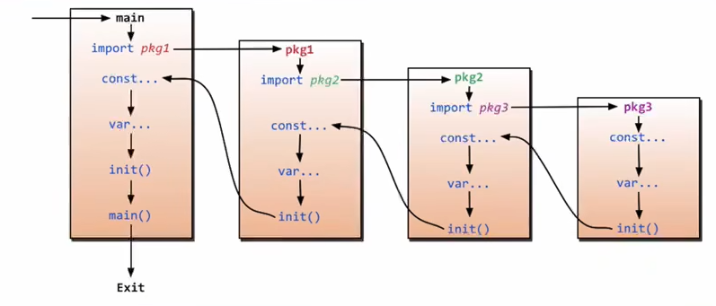

#### Hello, World

```go
package main

import (
	"fmt"
	"time"
)

func main() {
	fmt.Println("hello world!")
	time.Sleep(time.Second)
}
```

#### 变量声明

```go
package main

import (
	"fmt"
)

// global varibales
var g_A = 20

// g_B := 20 // error

func main() {

	var a int
	var b int = 10
	var c = 10
	d := 10
	var (
		e = 10
		f = "sb"
	)

	fmt.Printf("a = %2d, type = %T\n", a, a)
	fmt.Printf("b = %2d, type = %T\n", b, b)
	fmt.Printf("c = %2d, type = %T\n", c, c)
	fmt.Printf("d = %2d, type = %T\n", d, d)
	fmt.Printf("e = %2d, type = %T\n", e, e)
	fmt.Printf("f = %2s, type = %T\n", f, f)

}

```

#### 常量声明

```go
package main

import "fmt"

/**
 * 1. const 关键字的使用与 var 关键字的使用语法是类似的
 * 2. iota 关键字只能配合 const 关键字使用
 */

const (
	UP    = iota // 0
	DOWN         // 1
	LEFT         // 2
	RIGHT        // 3
)

const (
	a, b = iota + 1, iota + 2 // 1, 2
	c, d                      // 3, 4
	e, f                      // 5, 6
	g, h = iota * 2, iota * 3 // 6, 9
	i, j                      // 8, 12
)

func main() {
	const length int = 20
	fmt.Println("hello world")
}

```

#### 函数

```go
package main

import "fmt"

func add(a int, b int) int {
  return a + b
}

func sub(a int, b int) int {
	return a - b
}

func foo(a int, b int) (int, int) {
	return add(a, b), sub(a, b)
}

func bar(a int, b int) (r1 int, r2 int) {
	r1 = add(a, b)
	r2 = sub(a, b)
	return
}

func main() {
  fmt.Println(add(3, 2), sub(3, 2))
  fmt.Println(foo(3, 2))
  fmt.Println(bar(3, 2))
}

```

#### 包



- main包导入pkg1，将先导入pkg1中依赖的pkg2，然后初始化全局常量和全局变量，然后调用init函数。pkg1导入pkg2的方式是类似的，是一种递归调用

- main包中的init函数将再main函数前运行，可以在init函数中进行一些初始化操作

- 一个包中的函数名称的头字母为大写，代表这个函数对外公开，为小写则代表这个函数仅该包内部可见

```go
package main

import (
  lib0        // 导入lib0
  _ lib1      // 将lib1作为匿名包导入，此后即使不使用lib1提供的接口编译也不会报错，可以通过这种方法调用lib1的init方法而不调用其他api
  mylib2 lib2 // 导入lib2，并为lib2取别名为mylib2
  . lib3      // 导入lib3内部的所有变量和函数，使用它们时不再需要 "lib3.func(...)"，慎用
)
```

#### 指针

```go
package main

import "fmt"

func swap(pa *int, pb *int) {
	tmp := *pa
	*pa = *pb
	*pb = tmp
}

func main() {
	a, b := 1, 2
	swap(&a, &b)
	fmt.Println(a, b)
}

```

#### defer

```go
package main

import "fmt"

// defer 关键字类似于 unix 的 atexit 库函数，并且作用在函数调用

func defer_callback() {
	fmt.Println("defer...")
}

func return_callback() int {
	fmt.Println("return...")
	return 0
}

func foo() int {
	defer defer_callback()
	return return_callback()
}

func main() {
	foo()
}
```

#### 数组

- 静态数组：传参时是深拷贝

```go
arr := [10]int{1, 2, 3, 4}
```

- 动态数组：传参时是浅拷贝

```go
arr := []int{1, 2, 3, 4}
```

- 动态数组：make，nil

- 动态数组：length，cap（类似于c++vector），2倍扩容，指定length和cap：arr := make([]int, 3, 5)

- 动态数组：append：arr = append(arr, 10)

- 动态数组：切片视图（视图即浅拷贝）：arr0 := []int{1, 2, 3}, arr1 := arr0[0:2]

- 动态数组：深拷贝：arr0 := []int{1, 2, 3}, arr1 := make([]int, 3), copy(arr1, arr0)

#### map

```go
package main

import "fmt"

func main() {
	var map0 map[int]string
	map0 = make(map[int]string) // 必须有这行，否则段错误
	map0[0] = "c++"
	map0[1] = "go"
	map0[2] = "java"

	map1 := make(map[int]string)
	map1[0] = "c++"
	map1[1] = "go"
	map1[2] = "java"

	map2 := map[int]string{1: "c++", 2: "go", 3: "java"}
	fmt.Println(map0)
	fmt.Println(map1)
	fmt.Println(map2)

	// 增删改查
	map2[4] = "C#"
	delete(map2, 4)
	map2[3] = "C#"
	value, ok := map2[4]
	if ok {
		fmt.Println("map2[4] =", value)
	} else {
		fmt.Println("map2[4] = null")
	}

	for key, val := range map2 {
		fmt.Println(key, val)
	}
}
```

#### 面向对象

- 类的定义

```go
package main

import (
	"fmt"
)

type vector []int // c++: using vector = std::vector<int>;

type book struct {
	name  string /*> 书名 */
	price int    /*> 价格 */
}

func changePrice(x *book) {
	x.price = 30
}

func (this *book) getPrice() int {
	return this.price
}

// 操作是在一个右值副本里进行的，无法更改对象的属性
func (this book) setPriceErr(price int) {
	this.price = price
}

// 正确的实现
func (this *book) setPrice(price int) {
	this.price = price
}

func main() {
	var vc vector = vector{1, 2, 3}
	fmt.Println(vc)

	x := book{"go", 20}
	fmt.Println(x)
	changePrice(&x)
	fmt.Println(x)
	x.setPrice(40)
	x.setPriceErr(50)
	fmt.Println(x)
}
```

- 继承和覆盖

```go
package main

import "fmt"

type Point2 struct {
	x int
	y int
}

type Point3 struct {
	Point2
	z int
}

func (this *Point2) disp() {
	fmt.Println(this.x, this.y)
}

func (this *Point3) disp() {
	fmt.Println(this.x, this.y, this.z)
}

func main() {
	p0 := Point2{0, 1}
	p1 := Point3{p0, 2}
	p0.disp()
	p1.disp()
}
```

- 接口、多态、重写

```go
package main

import "fmt"

type Calculator interface {
	Execute(int, int) int
}

type Add struct {
	Calculator // 实现Calculator接口
}

type Sub struct {
	Calculator // 实现Calculator接口
}

func (this *Add) Execute(x int, y int) int {
	return x + y
}

func (this *Sub) Execute(x int, y int) int {
	return x - y
}

func Calculate(c Calculator, x int, y int) int {
	return c.Execute(x, y)
}

func main() {
	a := Add{}
	b := Sub{}
	fmt.Println(Calculate(&a, 3, 2))
	fmt.Println(Calculate(&b, 3, 2))
}
```

#### 万能引用

```go
package main

import "fmt"

// universal reference
func disp(obj interface{}) {
	fmt.Println(obj)
	value, ok := obj.([]int) // type assert: is obj slice<int> type?
	if ok {
		value[0] = 123
	}
}

func main() {
	arr0 := [3]int{1, 2, 3}
	arr1 := []int{1, 2, 3}
	disp(123)
	disp("hello")
	disp(arr0)
	disp(arr1)
	fmt.Println(arr0)
	fmt.Println(arr1)
}
```

#### 反射

```go
package main

import (
	"fmt"
	"reflect"
)

type Foo struct {
	Name string
	Age  int
}

func (this *Foo) Disp() {
	fmt.Println(*this)
}

func reflectType(arg interface{}) {
	typeinfo := reflect.TypeOf(arg)
	reflectValue := reflect.ValueOf(arg)

	if typeinfo.Kind() == reflect.Ptr {
		typeinfo = typeinfo.Elem()
		reflectValue = reflectValue.Elem()
	}

	fmt.Println("arg's type is:", typeinfo.Name())
	for i := 0; i < typeinfo.NumField(); i++ {
		fieldinfo := typeinfo.Field(i)
		var v = reflectValue.Field(i).Interface()
		fmt.Printf("field: %v(%v) = %v\n", fieldinfo.Name, fieldinfo.Type, v)
	}

	for i := 0; i < reflect.TypeOf(arg).NumMethod(); i++ {
		method := reflect.TypeOf(arg).Method(i)
		fmt.Printf("method: %v(%v)\n", method.Name, method.Type)
		reflect.ValueOf(arg).Method(i).Call(nil)
	}
}

func main() {
	x := Foo{"xxx", 111}
	reflectType(&x)
}
```

#### Tag与json解析

```go
package main

import (
	"encoding/json"
	"fmt"
	"time"
)

type Movie struct {
	Title  string   `json:"title"`
	Year   int      `json:"year"`
	Price  int      `json:"rmb"`
	Actors []string `json:"actors"`
}

func main() {
	movie := Movie{"JokeKing", 2000, 10, []string{"zyc, zbz"}}
	json_str, _ := json.Marshal(movie)
	fmt.Println((string)(json_str))
	movie = Movie{}
	json.Unmarshal(json_str, &movie)
	fmt.Println(movie)
}
```

#### goroutine

- go: go callable

- channel: 

	- 当管道大小为1时，向管道写数据后会阻塞直到另一个协程从管道中取出该数据，从管道读数据会阻塞直到管道非空

	- 当管道大小大于1时，只要管道没有满，写数据就不会发生阻塞；而从管道读数据则会阻塞直到管道非空

```go
package main

import (
	"fmt"
	"time"
)

func main() {
	c := make(chan int)
	go func() {
		defer fmt.Println("goroutine finished...")
		fmt.Println("goroutine running...")
		c <- 666
	}()

	time.Sleep(time.Second)
	num := <-c
	fmt.Println("num = ", num)
	fmt.Println("main goroutine finished...")
	time.Sleep(time.Second)
}
```

- range

```go
package main

import "fmt"

func main() {
	c := make(chan int)
	go func() {
		for i := 0; i < 5; i++ {
			c <- i
		}
		close(c)
	}()

	for data := range c {
		fmt.Println(data)
	}

	fmt.Println("Main Finished...")
}
```

- select

```go
package main

import "fmt"

func fibnacii(c, quit chan int) {
	x, y := 1, 1

	for {
		select {
		case c <- x:
			tmp := x
			x = y
			y = tmp + y
		case <-quit:
			fmt.Println("quit")
			return
		}

	}
}

func main() {
	c := make(chan int)
	quit := make(chan int)

	go func() {
		for i := 0; i < 10; i++ {
			fmt.Println(<-c)
		}
		quit <- 0
	}()

	fibnacii(c, quit)
}
```

#### 模块管理

- go mod init