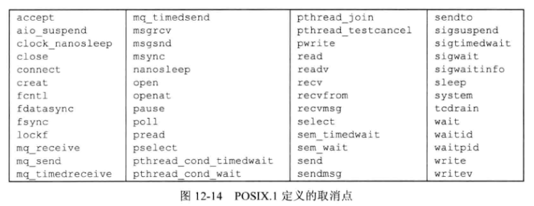
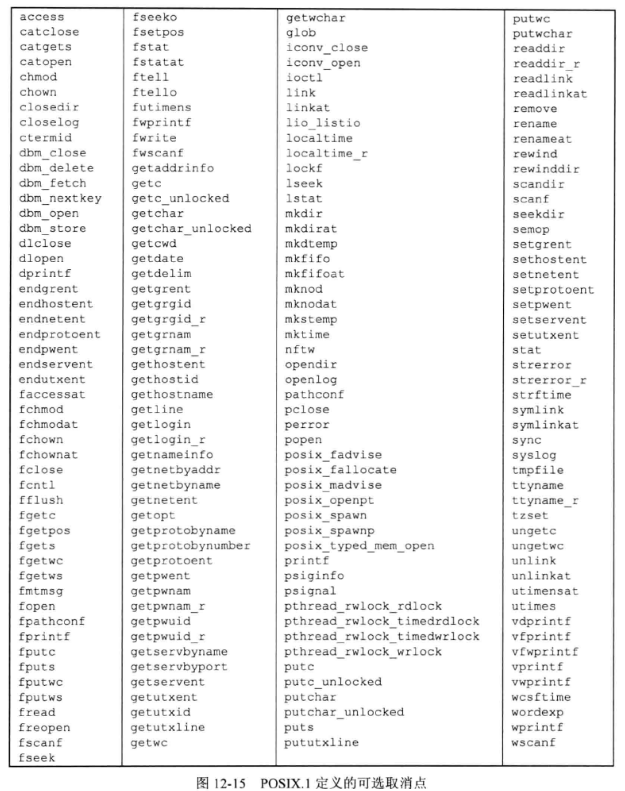

## 1 线程限制

- 线程限制可以通过 `sysconf` 函数进行查询

| 限制名称                         | 描述                                                 | `sysconf` 函数的 `name` 参数        | 值         |
| -------------------------------- | ---------------------------------------------------- | ----------------------------------- | ---------- |
| `PTHREAD_DESTRUNCTOR_ITERATIONS` | 线程退出时操作系统实现试图销毁线程特定数据的最大次数 | `_SC_THREAD_DESTRUNCTOR_ITERATIONS` | 4          |
| `PTHREAD_KEYS_MAX`               | 进程可以创建的键的最大数目                           | `_SC_THREAD_KEYS_MAX`               | 1024       |
| `PTHREAD_STACK_MIN`              | 一个线程的栈可用的最小字节数                         | `_SC_THREAD_STACK_MIN`              | 16384      |
| `PTHREAD_THREADS_MAX`            | 进程可以创建的最大线程数                             | `_SC_THREAD_THREADS_MAX`            | 无确定限制 |

## 2 线程属性

```cpp
#include <pthread.h>
int pthread_attr_init(pthread_attr_t *attr);
int pthread_attr_destroy(pthread_attr_t *attr);
// 两个函数的返回值：若成功，返回0；否则：返回错误编号
```

- `POSIX.1` 定义的线程属性

  | 名称          | 描述                                 |
  | ------------- | ------------------------------------ |
  | `detachstate` | 线程的分离状态属性                   |
  | `guardsize`   | 线程栈末尾的警戒缓冲区大小（字节数） |
  | `stackaddr`   | 线程栈的最低地址                     |
  | `stacksize`   | 线程栈的最小长度（字节数）           |

- 如果对现有的某个线程的终止状态不感兴趣的话，可以使用 `pthread_detach` 函数让操作系统在线程退出时收回它所占用的资源。

- 如果在创建线程时就知道不需要了解线程的终止状态，就可以修改 `pthread_attr_t` 结构中的 `detachstate` 线程属性，让线程一开始就处于分离状态：

  - `PTHREAD_CREATE_DETACHED` 以分离状态启动线程
  - `PTHREAD_CREATE_JOINABLE` 正常启动线程

  ```cpp
  #include <pthread.h>
  int pthread_attr_getdetachstate(const pthread_attr_t *restrict attr, int *detachstate);
  int pthread_attr_setdetachstate(pthread_attr_t *attr, int *detachstate);
  // 两个函数返回值：若成功，返回0；否则：返回错误编号
  ```

- 可以使用函数 `pthread_attr_getstack` 和 `pthread_attr_setstack` 对线程属性进行管理。

  ```cpp
  #include <pthread.h>
  int pthread_attr_getstack(const pthread_attr_t *restrict attr, void **restrict stackaddr, size_t *restrict stacksize);
  int pthread_attr_setstack(pthread_attr_t *attr, void *stackaddr, size_t stacksize);
  // 两个函数返回值：若成功，返回0；否则：返回错误编号
  ```

  - 进程虚地址空间大小是确定的，但对于线程而言，进程的虚地址空间需要被所有线程栈共享。如果应用程序使用了许多线程，以致这些线程栈的累积大小超过了可用的虚地址空间，就需要减少默认的线程栈大小。
  - 如果线程栈的虚地址空间都用完了，可以使用 `malloc` 或者 `mmap` 来为可替代的栈分配空间，并用 `pthread_attr_setstack` 函数来改变新建线程的栈位置。
  - `stackaddr` 线程属性被定义为线程栈的最低内存地址，但这并不一定是栈的开始位置，如果栈是从高地址向低地址方向增长的，那么 `stackaddr` 线程属性将是栈的结尾位置，而不是开始位置。

- 应用程序也可以通过 `pthread_attr_getstacksize` 和 `pthread_attr_setstacksize` 函数读取或设置线程属性 `stacksize`。

  ```cpp
  #include <pthread.h>
  int pthread_attr_getstacksize(const pthread_attr_t *restrict attr, size_t *restrict stacksize);
  int pthread_attr_setstacksize(pthread_attr_t *attr, size_t stacksize);
  // 两个函数返回值：若成功，返回0；否则：返回错误编号
  ```

  - 如果希望改变默认的栈大小，而不想自己处理线程栈的分配问题，这是使用 `pthread_attr_setstacksize` 函数就非常有用，设置时 `stacksize` 不能小于系统限制 `PTHRAED_STACK_MIN`。

- 线程属性 `guardsize` 控制这线程栈末尾之后用以避免栈溢出的扩展内存的大小，其默认值是由具体实现定义的，常用值是系统页大小。可以把 `guardsize` 设置为0，此时不提供警戒缓冲区。同样，如果修改了线程属性 `stackaddr` 系统就认为我们将自己管理栈，进而使栈警戒缓冲区机制无效，这等同于把 `guardsize` 线程属性设置为0。

  ```cpp
  #include <pthread.h>
  int pthread_attr_getguardsize(const pthread_attr_t *restrict attr, size_t *restrict guardsize);
  int pthread_attr_setguardsize(pthread_attr_t *attr, size_t *guardsize);
  // 两个函数返回值：若成功，返回0；否则：返回错误编号
  ```

  - 如果 `guardsize` 被修改了，操作系统可能会把它取为页面大小的整数倍。

- 此外，线程还有一些其他 `pthread_attr_t` 结构中没有表示的属性：可撤销状态和可撤销类型（见后文）。

## 3 同步属性

### 3.1 互斥量属性

- 初始化和反初始化

  ```cpp
  #include <pthread.h>
  int pthread_mutexattr_init(pthread_mutexattr_t *attr);
  int pthread_mutexattr_destroy(pthread_mutexattr_t *attr);
  // 两个函数返回值：若成功，返回0；否则：返回错误编号
  ```

- 进程共享属性

  ```cpp
  #include <pthread.h>
  int pthread_mutexattr_getpshared(const pthread_mutexattr_t *restrict attr, int *restrict pshared);
  int pthread_mutexattr_setpshared(pthread_mutexattr_t *attr, int pshared);
  // 两个函数返回值：若成功，返回0；否则：返回错误编号
  ```

  - `PTHREAD_PROCESS_PRIVATE`：仅允许在单个进程的不同线程中使用。
  - `PTHREAD_PROCESS_SHARED`：多个相互独立的进程可以把同一个内存数据块映射到它们各自独立的地址空间，此时这个内存数据块的就是一个临界资源。在该内存数据块上分配的互斥量设置了 `PTHREAD_PROCESS_SHARED` 属性时就可以被这些进程跨进程使用。

- 健壮属性

  ```cpp
  #include <pthread.h>
  int pthread_mutexattr_getrobust(const pthread_mutexattr_t *restrict attr, int *restrict robust);
  int pthread_mutexattr_setrobust(pthread_mutexattr_t *attr, int robust);
  // 两个函数返回值：若成功，返回0；否则：返回错误编号
  
  int pthread_mutex_consistent(pthread_mutex_t *mutex);
  // 返回值：若成功，返回0；否则：返回错误编号
  ```

  - 互斥量健壮属性与在多个进程间共享的互斥量有关，这意味着，当持有互斥量的进程终止时，需要解决互斥量状态恢复的问题。这种情况发生时，互斥量处于锁定状态，恢复起来很困难，其他阻塞在这个锁上的进程将会一直阻塞下去。

  - 健壮属性有两种取值： `PTHREAD_MUTEX_STALLED`（系统默认值）和 `PTHREAD_MUTEX_ROBUST` 。前者意味着当持有互斥量的进程终止时，其他试图获取该互斥量的进程会被“拖住”，而后者在其他进程试图获取该互斥量时不会被“拖住”，而是直接返回 `EOWNERDEAD` 而不是0。通过这个返回值我们可以知道此时需要对互斥量做状态恢复。
  - 如果应用状态无法恢复，在线程对互斥量解锁以后，该互斥量将处于永久不可用状态。为了避免这样的问题，线程可以调用`pthread_mutex_consistent` 函数，指明与该互斥量相关的状态在互斥量解锁之前是一致的。
  - 如果线程没有先调用 `pthread_mutex_consistent` 就对互斥量进行了解锁，那么其他试图获取该互斥量的阻塞线程就会得到错误码`ENOTRECOVERABLE`。如果发生这种情况，互斥量将不再可用。
  - 线程通过提前调用 `pthread_mutex_consistent`，能让互斥量正常工作，这样它就可以持续被使用。
  - 互斥量处于永久不可用状态时，我们必须先调用 `pthread_mutex_destroy` 来反初始化该锁，然后重新用锁的属性和锁的初始化函数来重新初始化该锁。

- 类型属性

  ```cpp
  #include <pthread.h>
  int pthread_mutexattr_gettype(const pthread_mutexattr_t *restrict attr, int *restrict type);
  int pthread_mutexattr_settype(pthread_mutexattr_t *attr, int type);
  // 两个函数返回值：若成功，返回0；否则：返回错误编号
  ```

  | 互斥量类型                 | 没有解锁时再次加锁 | 不占用时解锁 | 已解锁时再解锁 |
  | -------------------------- | ------------------ | ------------ | -------------- |
  | `PTHREAD_MUTEX_NORMAL`     | 死锁               | 未定义       | 未定义         |
  | `PTHREAD_MUTEX_ERRORCHECK` | 返回错误           | 返回错误     | 返回错误       |
  | `PTHREAD_MUTEX_RECURSIVE`  | 允许               | 返回错误     | 返回错误       |
  | `PTHREAD_MUTEX_DEFAULT`    | 未定义             | 未定义       | 未定义         |

  - `PTHREAD_MUTEX_NORMAL`：一种标准的互斥量类型，不做任何特殊的错误检查或死锁检测。
  - `PTHREAD_MUTEX_ERRORCHECK`：此互斥量类型提供错误检查。
  - `PTHREAD_MUTEX_RECURSIVE`：允许递归
  - `PTHREAD_MUTEX_DEFAULT`：提供默认特性和行为。例如 `Linux 3.2.0` 把这在类型映射为普通的互斥量类型。

### 3.2 读写锁属性

- 初始化和反初始化

  ```cpp
  #include <pthread.h>
  int pthread_rwlockattr_init(pthread_rwlockattr_t *attr);
  int pthread_rwlockattr_destory(pthread_rwlockattr_T *attr);
  // 两个函数返回值：若成功，返回0；否则：返回错误编号
  ```

- 进程共享属性：读写锁支持的唯一属性。该属性与互斥量的进程共享属性类似。

  ```cpp
  #include <pthread.h>
  int pthread_rwlockattr_getpshared(const pthread_rwlockattr_t *restrict attr, int *restrict pshared);
  int pthread_rwlockattr_setpshared(pthread_rwlockattr_t *attr, int pshared);
  // 两个函数返回值：若成功，返回0；否则：返回错误编号
  ```

### 3.3 条件变量属性

- 初始化和反初始化

  ```cpp
  #include <pthread.h>
  int pthread_condattr_init(pthread_condattr_t *attr);
  int pthread_condattr_destroy(pthread_condattr_t *attr);
  // 两个函数返回值：若成功，返回0；否则：返回错误编号
  ```

- 进程共享属性：该属性与互斥量的进程共享属性类似。

  ```cpp
  #include <pthread.h>
  int pthread_condattr_getpshared(const pthread_condattr_t *restrict attr, int *restrict pshared);
  int pthread_condattr_setpshared(pthread_condattr_t *attr, int pshared);
  // 两个函数返回值：若成功，返回0；否则：返回错误编号
  ```

- 时钟属性：控制计算 `pthread_cond_timewait` 函数的超时参数（`tsptr`）时采用的是哪个时钟。合法取值参考第 6 章。

  ```cpp
  #include <pthread.h>
  int pthread_condattr_getclock(const pthread_condattr_t *restrict attr, clockid_t *restrict clock_id);
  int pthread_condattr_setclock(pthread_condattr_t *attr, clockid_t clock_id);
  // 两个函数返回值：若成功，返回0；否则：返回错误编号
  ```

### 3.4 屏障属性

- 初始化和反初始化

  ```cpp
  #include <pthread.h>
  int pthread_barrierattr_init(pthread_barrierattr_t *attr);
  int pthread_barrierattr_destory(pthread_barrierattr_t *attr);
  // 两个函数返回值：若成功，返回0；否则：返回错误编号
  ```

- 进程共享属性

  ```cpp
  #include <pthread.h>
  int pthread_barrierattr_getpshared(const pthread_barrrierattr_t *restrict attr, int *restrict pshared);
  int pthread_barrierattr_setpshared(pthread_barrierattr_t *attr, int pshared);
  // 两个函数返回值：若成功，返回0；否则：返回错误编号
  ```

## 4 重入

- 线程安全函数：如果一个函数在相同的时间点可以被多个线程安全地调用，就称该函数是线程安全的。主要是针对数据竞争而言的，如果数据不需要共享，那么就让每个线程私有；如果数据需要共享就加锁。

- 可重入函数：可重入函数可以在执行的任意时刻中断后再次运行，不会出现非设计预期的结果。

- 异步信号安全函数：指线程在信号处理函数中不管以任何方式调用此函数时不死锁不修改数据，那就是信号安全的。

- 严格来说可重入函数需要区别是线程安全（弱可重入）还是信号安全（强可重入），但一般提及可重入指的就是信号安全。由于信号安全的要求高于线程安全，因此一个可重入函数必定是线程安全的，反之不成立（例如`malloc`函数是线程安全但不可重入的）。

  
  
- `POSIX.1` 还提供了以线程安全的方式管理 `FILE` 对象的方法。可以使用 `flockfile` 和 `ftrylockfile` 获取给定 `FILE` 对象关联的锁。这个锁是递归的。

  ```cpp
  #include <stdio.h>
  int ftrylockfile(FILE *fp);
  // 返回值：若成功，返回0；若不能获取锁，返回非0数值
  void flockfile(FILE *fp);
  void funlockfile(FILE *fp);
  ```

- 不加锁版本的基于字符的标准 `I/O` 例程

  ```cpp
  #include <stdio.h>
  int getchar_unlocked(void);
  int getc_unlocked(FILE *fp);
  // 两个函数返回值：若成功，返回下一个字符；若入到文件尾或出错，返回EOF
  int putchar_unlocked(int c);
  int putc_unlocked(int c, FILE *fp);
  // 两个函数返回值：若成功，返回c；若出错，返回EOF
  ```

## 5 线程特定数据

```cpp
#include <pthread.h>
int pthread_key_create(pthread_key_t *keyp, void (*destructor)(void*));
int pthread_key_delete(pthread_key_t *keyp);
int pthread_once(pthread_once_t *initflag, void （*initfn)(void));
//  三个函数返回值：若成功，返回0；否则，返回错误编号
pthread_once_t initflag = PTHREAD_ONCE_INIT;
```

- `pthread_key_create` 函数创建与线程特定数据相关联的键，这个键将用于获取对线程特定数据的访问，`destructor` 参数为该键关联一个析构函数，该参数可以为 `NULL`。
- `pthread_key_delete` 函数删除指定键。
- `pthread_once_t` 结构与 `pthread_once` 函数类似于 `cpp` 的 `once_flag` 和 `call_once`。

```cpp
#include <pthread.h>
void *pthread_getspecific(pthread_key_t key);
// 返回值：线程特定数据值；若没有值与该键位关联，返回NULL
int pthread_setspecific(pthread_key_t key, const void *value);
// 返回值：若成功，返回0；否则，返回错误编号
```

- 可以通过 `pthread_getspecific` 函数获得线程特定数据的地址。
- 可以通过 `pthread_setspecific` 函数把键和线程特定数据关联起来。
- 如果没有线程特定数据值与键关联，`pthread_getspecific` 将返回一个空指针，我们可以用这个返回值来确定是否要调用 `pthread_setspecific`。

## 6 取消选项

```cpp
#include <pthread.h>
int pthread_setcancelstate(int state, int *oldstate);
int pthread_setcanceltype(int type, int *oldtype);
// 返回值：若成功，返回0；否则，返回错误编号
```

- 有两个线程属性并没有包含在 `pthread_attr_t` 结构中，它们是可取消状态和可取消类型。这两个属性影响线程响应 `pthread_cancel` 函数调用时的行为。

- 可取消状态属性可以是 `PTHREAD_CANCEL_ENABLE`，也可以是 `PTHREAD_CANCEL_DISABLE`。线程可以通过 `pthread_setcancelstate` 进行修改。

- `pthread_setcancelstate` 把当前的可取消状态设置为 `state`，把原来的可取消状态存储在由 `oldstate` 指向的内存单元，这两步是一个原子操作。

- `pthread_cancel` 调用并不等待线程终止。在默认情况下，线程在取消请求发出以后还是继续运行，直到线程到达某个取消点。取消点是线程检查它是否被取消的一个位置，如果取消了，则按照请求行事。`POSIX.1` 保证在线程调用下列任何函数时，取消点都会出现。

  

- 线程启动时默认的可取消状态是 `PTHREAD_CANCEL_ENABLE`。当状态设为 `PTHREAD_CANCEL_DISABLE` 时，对 `pthread_cancel` 的调用并不会杀死线程。相反，取消请求对这个线程来说还处于挂起状态，当取消状态再次变为 `PTHREAD_CANCEL_ENABLE` 时，线程将在下一个取消点对所有挂起的取消请求进行处理。

- `POSIX.1` 还指定了下列函数作为可选的取消点。

  

- `pthread_setcanceltype` 函数修改线程的取消类型。参数类型可以是 `PTHREAD_CANCEL_DEFFERED`，也可以是 `PTHREAD_CANCEL_ASYNCHRONOUS`。前者为默认行为（延迟取消），后者为异步取消。

- 异步取消时，线程可以在任意时间撤销，不是非得遇到取消点才能被取消。

## 7 线程和信号

```cpp
#include <signal.h>
int pthread_sigmask(int how, const sigset_t *restrict set, sigset_t *restrict oset);
int sigwait(const sigset_t *restrict set, int *restrict signop);
// 两个函数返回值：若成功，返回0，否则，返回错误编号
```

- 每个线程均有自己的信号屏蔽字，`pthread_sigmask` 函数与 `sigprocmask` 函数基本相同，不过 `pthread_sigmask` 修改 `threadlocal` 的屏蔽字，而 `sigprocmask` 仅工作在单线程。另外一个区别是 `pthread_sigmask` 失败时返回错误码，而 `sigprocmask` 错误时设置 `errno` 并返回 -1。
- 线程可以调用 `sigwait` 函数等待一个或多个信号的出现，`set` 参数指定了要等待的信号集，返回时，`signop` 指向的整数将包含发送信号的数量。
- 对于 `  sigwait` 函数，如果参数 `set` 中的某个信号在  `sigwait` 调用的时候处于挂起状态，那么 `sigwait` 将无阻塞的返回。在返回之前，`sigwait` 将从进程中移除那些 `set`参数中包含了的且处于挂起等待状态的信号。如果具体实现支持排队信号，并且信号的多个实例被挂起，那么 `sigwait` 将会移除该信号的一个实例，其他的实例还要继续排队。
- 为了避免错误行为的发生，线程在调用 `sigwait` 之前，必须阻塞那些它正在等待的信号（`set` 参数中包含的信号）。`sigwait` 函数会原子地取消信号集 `set` 中信号的阻塞状态，然后使得调用线程休眠，直到有 `set` 中包含的信号被递送，此时该函数将会返回，在返回之前，`sigwait` 函数将会恢复线程中的信号屏蔽字。
- 对于 `sigwait` 函数，如果 `set` 参数中的信号没有被阻塞，那么在 `sigwait` 函数调用返回之前会有一个时间窗，在这个时间窗内，`set` 参数中的信号就有可能会被发送给线程，从而导致该信号被 `sigwait` 调用丢失。
- 在进程环境中，对信号的处理是，先注册信号处理函数，当信号异步发生时，调用处理函数来处理信号。它**完全是异步**的。然而信号处理函数的实现，有着许多的限制；比如有一些函数不能在信号处理函数中调用；再比如一些函数 `read`、`recv` 等调用时会被异步的信号给中断(`interrupt`)，因此我们必须对在这些函数在调用时因为信号而中断的情况进行处理（判断函数返回时 `errno` 是否等于 `EINTR`）。
- 但是在多线程中处理信号的原则却完全不同，它的基本原则是：将对信号的异步处理，转换成同步处理，也就是说用一个线程专门的来 “同步等待” 信号的到来（使用 `sigwait` 函数），而其它的线程可以完全不被该信号中断/打断(`interrupt`)。这样就在相当程度上简化了在多线程环境中对信号的处理。而且可以保证其它的线程不受信号的影响。这样我们对信号就可以完全预测，因为它不再是异步的，而是同步的（我们完全知道信号会在哪个线程中的哪个执行点到来而被处理！）。而同步的编程模式总是比异步的编程模式简单。其实多线程相比于多进程的其中一个优点就是：多线程可以将进程中异步的东西转换成同步的来处理。

```cpp
#include <signal.h>
int pthread_kill(pthread_t thread, int signo);
// 返回值：若成功，返回0，否则，返回错误编号
```

- `pthread_kill` 函数把信号发送给线程。可以传入一个 0 值的 `signo` 来检查线程是否存在。如果信号的默认处理动作是终止该进程，那么把信号传递给某个线程仍然会杀死整个进程。
- 注意，闹钟定时器时进程资源，并且所有线程共享相同的闹钟。所以，进程中的多个线程不可能互不干扰地使用闹钟定时器。

## 8 线程和 `fork`
- 子进程通过继承整个地址空间的副本，还从父进程那儿继承了每个互斥量、读写锁和条件变量的状态。如果父进程包含了一个以上的线程，子进程在 `fork` 返回以后，如果不是紧接着不是马上调用 `exec` 的话，就需要清理锁状态。
- 在子进程内部，只存在一个线程，它是由父进程中调用 `fork` 的线程的副本构成的。如果父进程中的线程占有锁，子进程将同样占有这些锁。问题是子进程并不包含占有锁的线程的副本，所以子进程没有办法知道它占有哪些锁、需要释放哪些锁。
- 如果子进程从 `fork` 返回以后马上调用 `exec`，就可以避免这样的问题，这种情况下，旧的地址空间就被丢弃，所以锁的状态无关紧要。但如果子进程需要继续做处理工作的话，这种策略就不行，还需要使用其他策略。
- 在多线程的进程中，为了避免不一致状态的问题，`POSIX.1` 声明，在 `fork` 返回和子进程调用 `exec` 之间，子进程只能调用异步信号安全的函数。这就限制了在调用 `exec` 之前能做什么，但不涉及子进程中锁的状态的问题。
- 要清除锁状态，可以通过调用 `pthread_atfork` 函数建立 `fork` 处理程序。

```cpp
#include <pthread.h>
int pthread_atfork(void (*prepare)(void), void (*parent)(void), void (*child)(void));
// 返回值：若成功，返回0；否则，返回错误编号
```
- 用 `pthread_atfork` 函数最多可以安装3个帮助清理锁的函数。`prepare` 函数由父进程在 `fork` 创建子进程前调用，这个函数的任务是获取父进程定义的所有锁。`parent` 函数是在 `fork` 创建子进程以后、返回之前在父进程上下文中调用的，这个 `fork` 函数的任务是对 `prepare` 函数获取的所有锁进行解锁。`child` 函数在 `fork` 返回之前在子进程上下文中调用，与 `parent` 处理程序一样，`child` 函数也必须释放 `prepare` 处理程序中的所有锁。
- 可以多次调用 `pthread_atfork` 函数从而设置多套 `fork` 处理程序。如果不需要其中某个处理程序，可以给特定的处理程序参数传入空指针。使用多个 `fork` 处理程序时，处理程序的调用顺序并不相同。`parent` 和 `child` 函数是以它们注册时的顺序进行调用的，而 `prepare` 函数的调用顺序与它们注册时的顺序相反。这样可以允许多个模块注册它们自己的 `fork` 处理程序，而且可以保持锁的层次。
- 虽然 `pthread_atfork` 机制的意图是使 `fork` 之后的锁状态保持一致，但它还是存在一些不足之处，只能在有限的情况下使用。
  - 没有很好的办法对较复杂的同步对象（如条件变量或者屏障）进行状态的重新初始化。
  - 某些错误检查的互斥量实现在 `child` 函数试图对被父进程加锁的互斥量进行解锁时会产生错误。
  - 递归互斥量不能在 `child` 函数中清理，因为没有办法确定该互斥量被加锁的次数。

## 9 线程和 `IO`

- 第 3 章中的 `pread` 和 `pwrite` 函数在多线程环境下是非常有用的，因为进程中的所有线程共享相同的文件描述符。

