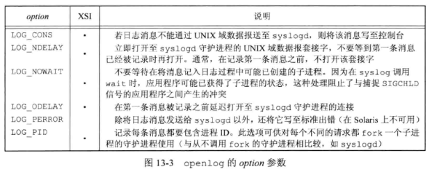
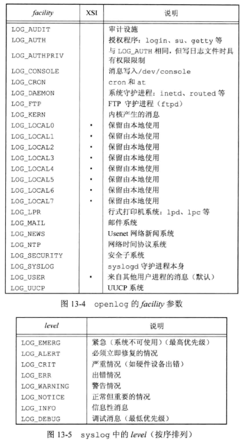

## 1 守护进程的特征

- 守护进程时生存期长的一种进程，它们常常在系统引导装入时启动，仅在系统关闭时终止。
- 没有控制终端，运行在后台。
- 使用 `ps -axj` 打印进程信息。

## 2 编程规则

- 首先要调用 `umask` 将文件模式创建屏蔽字设置为一个已知值（通常是0）。由继承得来的文件模式创建屏蔽字可能会被设置为拒绝某些权限。
- 调用 `fork`，然后使父进程 `exit`。这样做使得子进程在可以在后台运行，且子进程继承了父进程的进程组`ID`，但获得了一个新的进程`ID`，这就保证了子进程不是一个进程组的组长，从而可以调用 `setsid`。
- 调用 `setsid` 创建一个新会话，使得该进程成为一个新会话的首进程，同时成为一个新进程组的组长且没有控制终端。
- 由于会话首进程具有打开一个新的控制终端的能力，为了避免守护进程打开一个控制终端，此时再调用一次 `fork`，本进程退出，子进程运行，且子进程不再是会话首进程，不能再打开控制终端，同时子进程也会成为一个孤儿进程，被 `init` 收养。
- 将当前工作目录更改为根目录或者指定的工作目录。
- 关闭不再需要的文件描述符。
- 将标准输入、标准输出、标准错误绑定到 `/dev/null`。

## 3 出错记录

```cpp
#include <syslog.h>
void openlog(const char *ident, int option, int facility);
void syslog(int priority, const char *fmt, ...);
void colselog(void);
int setlogmask(int maskpri);
// 返回值：前日志记录优先级屏蔽字
```

- 以下3种方法可以产生日志：
  - 内核例程调用 `log` 函数。任一用户进程都可以打开和读取 `/dev/klog` 设备来读取这些消息。
  - 用户进程调用 `syslog` 函数产生日志，这些消息被发送至 `UNIX` 域数据报套接字 `dev/log`。
  - 本地用户或远程用户都可以将日志消息发送到 `UDP` 端口 `514`。
  
- `openlog` 函数的调用是可选的，如果不调用它，则在第一次 `syslog` 时，自动调用 `openlog`。

- `closelog` 函数的调用是可选的，它仅仅关闭曾被用于与 `syslogd` 收集进程进行通信的描述符。

- `openlog` 函数的 `ident` 参数指定一个标识，此 `ident` 将被加至每则日志中。`ident` 一般是程序的名称。`option` 参数指定各种选项的位屏蔽。`facility` 参数指定产生日志的设备。

- `syslog` 函数的 `priority` 参数是 `openlog` 函数的 `facility` 参数与 `level` 的组合（按位与）。`option`、`facility`、`level` 参数取值如表所示。`level` 值按优先级从高到低依次排序。

- `setlogmask` 函数用于设置进程的记录优先级屏蔽字，当设置了记录优先级屏蔽字时，个消息除非已在优先级屏蔽字中进行了设置，否则将不被记录。

- 大多数 `syslog` 实现将消息短时间处于队列中。如果在此时间中有重复的消息到达，那么 `syslog` 守护进程不会把它写入到日志中，而是会打印输出一条类似于 "上一条消息重复了N次" 的消息。

  

  

## 4 单实例守护进程

- 为了实现单实例守护进程，通常的方法是使得每一个守护进程创建一个固定名字的文件，并在该文件的整体上加一把写锁，那么只允许创建一把这样的写锁。在此之后创建写锁的尝试都会失败。
- 文件和记录锁提供了一种方便的互斥机制。如果守护进程在一个文件的整体上得到一把写锁，那么在该守护进程终止时，这把锁将被自动删除。

## 5 守护进程的惯例

- 若守护进程使用锁文件，那么该文件通常存储在 `/var/run` 目录中，需要注意，守护进程可能需要具有超级用户权限才能在此目录下创建文件。锁文件的名字通常是 `name.pid`，其中，`name` 是该守护进程或服务的名字。
- 若守护进程支持配置选项，配置文件通常存放在 `/etc` 目录中，文件名通常是 `name.conf`。
- 守护进程可用命令行启动，但通常它们是由系统初始化脚本之一启动的。
- 守护进程是孤儿进程，没有控制终端，因而可以安全地重复使用 `SIGHUP`，可以通过该信号重新读取配置文件。

## 6 客户进程-服务器进程模型

- 在服务进程中调用 `fork` 然后 `exec` 另一个程序来向客户进程提供服务是很常见的。这些服务器进程通常管理者多个文件描述符：通信端点，配置文件，日志文件和类似的文件。子进程保持这些描述符打开可能会导致安全问题，`exec` 的程序可能有一些恶意行为，如更改服务端配置文件或欺骗客户端程序使其认为正在与服务器端通信，从而获取未授权的信息。
- 解决此问题的一个简单方法是对所有被执行程序不需要的文件描述符设置执行时关闭（`close-on-exec`）标志。
