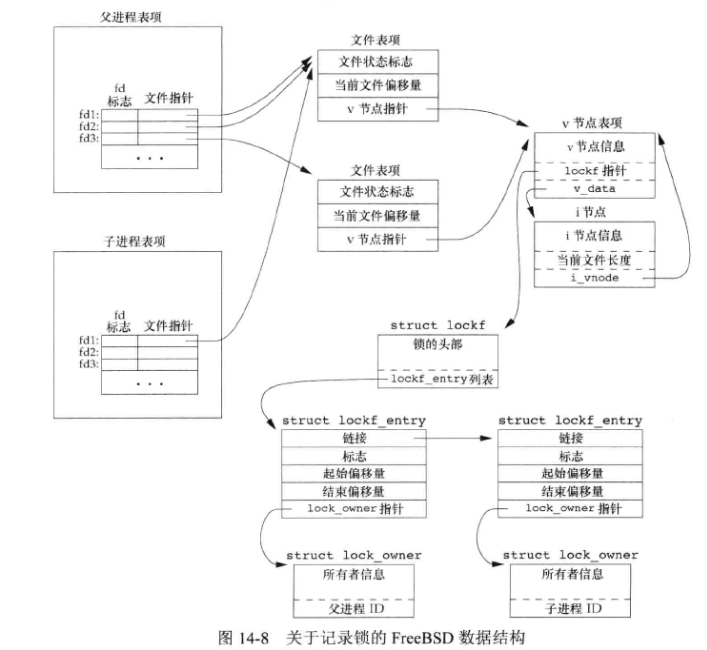

## 1 非阻塞 `IO`

- 非阻塞 `IO` 使我们可以翻出 `open`、`read`、`write` 等 `IO` 操作，并使这些操作不会永远阻塞，如果这些操作不能完成，则调用立即出错返回，表示该操作如果继续执行将阻塞。

- 对于一个给定的描述符，有三种为其指定为非阻塞 `IO` 的方法

  - 如果调用 `open` 获得该描述符，则可指定 `O_NONBLOCK` 标志。
  - 对于已经打开的描述符，则可调用 `fcntl`，由该函数打开 `O_NONBLOCK` 文件状态标志。
  - `ioctl` 函数也有类似功能。

  ```cpp
  // 实现方式一
  int setFdNonBlock(int fd) {
      assert(fd > 0);
      int val;
      if ((val = fcntl(fd, F_GETFL, 0)) < 0)
          return -1;
      val |= O_NONBLOCK;
      if (fcntl(fd, F_SETFL, val) < 0)
          return -1;
      return 0;
  }
  // 实现方式二
  int setFdNonBlock(int fd) {
      assert(fd > 0);
      int nb = 1;
      return ioctl(fd, FIONBIO, &nb);
  }
  ```

## 2 记录锁

```cpp
#include <fcntl.h>
int fcntl(int fd, int cmd, .../* struct flock *flockptr */);

struct flock {
  short l_type;		/* F_RDLCK, F_WRLCK, or F_UNLCK */
  short l_whence;	/* SEEK_SET, SEEK_CUR, or SEEK_END */
  short l_start;	/* offset in bytes, relative to l_whence */
  short l_len;		/* length, in bytes; 0 means lock to EOF */
  short l_pid;		/* returned with F_GETLK */
};
```

- 记录锁的功能是：当第一个进程正在读取或修改文件的某个部分时，使用记录锁可以阻止其他进程修改同一文件区。一个更适合的术语可能是 `字节范围锁`。

- 锁可以在当前文件尾端处开始或者越过尾端处开始，但不能在文件的起始位置之前开始。

- 若 `l_len` 为 `0`，则表示锁的范围可以扩展到最大可能偏移量。

- 为了对整个文件加锁，我们设置 `l_start` 和 `l_whence` 指向文件的起始位置，并指定长度 `l_len` 为0。

- 对于不同进程而言，记录锁类似与读写锁。对于单个进程而言，如果该进程对一个文件区间已有了一把锁，后来该进程又企图在同一文件区间再加一把锁，那么新锁将替换已有锁。

- 加读锁时，该描述符必须是读打开的；加写锁时，该描述符必须是写打开的。

- `fcntl` 函数的 `cmd` 参数（仅关注记录锁相关的选项）：

  - `F_GETLK`：判断由 `flockptr` 描述的锁是否会被另外一把锁排斥。如果存在一把锁，它阻止创建由 `flockptr` 描述的锁，则该现有锁的信息将重写 `flockptr` 指向的信息。如果不存在这种情况，则除了将 `l_type` 设置为 `F_UNLCK` 之外，`flockptr` 所指向结构中的其他信息保持不变。
  - `F_SETLK`：设置由 `flockptr` 所描述的锁。如果上锁冲突，则 `fcntl` 立即出错返回，`errno` 设置为 `EACCES` 或 `EAGAIN`。
  - `F_SETLKW`：`F_SETLK` 的阻塞版本，上锁冲突时，休眠调用进程。如果请求创建的锁已经可用，或者休眠由信号中断，则该进程被唤醒。

- 如果系统检测到了死锁（多个进程阻塞），内核会选择一个进程接收出错返回，而不是让他继续被阻塞。

- 锁与进程和文件二者相关联。

  - 当一个进程终止时，它所建立的锁全部释放。
  - 关闭一个描述符时，该进程通过这一描述符引用的文件上的所有锁都会被释放。
  - 由 `fork` 产生的子进程不继承父进程所设置的锁。（因为记录锁是进程独占资源）。
  - 在执行 `exec` 后，新程序可以继承原程序的锁（因为进程主体没有改变）。但如果设置了 `CLOSE_ON_EXEC` 时例外。

- 记录锁数据结构示例：

  ```cpp
  fd1 = open(pathname, ...);
  write_lock(fd1, 0, SEEK_SET, 1); /* parent write locks byte 0 */
  if ((pid = fork()) > 0) {	/* parent */
      fd2 = dup(fd1);
      fd3 = open(pathname, ...);
  } else if (pid == 0) {
      read_lock(fd1, 1, SEEK_SET, 1); /* child read locks byte 1 */
  }
  ```

  

- 在文件尾端加锁示例：

  ```cpp
  writew_lock(fd, 0, SEEK_END, 0); /* 阻塞式地对当前文件末端之后的字节加写锁 */
  write(fd, buf, 1); /* 这个字节现在是被加了写锁的状态 */
  un_lock(fd, 0, SEEK_END, 0); /* 解锁当前文件末端之后的字节 */
  write(fd, buf, 1); /* 这个字节现在是没有上锁的 */
  ```

- 建议性锁和强制性锁：

  - 建议性锁：建议性锁仅影响跨进程的记录锁上锁操作（可能会上锁冲突）。
  - 强制性锁：强制性锁不仅影响跨进程的记录锁上锁操作，还会影响跨进程的读写操作。对于特定文件打开其设置组 `ID` 位、关闭其组执行位便开启了对该文件的强制性锁机制，因为当组执行位关闭时，设置组 `ID` 位不再有意义，所以 `SVR3` 的设计者借用两者的这种组合来指定对一个文件的锁是强制性的而非建议性的。

## 3 `I/O` 多路转接

### 3.1 `I/O` 多路转接

- 当我们需要处理多个描述符的读写时，我们不能在任一描述符上进行阻塞读写，这种情况下需要 `I/O` 多路转接技术。

- `I/O` 多路转接（多路复用），为了使用这种技术，先构造一张我们感兴趣的描述符的列表，然后调用一个函数（例如 `select`），直到这些描述符中的一个已准备好进行 `I/O` 时，该函数才返回。`poll`、`select` 和 `pselect` 这3个函数使我们能执行 `I/O` 多路转接。从这些函数返回时，进程会被告知哪些描述符已经准备好可以进行 `I/O`，使用这种返回信息，就可调用相应的 `I/O` 函数（一般是 `read` 或 `write`），并且确知该函数不会阻塞。

### 3.2 函数 `select` 和 `pselect`

```cpp
#include <sys/select.h>
int select(int maxfdp1, fd_set *restrict readfds, fd_set *restrict writefds, fd_set *restrict exceptfds, struct timeval *restrict tvptr);

int pselect(int maxfdp1, fd_set *restrict readfds, fd_set *restrict writefds, fd_set *restrict exceptfds, const struct timespec *restrict  tsptr, const sigset_t *restrict sigmask);
// 两个函数返回值：准备就绪的描述符数目；若超时，返回0；若出错，返回-1

int FD_ISSET(int fd, fd_set *fdset);
// 返回值：若fd在描述符集中，返回非0值；否则，返回0
void FD_CLR(int fd, fd_set *fdset);	// 置0
void FD_SET(int fd, fd_set *fdset);	// 置1
void FD_ZERO(fd_set *fdset);		// 清空
```

- `maxfdp1` 参数的含义是 "最大的文件描述符编号加 1"。考虑所有 3 个描述符集，在这 3 个集合中找出最大的描述符编号值然后加 1，这就是 `maxfdp1` 参数值。也可以将 `maxfdp1` 参数设置为 `FD_SETSIZE`，这个宏指定最大描述符数（经常为 1024）。
- `readfds`、`writefds` 和 `exceptfds` 参数是指向描述符集的指针，分别说明了我们关心的可读、可写或处于异常条件的描述符集合。每个描述符集存储在一个 `fd_set` 数据类型中。这个数据类型是由实现选择的，我们可以认为它只是一个很大的字节数组。
- `tvptr` 和 `tsptr` 指定愿意等待的时间长度（选用的时间数据类型不同）。
  - 该参数为 `NULL`，则阻塞等待。当有 `I/O` 事件到来或捕捉到一个信号时返回。如果被信号中断，函数返回 `-1`，`errno` 设置为 `EINTR`。
  - 该参数为 `0`，则不等待，测试所有指定的描述符并立即返回。
  - 该参数为非 `0`，则等待指定时长，若超时返回，则返回值为 `0`，否则返回就绪的描述符数目（3个描述符集中就绪描述符数量之和）。
- `select` 和 `pselect` 函数若等待到了 `I/O` 事件，返回时会修改三个描述符集指针指向的描述符集为发生对应事件的描述符的集合。
- 如果在一个描述符上碰到了文件尾端，则 `(p)select` 会认为该描述符是可读的。然后如果调用 `read` 则会返回 `0`。（很多人错误地认为，当到达文件尾端时，`select` 会指示一个异常条件。
- `pselect` 函数可使用可选信号屏蔽字，若 `sigmask` 不为 `NULL`，`pselect` 以原子操作的方式安装该信号屏蔽字，返回时恢复以前的信号屏蔽字。

### 3.3 函数 `poll`

```cpp
#include <poll.h>
int poll(struct pollfd fdarray[], nfds_t nfds, int timeout);
// 返回值：准备就绪的描述符数目；若超时，返回0；若出错，返回-1

struct pollfd {
  int fd;	/* file descriptor to check, or < 0 to ignore */
  short events; /* events of interest on fd */
  short revents;/* events that occurred on fd */
};
```

- 与 `select` 不同， `poll` 不是为每个条件（可读性、可写性和异常条件）构造一个描述符集，而是构造一个 `pollfd` 结构的数组，每个数组元素指定一个描述符编号以及我们对该描述符感兴趣的事件。

- `nfds` 参数指定 `fdarray` 数组中的元素数量。

- `timeout` 参数指定等待时间（毫秒）。

  - `timeout == -1`：阻塞等待，除非事件到来或被信号中断。
  - `timeout == 0`：不等待，测试所有描述符并立即返回。
  - `timeout > 0`：等待 `timeout` 毫秒。

- `poll` 函数返回时，会将每个描述符发生的事件写入到 `pollfd` 结构中的 `revents` 字段中。

- `pollfd` 结构中的 `events` 和 `revents` 标志如表所示

  | 标志名       | 说明                                                         |
  | ------------ | ------------------------------------------------------------ |
  | `POLLIN`     | 可以不阻塞地读高优先级数据意外的数据（等效于 `POLLRDNORM` | `POLLRDBAND`） |
  | `POLLRDNORM` | 可以不阻塞地读普通数据                                       |
  | `POLLRDBAND` | 可以不阻塞地读优先级数据                                     |
  | `POLLPRI`    | 可以不阻塞地读高优先级数据                                   |
  | `POLLOUT`    | 可以不阻塞地写普通数据                                       |
  | `POLLWRNORM` | 与 `POLLOUT` 相同                                            |
  | `POLLWRBAND` | 可以不阻塞地写优先级数据                                     |
  | `POLLERR`    | 已出错                                                       |
  | `POLLHUP`    | 已挂断                                                       |
  | `POLLNVAL`   | 描述符没有引用一个打开文件                                   |

### 3.4 函数 `epoll`

```cpp
int epoll_create(int size);
// 创建一个 epoll 对象，返回该对象的描述符，注意要使用 close 关闭该描述符, size 这个参数现在已经被忽略了，只要求 size 大于 0 即可。

typedef union epoll_data {
  void        *ptr;
  int          fd;
  uint32_t     u32;
  uint64_t     u64;
} epoll_data_t; // 8 Byte
 
struct epoll_event {
  uint32_t     events;      /* Epoll事件 */
  epoll_data_t data;        /* 用户数据 */
};

/**
 *@brief 操作控制 epoll 对象，主要涉及 epoll 红黑树上节点的一些操作，比如添加节点，删除节点，修改节点事件。
 *@event: 添加事件：相当于往红黑树添加一个节点，每个客户端连接服务器后会有一个通讯套接字，这个通讯套接字就是红黑树的 key。
 *@event: 修改事件：把红黑树上监听的 socket 对应的监听事件做修改。
 *@event: 删除事件：相当于取消监听 socket 的事件。
 *@param epfd 通过 epoll_create 创建的 epoll 对象句柄。
 *@param op 对红黑树的操作，添加节点、删除节点、修改节点监听的事件，分别对应 EPOLL_CTL_ADD，EPOLL_CTL_DEL，EPOLL_CTL_MOD。
 *@param fd 需要添加监听的 socket 描述符，可以是监听套接字，也可以是与客户端通讯的通讯套接字。
 *@param event 事件信息。
 **/
int epoll_ctl(int epfd, int op, int fd, struct epoll_event *event);

/**
 *@brief 阻塞一段时间并等待事件发生，返回事件集合。说白了就是遍历双向链表，把双向链表里的节点数据拷贝出来，拷贝完毕后就从双向链表移除。
 *@note 节点被从双向链表移除，但仍然存在于红黑树上，事实上，节点通过红黑树管理，同时也通过指针被连接成了一个链表。
 *@param epid epoll_create 返回的 epoll 对象描述符。
 *@param events 存放就绪的事件集合，这个是传出参数。
 *@param maxevents 代表可以存放的事件个数，也就是 events 数组的大小。
 *@param timeout 阻塞等待的时间长短，以毫秒为单位，如果传入 -1 代表阻塞等待。
 *@return int 准备就绪的描述符数目；若超时，返回0；若出错，返回-1
 **/
int epoll_wait(int epid, struct epoll_event *events, int maxevents, int timeout);
```

- `epoll_event` 结构 `events` 参数取值：

  | events参数取值 | 含义                                                         |
  | -------------- | ------------------------------------------------------------ |
  | `EPOLLIN`      | 监听 `fd` 的读事件。举例：如果客户端发送消息过来，代表服务器收到了可读事件。 |
  | `EPOLLOUT`     | 监听 `fd` 的写事件。如果 `fd` 对应的发数据内核缓冲区不为满，只要监听了写事件，就会触发可写事件。 |
  | `EPOLLPRI`     | 监听紧急数据可读事件。                                       |
  | `EPOLLERR`     | 表示对应的文件描述符发生错误。                               |
  | `EPOLLHUP`     | 表示对应的文件描述符被挂断。                                 |
  | `EPOLLET`      | 将 `EPOLL` 设为边沿触发。                                    |
  | `EPOLLRDHUP`   | 监听套接字关闭或半关闭事件，`Linux` 内核 2.6.17 后可用。     |
  | `EPOLLONESHOT` | 只监听一次事件，当监听完这次事件之后，如果还需要继续监听这个 `socket` 的话，需要再次把这个 `socket` 加入到 `EPOLL` 队列里。 |

- 在 `tcp` 的协议栈中，有四个地方会触发 `epoll` 的回调函数，在此四处添加 `epoll` 的回调函数，即可使得 `epoll` 正常接收到 `IO` 事件。

  - 完成 `tcp` 三次握手后 ， 需要将监听 `socket` 的 `event` 置为 `EPOLLIN` ，此时标识可以进入到 `accept` 读取 `socket` 数据 。
  - 在 `established` 状态，收到数据以后需要将 `socket` 的 `event` 置为 `EPOLLIN` 状态 。
  - 在 `established` 状态，收到 `fin` 时 ，`socket` 进入到 `close _wait` 。此时需要 `socket` 的 `event` 置为 `EPOLLIN` ，读取断开信息。
  - 检测 `socket` 的 `send` 状态， 如果对端 ``cwnd > 0` 是可以发送数据的。故需要将 `socket` 置为 `EPOLLOUT` 。

- 水平触发和边沿触发：

  - 水平触发：此时只要 `event` 设置了 `EPOLLIN`，就能不断的触发 `epoll` 回调函数。
  - 边沿触发：与之前的 `event` 相比，如果 `event` 发生改变就会触发 `epoll` 回调函数 。 在此情形下变化只发生一次，故只调用一次 `epoll` 回调函数 。

### 3.5 `select` 和 `poll` 的可中断性

- 在 `BSD` 系统中，在接到一信号时`select` 和 `poll` 函数都不重启，即使使用了 `SA_RESTART` 标志也是如此。

## 4 异步 `I/O`

### 4.1 `BSD` 异步 `I/O`

- 在 `BSD` 派生的系统中，异步 `I/O` 是信号 `SIGIO` 和 `SIGURG` 的组合。
- 为了接收 `SIGIO` 信号，需要执行以下三步：
  - 为 `SIGIO` 绑定信号处理程序（`signal` 或 `sigaction`）。
  - 以命令 `F_SET_TOWN` 调用 `fcntl` 来设置异步 `I/O` 所有权（进程 `ID` 或进程组 `ID`），用于接收对于该描述符的信号。
  - 以命令 `F_SETFL` 调用 `fcntl` 来设置 `O_ASYNC` 文件状态标志，使在该描述符上可以进行异步 `I/O`。这一步只能对指向终端或网络的描述符执行，这是 `BSD` 异步 `I/O` 设施的一个基本限制。
- 对于 `SIGURG` 信号，只需执行第一步和第二步。

### 4.2 `POSIX` 异步 `I/O`

```cpp
struct aiocb {
  int 			  aio_fildes;	 /* file destcriptor */
  off_t 		  aio_offset;	 /* file offset for I/O */
  volatile void  *aiobuf;		 /* buffer for I/O */
  size_t		  aio_nbytes;	 /* number of bytes to transfer */
  int			  aio_reqprio;	 /* priority */
  struct sigevent aio_sigevent;	 /* signal information */
  int			  aio_lio_opcode;/* operation for list I/O */
};

struct sigevent {
  int		sigev_notify;	/* notify type */
  int		sigev_signo;	/* signal number */
  union sigval sigev_value; /* notify argument */
  void (*sigev_notify_function)(union sigval);/* notify function */
  pthread_attr_t *sigev_notify_attributes; /* notify attrs */
};

#include <aio.h>
int aio_read(struct aiocb *aiocb);
int aio_write(struct aiocb *aiocb);
int aio_fsync(int op, struct aiocb *aiocb);
// 三个函数返回值：若成功，返回0；若出错，返回-1
```

- `sigevent` 结构中的 `sigev_notify` 控制通知的类型。
  - `SIGEV_NONE`：异步 `I/O` 请求完成后，不通知进程。`sigevent` 的其他字段将被忽略。
  - `SIGEV_SIGNAL`：异步 `I/O` 请求完成后，产生由 `sigev_signo` 字段指定的信号。如果应用程序捕捉该信号，并在建立信号处理程序时指定了 `SA_SIGINFO` 标志，那么该信号将被入队（如果实现支持排队信号）。信号处理程序的 `siginfo_t` 参数中的 `si_value` 字段将被设置为 `sigev_value`（如果使用了 `SA_SIGINFO` 标志）。
  - `SIGEV_THREAD`：异步 `I/O` 请求完成后，由 `sigev_notify_function` 字段指定的函数被调用。`sigev_value` 字段被传入作为它的唯一参数。除非 `sigev_notify_attributes` 字段被设定为 `pthread` 属性结构的地址，且该结构指定了一个另外的线程属性，否则该函数将在分离状态下的一个单独的线程中执行。
- `aio_fsync` 函数强制所有等待中的异步操作不等待而写入持久化的存储中。如果 `op` 参数为 `O_DSYNC`，那么操作执行起来就会像调用了 `fdatasync` 一样。否则，若 `op` 参数指定为 `O_SYNC`，那么操作执行起来就会像调用了 `fsync` 一样。

```cpp
#include <aio.h>
int aio_error(const struct aiocb *aiocb);
ssize_t aio_return(const struct aiocb *aiocb);
// 两个函数返回值：见下
```

- `aio_error` 获知一个异步读、写或者同步操作的完成状态。
- `aio_error` 返回值为下面四种情况之一：
  - 0：异步操作完成。需要调用 `aio_return` 函数获取操作返回值。
  - -1：对 `aio_error` 函数的调用失败，此时 `errno` 会告诉我们为什么。
  - `EINPROGRESS`：异步读、写或同步操作仍在等待。
  - 其他情况：其他任何返回值是相关的异步操作失败返回的错误码。
- 如果已确知异步操作成功，可以调用 `aio_return` 函数获取异步操作的返回值。需要小心对每个异步操作只能调用一次 `aio_return`。一旦调用了该函数，操作系统就可以释放掉包含了 `I/O` 操作返回值的记录。
- 如果 `aio_return` 函数本身失败，会返回 `-1`，并设置 `errno`。其他情况下，它将返回异步操作的结果。

```cpp
#include <aio.h>
int aio_suspend(const struct aiocb *const list[], int nent, const struct timespec *timeout);
// 返回值：若成功，返回0；若出错，返回-1
```

- 如果完成了所有事务时，还有异步操作未完成，可以调用 `aio_suspend` 函数来阻塞进程，直到操作完成。

```cpp
#include <aio.h>
int aio_cancel(int fd, struct aiocb *aiocb);
// 返回值：见下
```

- 当还有我们不想再完成的等待中的异步 `I/O` 操作时，可以尝试使用 `aio_cancel` 函数来取消它们。
- `fd` 参数指定了那个未完成的异步 `I/O` 操作的文件描述符。如果 `aiocb` 参数为 `NULL`，系统会尝试取消所有该文件上未完成的异步 `I/O` 操作，其他情况下，系统将尝试取消由 `AIO` 控制块描述的单个异步 `I/O` 操作。
- 我们之所以说 "尝试" 取消操作，是因为无法保证系统能够取消正在进程中的任何操作。
- `aio_cancel` 参数可能返回以下四个值之一：
  - `AIO_ALLDONE`：所有操作在尝试取消它们之前已经完成。
  - `AIO_CANCELED`：所有要求的操作已被取消。
  - `AIO_NOTCANCELED`：至少有一个要求的操作没有被取消。
  - `-1`：对 `aio_cancel` 的调用失败，错误码将被存储在 `errno` 中。
- 如果异步 `I/O` 操作被成功取消，对相应的 `AIO` 控制块调用 `aio_error` 函数将会返回错误 `ECANCELED`。

```cpp
#include <aio.h>
int lio_listio(int mode, struct aiocb *restrict const list[restrict], int nent, struct sigevent *restrict sigev);
// 返回值：若成功，返回0；若出错，返回-1
```

- `lio_listio` 函数：该函数既能以同步的方式来使用，又能以异步的方式使用。该函数提交一系列由一个 `AIO` 控制块列表描述的 `I/O` 请求。
- `mode` 参数决定了 `I/O` 是否真的是异步的。
  - 如果该参数为 `LIO_WAIT`，`lio_listio` 函数将在所有由列表指定的 `I/O` 操作完成后返回。这种情况下，`sigev` 参数将被忽略。
  - 如果该参数为 `LIO_NOWAIT`，`lio_listio` 函数将在 `I/O` 请求入队后立即返回。进程将在所有 `I/O` 操作完成后，按照 `sigev` 参数指定被异步地通知。如果不想被通知，`sigev` 参数可以设置为 `NULL`。注意，每个 `AIO` 控制可本身也可能启用了在各自操作完成时的异步通知。被 `sigev` 参数指定的异步通知是在此之外另加的，并且只会在所有提交的 `I/O` 操作完成后发送。
- 在每一个 `AIO` 控制块中，`aio_lio_opcode` 字段指定了该操作是一个读操作（`LIO_READ`）、写操作（`LIO_WRITE`），还是将被忽略的空操作（`LIO_NOP`）。读操作将会调用 `aio_read` 处理，写操作将会调用 `aio_write` 处理。


## 5 函数 `readv` 和 `writev`

```cpp
#include <sys/uio.h>
ssize_t readv(int fd, const struct iovec *iov, int iovcnt);
ssize_t writev(int fd, const struct iovec *iov, int iovcnt);
// 两个函数返回值：已读或已写的字节数；若出错，返回-1

struct iovec {
  void *iovbase;	/* starting address of buffer */
  size_t iov_len;	/* size of buffer */
};
```

## 6 函数 `readn` 和 `writen`

```cpp
#include <unistd.h>
ssize_t readn(int fd, void *buf, size_t nbytes);
ssize_t writen(int fd, void *buf, size_t nbytes);
// 两个函数返回值：读、写的字节数；若出错，返回-1
```

- `readn` 和 `writen` 指定 读、写 `N` 字节数据，并处理返回值可能小于要求值的情况。它们只是按需多次调用 `read` 和 `write` 直至读、写了 `N` 字节数据。
- 若在已经读、写一些数据之后出错，则这两个函数返回的是已传输的数据量，而非错误。

## 7 存储映射 `I/O`

```cpp
#include <sys/mman.h>
void *mmap(void *addr, size_t len, int prot, int flag, int fd, off_t off);
// 返回值：若成功，返回映射区的起始地址；若出错，返回MAP_FAILED
```

- `addr` 参数指定映射存储区的起始地址。若该参数为 `NULL`，则由系统选择该映射区的起始地址。

- `fd` 参数时指定要被映射文件的描述符。在文件西映射到地址空间之前，必须先打开该文件。

- `len` 参数指定要映射的字节数。

- `off` 参数指定了要映射字节在文件中的起始偏移量。

- `prot` 参数指定了映射存储区的保护要求，该参数可为 `PROT_NONE`，也可为其他几个选项的组合（按位与）。保护要求不能超过文件 `open` 模式访问权限。

  | prot         | 说明           |
  | ------------ | -------------- |
  | `PROT_READ`  | 映射区可读     |
  | `PROT_WRITE` | 映射区可写     |
  | `PROT_EXEC`  | 映射区可执行   |
  | `PROT_NONE`  | 映射区不可访问 |

- `flag` 参数影响映射存储区的多种属性（见第5章）。

```cpp
#include <sys/mman.h>
int mprotect(void *addr, size_t len, int prot);
int msync(void *addr, size_t len, int flags);
int munmap(void *addr, size_t len);
// 三个函数返回值：若成功，返回0；若出错，返回-1
```

- `mprotect` 可以更改一个现有映射的权限。
- 如果共享映射中的页已修改，那么可以调用 `msync` 将该页冲洗到被映射的文件中。`msync` 函数类似于 `fsync`（见第3章），但作用于存储映射区。
- 如果映射是私有的，那么不修改被映射的文件。与其他存储映射函数一样，地址必须与页边界对齐。
- `msync` 函数的 `flags` 参数使我们对如何冲洗存储区由某种程度的控制。
  - `MS_ASYNC` 标志：简单地调试要写的页。
  - `MS_SYNC` 标志：在返回前等待写操作完成。一定要指定 `MS_ASYNC` 和 `MS_SYNC` 中的一个。
  - `MS_INVALIDATE` 标志：该标志是可选的，允许我们同志操作系统丢弃那些与底层存储器没有同步的页，若使用了此标志，某些实现将丢弃指定范围内中的所有页，但这种行为并不是必须的。
- `munmap` 函数解除映射区映射。关闭映射存储区时使用的文件描述符并不解除映射区。

