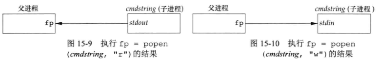
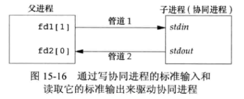

## 1 管道

```cpp
#include <unistd.h>
int pipe(int fd[2]);
// 返回值：若成功，返回0，若出错，返回-1
```

- `fd[0]` 为读而打开，`fd[1]` 为写而打开。`fd[1]` 的输出是 `fd[0]` 的输入。
- 历史上，管道是半双工的，现在某些实现提供全双工管道，但为了最佳可移植性，应假设管道是半双工的。
- 对于一个从父进程到子进程的管道，子进程关闭 `fd[1]`，父进程关闭 `fd[0]`。
- 对于一个从子进程到父进程的管道，父进程关闭 `fd[1]`，子进程关闭 `fd[0]`。
- 当读一个写端已被关闭的管道时，在所有数据都被读取后，`read` 返回 `0`，表示文件结束。
- 当写一个读端已被关闭的管道时，产生信号 `SIGPIPE`。如果忽略该信号或者捕捉该信号并从其处理程序返回，则 `write` 返回 `-1`，`errno` 设置为 `EPIPE`。
- 在写管道或 `FIFO` 时，常量 `PIPE_BUF` 规定了内核的管道缓冲区的大小。如果对管道调用 `write`，而且要求写的字节数小于等于 `PIPE_BUF`，则此操作不会与其他进程对同一管道或 `FIFO` 的 `write` 操作交叉进行。但是，若有多个进程同时写一个管道或 `FIFO`，而且我们要求写的字节数超过 `PIPE_BUF`，那么我们所写的数据可能会与其他进程所写的数据相互交叉。用 `pathconf` 或 `fpathconf` 函数可以确定 `PIPE_BUF` 的值。


## 2 函数 `popen` 和 `pclose`

```cpp
#include <stdio.h>
FILE *popen(const char *cmdstring, const char *type);
// 返回值：若成功，返回文件指针；若出错，返回NULL
int pclose(FILE *fp);
// 返回值：若成功，返回cmdstring的终止状态；若出错，返回-1
```

- 函数 `popen` 先执行 `fork`，然后调用 `exec` 执行 `cmdstring`，并且返回一个标准 `I/O` 文件指针。`type` 参数只能为 `"r"` 或 `"w"`。

  

- 如果 `type` 是 `"r"`，则返回的文件指针是可读的，如果 `type` 是 `"w"`，则返回的文件指针是可写的。

- `pclose` 函数关闭标准 `I/O` 流，等待命令终止，然后返回 `shell` 的终止状态。

- `cmdstring` 由 `Bourne shell` 以下列方式执行：

  ```sh
  sh -c cmdstring
  ```

## 3 协同进程

- `UNIX` 系统过滤程序从标准输入读取数据，向标准输出写数据。几个过滤程序通常在 `shell` 管道中线性连接。当一个过滤程序既产生某个过滤程序的输入，又读取该过滤程序的输出时，它就变成了协同进程。

  

- 对协同进程的标准输入、标准输出重定向到管道描述符后，会改变标准 `I/O` 的缓冲模式。管道默认是全缓冲的，因而很可能协同进程（例如上图的子进程）读取管道1的数据，但管道1的标准 `I/O` 缓冲区尚未填满，此时读取操作是阻塞的，而被协同的进程（例如上图的父进程）读取管道2的数据也会被阻塞，因为管道2的数据是由子进程的逻辑产生的，但此时子进程阻塞在读取管道1数据的操作上，此时产生了死锁。

- 上述问题的解决方式是显式地调用 `setvbuf` 函数为协同进程的 `stdin` 和 `stdout` 设置缓冲模式为行缓冲。

  ```cpp
  setvbuf(stdin, NULL, _IOLBF, 0);
  setvbuf(stdout, NULL, _IOLBF, 0);
  ```
  

## 4 `FIFO`

- `FIFO` 又称命名管道

- 未命令的管道只能在两个相关的进程之间使用，而且这两个相关的进程还要有一个共同创建了他们的祖先进程。但是通过 `FIFO` 不相关的进程也能交换数据。

- 对 `stat` 结构的 `st_mode` 成员可以使用 `S_ISFIIO` 宏测试该文件是否为 `FIFO`。

- 创建 `FIFO`：与 `open` 函数创建文件类似。

  ```cpp
  #include <sys/stat.h>
  int mkfifo(const char *path, mode_t mode);
  int mkfifoat(int fd, const char *path, mode_t mode);
  // 两个函数返回值：若成功，返回0；若出错，返回-1
  ```

- 当 `open` 一个 `FIFO` 类型文件时，非阻塞标志（`O_NONBLOCK`）会产生下列影响：

  - 在一般情况下（没有指定 `O_NONBLOCK`），只读 `open` 要阻塞到某个其他进程为写而打开这个 `FIFO` 为止。类似地，只写 `open` 要阻塞到某个其他进程为读而打开它为止。
  - 如果指定了 `O_NONBLOCK`，则只读 `open` 立即返回。但是，如果没有进程为读而打开一个 `FIFO`，那么只写 `open` 将返回 `-1`，并将 `errno` 设置成 `ENXIO`。

- 类似于管道，若 `write` 一个尚无进程为读而打开的 `FIFO`，则产生信号 `SIGPIPE`。若某个 `FIFO` 的最后一个写进程关闭了该 `FIFO`，则将为该 `FIFO` 的读进程产生一个文件结束标志。

- 一个给定的 `FIFO` 有多个写进程是常见的。这就意味着，如果不希望多个进程所写的数据交叉，则必须考虑原子写操作。和管道一样，常量 `PIPE_BUF` 说明了可被原子地写到 `FIFO` 的最大数据量。

## 5 `XSI IPC`

- 每个内核中的 `IPC` 结构（消息队列、信号量和共享存储）都用一个非负整数的标识符加以引用，与文件描述符不同，当一个`IPC` 结构被创建，以后又被删除时，与这种结构相关的标识符连续加 `1`，直至达到一个整型数的最大正值，然后又回转到 `0`。标识符是 `IPC` 对象的内部名，还有一个外部名称为键，数据类型是 `key_t`。

  ```cpp
  #include <sys/ipc.h> 
  key_t ftok(const char *pathname, int proj_id);
  // 返回值：若成功，返回键；若出错，返回 (key_t)-1
  ```

- 消息队列、信号量和共享存储都有自己的 `get` 函数，`msgget`、`semget` 和 `shmget`，用于创建 `IPC` 对象，它们都设置了自己的 `ipc_perm` 结构。

  ```cpp
  struct ipc_perm {
      key_t          __key;       /* Key supplied to msgget(2) */ 
      uid_t          uid;         /* Effective UID of owner */ 
      gid_t          gid;         /* Effective GID of owner */ 
      uid_t          cuid;        /* Effective UID of creator */ 
      gid_t          cgid;        /* Effective GID of creator */ 
      unsigned short mode;        /* Permissions */ 
      unsigned short __seq;       /* Sequence number */ 
  };
  ```

- 消息队列、信号量和共享存储都有自己的内置限制，这些限制的大多数可以通过重新配置内核而加以更改，如 `sysctl` 命令，可以配置运行时内核参数。

- 需要注意的是，`IPC` 对象是在系统范围内起作用的，没有访问计数，不同于普通文件。例如，如果进程创建了一个消息队列，在该队列中放入了几则消息，然后终止，但是该消息队列及其内容并不会被删除，它们余留在系统中直至出现下述情况：由某个进程调用 `msgrcv` 读消息或 `msgctl` 删除消息队列；或某个进程执行 `ipcrm` 命令删除消息队列；或由正在再启动的系统删除消息队列。将此与管道相比，当最后一个访问管道的进程被终止时，管道就被完全地删除了。对于 `FIFO` 而言，虽然当最后一个引用 `FIFO` 的进程终止时其名字仍保留在系统中，直至显式地删除它，但是留在 `FIFO` 中的数据却在此时被全部删除。

## 6 消息队列

- 消息队列即 `message queue`，存放在内核中并由消息队列标识符标识，涉及如下函数和数据结构。

  ```cpp
  #include <sys/types.h> 
  #include <sys/ipc.h> 
  #include <sys/msg.h> 
  
  int msgget(key_t key, int flag);
  // 返回值：若成功，返回消息队列ID；若出错，返回-1
  int msgsnd(int msqid, const void *ptr, size_t nbytes, int flag);
  // 返回值：若成功，返回0；若出错，返回-1
  ssize_t msgrcv(int msqid, void *ptr, size_t nbytes, long type, int flag);
  // 返回值：若成功，返回消息数据部分的长度；若出错，返回-1
  int msgctl(int msqid, int cmd, struct msqid_ds *buf);
  // 返回值：若成功，返回0；若出错，返回-1
  
  struct msqid_ds { 
    struct ipc_perm msg_perm;     /* Ownership and permissions */ 
    time_t          msg_stime;    /* Time of last msgsnd(2) */ 
    time_t          msg_rtime;    /* Time of last msgrcv(2) */ 
    time_t          msg_ctime;    /* Time of last change */ 
    unsigned long   __msg_cbytes; /* Current number of bytes in queue (nonstandard) */ 
    msgqnum_t       msg_qnum;     /* Current number of messages in queue */ 
    msglen_t        msg_qbytes;   /* Maximum number of bytes allowed in queue */ 
    pid_t           msg_lspid;    /* PID of last msgsnd(2) */ 
    pid_t           msg_lrpid;    /* PID of last msgrcv(2) */ 
  };
  
  struct msgbuf {
    long mtype;       /* positive message type */
    char mtext[];  	/* message data, of length nbytes */
  };
  ```

- `msgget` 用于创建一个新队列或打开一个现存的队列，参数 `key` 可自定义或通过 `ftok` 生成，或者使用 `IPC_PRIVATE`，需要保证的是 `key` 值没有与现存的队列相关联，`flag` 为 `IPC_CREAT` 时创建新队列，排它性使用 `IPC_EXCL`。

- `msgsnd` 将新消息添加到队列尾端，参数 `msqid` 为消息队列 `id`，`ptr` 比较特殊，需要包括两部分内容，消息类型和实际的消息数据，如上面的 `msgbuf` 结构，`nbytes` 指定消息长度，`flag` 可以设置为 `IPC_NOWAIT`，表示非阻塞。

- `msgrcv` 用于从队列中取消息，参数 `nbytes` 表示缓冲区长度，当消息长度大于 `nbytes` 时，若 `flag` 设置了 `MSG_NOERROR` 则截短消息，否则出错`E2BIG`，`type` 为 `0` 时获取第一个消息，大于 `0` 时获取类型为 `type` 的第一个消息，小于 `0` 时获取类型小于等于 `type` 的类型值最小的第一个消息。每个消息队列都有一个 `msqid_ds` 结构与其相关联，规定了队列的当前状态。

- `msgctl` 则可以对消息队列的这种结构进行操作，参数 `cmd` 可以是 `IPC_STAT`、`IPC_SET`、`IPC_RMID`，分别表示获取状态、设置状态、移除消息队列。

## 7 信号量
```cpp
#include <sys/types.h> 
#include <sys/ipc.h> 
#include <sys/sem.h> 

int semget(key_t key, int nsems, int flag);
int semctl(int semid, int semnum, int cmd, ... /* union semun arg */); 
int semop(int semid, struct sembuf semoparray[], unsigned nops);

struct semid_ds {
  struct ipc_perm sem_perm;  /* Ownership and permissions */
  time_t          sem_otime; /* Last semop time */
  time_t          sem_ctime; /* Last change time */
  unsigned long   sem_nsems; /* No. of semaphores in set */
};

union semun {
  int              val;    /* Value for SETVAL */
  struct semid_ds *buf;    /* Buffer for IPC_STAT, IPC_SET */
  unsigned short  *array;  /* Array for GETALL, SETALL */
  struct seminfo  *__buf;  /* Buffer for IPC_INFO (Linux-specific) */
};

struct sembuf {
  unsigned short int sem_num;   /* semaphore number */
  short int           sem_op;   /* semaphore operation */
  short int          sem_flg;   /* operation flag */
};

struct {
  unsigned short  semval;   /* semaphore value */
  unsigned short  semzcnt;  /* # waiting for zero */
  unsigned short  semncnt;  /* # waiting for increase */
  pid_t           sempid;   /* ID of process that did last op */
};
```

- `semget` 用于获取信号量集标识符，参数 `nsems` 表示信号量个数，`semid_ds.sem_nsems` 被设置为该值，创建新的信号量集时必须大于0，获取已有的则为0。`flag` 参数指定 `semid_ds.sem_perm.mode` 字段（权限位）。

- `semctl` 对信号量进行操作，第四个参数可选，类型为 `semun` 联合体，`semnum` 指定信号量集中的某个信号，`cmd` 同消息队列的 `msgctl` 一样也可以是 `IPC_STAT`、`IPC_SET`、`IPC_RMID`，还有形如 `GETXXX` 的值。

- `semop` 函数是个原子操作，自动执行信号量集合上的操作数组 `semoparray`，`semoparray` 为 `sembuf` 结构体，成员`sem_op` 可以为0、正数、负数，`sem_flg` 为 `IPC_NOWAIT` 或 `SEM_UNDO`，后者表示进程终止时自动处理还未处理的信号量，参数 `nsops` 规定该数组中操作的数量。

## 8 共享存储
```cpp
#include <sys/ipc.h> 
#include <sys/shm.h> 

int shmget(key_t key, size_t size, int flag);
int shmctl(int shmid, int cmd, struct shmid_ds *buf);
void *shmat(int shmid, const void *shmaddr, int flag);
int shmdt(const void *shmaddr);

struct shmid_ds {
  struct ipc_perm shm_perm;    /* Ownership and permissions */
  size_t          shm_segsz;   /* Size of segment (bytes) */
  time_t          shm_atime;   /* Last attach time */
  time_t          shm_dtime;   /* Last detach time */
  time_t          shm_ctime;   /* Last change time */
  pid_t           shm_cpid;    /* PID of creator */
  pid_t           shm_lpid;    /* PID of last shmat(2)/shmdt(2) */
  shmatt_t        shm_nattch;  /* No. of current attaches */
  ...
};
```

- `shmget` 用于获取共享存储标识符，参数 `size` 为共享存储区的长度，单位是字节，实现通常将其向上取为系统页长的整数倍，若 `size` 并非系统页长的整数倍，那么最后一页的余下部分是不可用的，创建一个新的共享存储区时 `size` 需要大于0，引用已有的共享存储区则将 `size` 设置为0。

- `shmctl` 可操作共享存储区，同样可以是 `IPC_STAT`、`IPC_SET`、`IPC_RMID` 等。

- `shmat` 用于将共享存储段连接到调用进程指定的地址 `shmaddr` 上，但一般应指定 `shmaddr` 为0，内核会自动选择合适的地址，`flag` 可选 `SHM_RND` 即地址取整，`SHM_RDONLY` 只读，默认读写。

- 当对共享存储段的操作结束时，调用 `shmdt` 取消当前进程与共享存储段的连接。

## 9 `POSIX` 信号量
```cpp
#include <semaphore.h>
sem_t *sem_open(const char *name, int oflag, ... /* mode_t mode, unsigned int value */);
// 返回值：若成功，返回指向信号量的指针，若出错，返回SEM_FAILED
int sem_close(sem_t sem);
int sem_unlink(const char *name);
int sem_trywait(sem_t *sem);
int sem_wait(sem_t *sem);
int sem_timedwait(sem_t *restrict sem, const struct timespec *restrict tsptr);
int sem_post(sem_t *sem);
// 六个函数返回值：若成功，返回0；若出错，返回-1
```

- 在创建信号量时，`mode` 的取值和打开文件的权限位相同，`value` 参数用来指定信号量的初值。
- `sem_close` 函数释放任何信号量相关的资源。如果进程没有首先调用 `sem_close` 而退出，那么内核将自动关闭任何打开的信号量。注意，这不会影响信号量值的状态——如果已经对它进行了增 `1` 操作，这并不会仅因为退出而改变。类似地，如果调用 `sem_close`，信号量值也不会受到影响。在 `POSIX` 信号量中没有类似 `SEM_UNDO` 标志的机制。 
- `sem_unlink` 函数销毁一个命名信号量，该函数删除信号量的名字，如果没有打开的信号量引用，则该信号量会被销毁。否则，销毁将延迟到最后一个打开的引用关闭。

```cpp
#include <semaphore.h>
int sem_init(sem_t *sem, int pshared, unsigned int value);
int sem_destroy(sem_t *sem);
int sem_getvalue(sem_t *restrict sem, int *restrict valp);
// 三个函数返回值：若成功，返回0；若出错，返回-1
```

- 当我们想在单个进程中使用 `POSIX` 信号量时，使用未命名信号量更容易。这仅仅改变创建和销毁信号量的方式。
- 可以调用 `sem_init` 函数来创建一个未命名的信号量。`pshared` 参数表明是否在多个进程中使用信号量。如果是，将其设置成一个非 `0` 值。`value` 参数指定了信号量的初始值。
- 需要声明一个 `sem_t` 类型的变量并把它的地址传递给 `sem_init` 来实现初始化，而不是像 `sem_open` 函数那样返回一个指向信号量的指针。如果要在两个进程之间使用信号量，需要确保 `sem` 参数指向两个进程之间共享的内存范围。
- `sem_destroy` 反初始化信号量。
- `sem_getvalue` 检索信号量的值，注意，我们试图要使用我们刚读出来的值的时候，信号量的值可能已经变了。除非使用额外的同步机制来避免这种竞争，否则 `sem_getvalue` 函数只能用于调试。 

