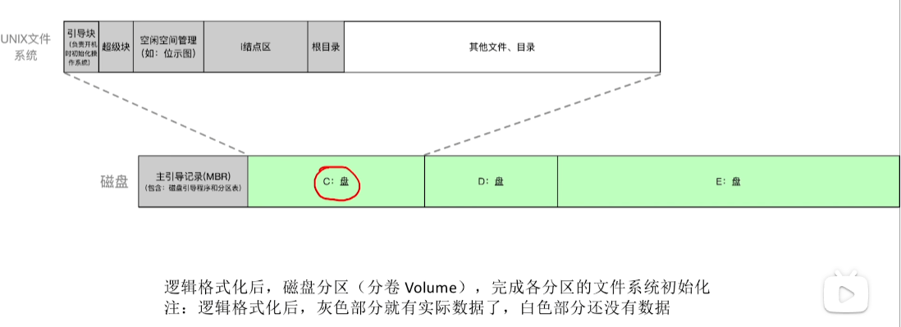

#### 文件的物理结构

- 解决的问题：一个文件会有数个数据块，怎么把这些数据块的编号存储下来

- 链接分配（隐式）：使用链表存储数据块编号。在每个数据块末尾划分出一个区域，用于存储指向下一块的指针

- 链接分配（显式）：使用链表存储数据块编号，FAT文件系统采用的方式。整个文件系统中单独开辟一个区域，显式存储每个数据块的下一块的索引

- 索引分配：使用数组存储数据块编号，ext文件系统采用的方式。但数组的最后几个数据块编号指向的不是数据块，而是间接索引块，这些间接索引块里面存储的才是数据块的编号，例如，一个长度为10的数组，前8个元素直接存储数据块的编号，第9个元素存储的是一级间接索引块的编号，第10个元素存储的是二级间接索引块的编号。

#### 文件的存储空间管理

- 解决的问题：如何管理当前文件系统中空闲块的集合

- 位图法：使用位来描述数据块的空闲状况

- 成组链接法：UNIX采用的策略，适合大型文件系统。一个文件系统中会有超级块，超级块存储的就是成组链接树的数据。具体见王道计算机考研 操作系统 文件存储空间管理：成组链接法 https://www.bilibili.com/video/BV1YE411D7nH?p=64

    - 超级块用于快速找到一组未使用的数据块供上层使用。

    - 数据块位图用于快速判断一个数据块是否是空闲状态。

#### inode

- inode 存储文件的元数据：文件名称、长度、权限、访问/修改时间等，同时也存储了一个数据结构，这个数据结构用于描述该文件使用了哪些数据块。在linux中，这个数据结构就是采用的`文件的物理结构——索引分配`的方式。

- 一个文件系统中的所有inode都存储在一个集中的区域。

#### 文件系统的全局结构

- UNIX文件系统的组成：引导块、超级块（管理空闲块，见：文件的存储空间管理——成组链接法）、空闲管理（i节点位图和数据块位图）、i节点区、根目录块（目录本身也是一种文件，会占用数据块）、其他文件和目录。

#### 文件系统在内存中的结构

- 对于每个进程而言，在用户空间都有一个文件描述符表，每个表项存储文件描述符标志（文件描述符使用数组下标可以隐式存储）

- 对于每个进程而言，在内核空间都有一个进程的打开文件表，每个表项存储文件的打开方式（读/写等）、文件的状态标志、指向系统打开文件表中的一项的索引等。一个文件描述符表项指向一个进程打开文件表项

- 系统有一张全局唯一的系统打开文件表，统一管理当前系统中所有进程打开的文件，如果有多个进程打开了同一个文件，系统打开文件表的对应表项会存储引用计数。一个进程打开文件表项指向一个系统打开文件表项。

- 调用write写一个文件描述符时，数据将写入这个文件的内核缓冲区，如果有多个进程打开了相同的文件，那么这个内核缓冲区应该是同一个位置。

- 使用dup、dup2后，多个文件描述符指向了同一个进程打开文件表项
