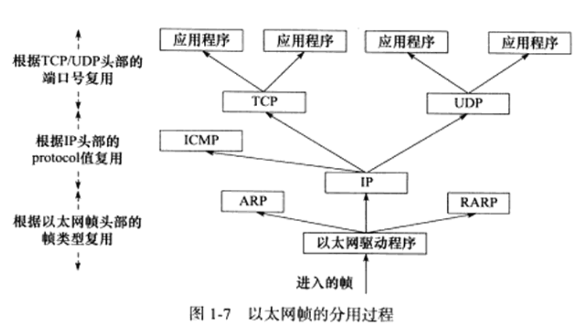

# 第一篇 TCP/IP 协议详解

## 第 1 章 TCP/IP 协议族

### OSI 七层模型

- 自顶向下依次为：应用层，表示层，会话层，传输层，网络层，数据链路层，物理层

### TCP/IP 四层模型

- 自顶向下依次为：应用层，传输层，网络层，数据链路层


#### 数据链路层

- 向上隐藏了不同物理设备的电气特性的差异，提供统一接口。
- ARP协议：实现LAN中IP地址向物理地址（通常是MAC地址）的转换
- RARP协议：实现LAN中物理地址（通常是MAC地址）向IP地址的转换

#### 网络层

- 实现数据包的选路和转发。WAN通常使用众多分级的路由器来连接分散的主机或LAN
- 向上隐藏网络拓扑，提供两台主机逻辑上的直接连接
- IP协议：根据数据包的目的IP地址来决定如何投递它。
- ICMP协议：因特网控制报文协议。用于检测网络连接。例如报告网络错误，目标不可达，重定向。也可以用于查询网络信息，例如 ping 使用 ICMP 报文查看目标是否可达。

#### 传输层

- 为两台主机的应用程序提供端到端的通信
- TCP协议：为应用层提供可靠的，面向连接的和基于流的服务。超时重传，数据确认。
- UDP协议：为应用层提供不可靠的，无连接的和基于数据报的服务。

#### 应用层

- 负责应用程序的逻辑，数据链路层，网络层和传输层负责处理网络通信细节，这部分必须稳定又高效，因此它们都在内核空间实现。而应用层协议绝大多数都在用户空间实现。
- ping程序：用于调试网络
- telnet协议：远程登录协议
- OSPF协议：动态路由更新协议
- DNS协议：提供机器域名到IP地址的转换

### 封装


### 分用



### ARP 协议

#### 工作原理：

- 主机向自己所在网络广播一个ARP请求，该请求包含目标机器的网络地址，此网络上的其他机器都将收到这个请求，但只有被请求的目标机器会回答一个ARP应答，其中包含自己的物理地址。

#### arp 命令

- arp -a 查看所有 arp 映射缓存
- arp -d `<ipAddr>` 删除 ipAddr 对应的 arp 表项
- arp -s `<ipAddr>` `<macAddr>` 添加 arp 表项

### DNS 协议

- DNS 是一套分布式域名服务系统，每个 DNS 服务器都存放着大量机器名和 IP 地址的映射，并且动态更新。
- DNS 查询分为递归式查询和迭代式查询。
- 查看 DNS 服务器配置：cat /etc/resolv.conf

### socket 和 TCP/IP 协议族的关系

#### socket 定义的一组api提供如下两个功能

- 将应用程序数据从用户缓冲区中复制到TCP/UDP内核发送缓冲区，或从内核缓冲区复制到用户缓冲区。例如 send、recv
- 用户程序可以通过socket api精细设定内核中各层协议的某些头部信息或其他数据结构。例如 setsockopt 函数

#### socket 是一套通用的网络，它不但可以访问内核中的TCP/IP协议栈，而且可以访问其他网络协议栈，例如UNIX本地域协议栈。

## 第 2 章 IP 协议详解

### IPv4 头部结构


- 4位版本号：IP协议版本，IPv4版本的版本号为4。
- 4位头部长度：IP头的长度，以4字节为基本偏移。
- 8位服务类型：可以用于设置需要最小延迟服务（ssh，telnet）、最大吞吐量（ftp）等。
- 16位总长度：IP数据报的总长度，以字节为基本偏移。包括头部和数据。
- 16位标识：唯一标识当前分片所属的IP数据报。
- 3位标志：第一位保留，第二位（DF，表示禁止分片），第三位（MF，表示后面还有分片）。
- 13位偏移：表示当前分片在数据报中的起始偏移，以8字节为基本偏移。
- 8位生存时间（TTL）：用于检测超时，例如初值设为64，每过一跳减1，减少到0则向源IP发送ICMP差错报文。
- 8位协议：标识上层数据使用等协议，例如TCP（6）、UDP（17）、ICMP（1）。
- 16位头部校验和：使用CRC校验头部是否损坏。

### IP 分片

- IP数据报总长度大于1500（MTU）时，需要进行分片。
- 如果需要进行分片，则最后一个IP分片的MF设置为0，其他分片的MF设置为1，且每个IP分片的13位偏移也不同。其余头部信息保持一致。

### IP 路由

- 1）从收到的IP分组的首部提取目的主机的IP地址D（即目的地址）
- 2）若查找到特定主机路由（目的地址位D），就按照这条路由的下一跳转发分组，否则从转发表中的下一条（即按前缀长度的顺序）开始检查，执行步骤3）。
- 3）将这一行的子网掩码与目的地址D进行按位与运算。若运算结果与本行前缀匹配，则查找结束，按照下一跳指出的进行处理（要么直接交付本网络上的目的主机，要么通过指定接口发送到下一跳路由器）。否则，若转发表还有下一行，则对下一行进行检查，重新执行步骤3）。否则，执行步骤4）。
- 4）若转发表中有一个默认路由，则把分组传送给默认路由，否则，报告转发分组出错。

### 路由表更新

- 静态更新：使用 route 命令手动增删改。
- 动态更新：通过协议更新：BGP、RIP、OSPF等。

### 重定向

- ICMP报文也能用于更新路由表（ICMP主机重定向报文）。
- ICMP重定向报文的数据部分含义很明确，它给出两个关键信息：引起重定向的IP数据报的源端IP地址和应该使用的路由器的IP地址。

### 私有IP

- A类：10.0.0.0 ~ 10.255.255.255
- B类：172.16.0.0 ~ 172.31.255.255
- C类：192.168.0.0 ~ 192.168.255.255

### NAT

- 路由器的NAT服务程序负责将 内网IP:端口 映射到 公网IP:端口。反之亦然。
- 主机发送数据时，先传到路由器，路由器通过NAT将数据报中的内网IP和端口号替换成对应的公网IP和端口号，然后向外递送，收到回复数据时，回复数据到达路由器后，路由器再把回复数据中的公网IP和端口号替换成内网IP和端口号，然后向内递送回主机。

### VPN

- TODO [2023.04.03]

## 第 3 章 TCP 协议详解

### TCP 服务的特点

- 面向连接
- 字节流
- 有限状态机
- 可靠传输
- 确认机制
- 超时重传
- 流量控制
- 拥塞控制

### TCP头部结构


- 32位序号：A发送给B的报文段字节序号为 [ x, y ]，则A发送的报文段的序号为 x。
- 32位确认号：A发送给B的报文段字节序号为 [ x, y ]，则B回复A的报文段的确认号设置为 y + 1。
- 4位头部长度：标识头部长度，以4字节为基本偏移。
- URG：紧急标志，标识紧急指针是否有效。
- ACK：标识确认号是否有效。
- PSH：标识接收端是否需要立即从TCP缓冲区中读走数据。
- RST：标识要求对方重新建立连接。称携带RST标志的TCP报文段为复位报文段。
- SYN：标识请求建立一个连接。称携带SYN标志的TCP报文段为同步报文段。
- FIN：标识通知对方本端要关闭连接了。称携带FIN标志的TCP报文段为结束报文段。
- 16位窗口大小：告诉对方本端的TCP接收缓冲区还能容纳多少个字节的数据。
- 16位校验和：用于检验整个TCP报文段（包含头部）在传输过程中是否损坏。
- 16位紧急指针：指向紧急数据所在的字节的下一个偏移地址。紧急数据只能是一个字节。

### TCP连接的建立和关闭


#### 三次握手

- 第一次握手：A向B发送带有SYN标志的报文段，并进入SYN_SENT状态。
- 第二次握手：B收到A的SYN报文后，向A回复带有SYN标志和ACK标志的报文段，并进入SYN_RCVD状态。
- 第三次握手：A收到B的回复报文后，向B发送带有ACK标志的报文段，并进入ESTABLISHED状态。B收到这个报文段后，B也会进入ESTABLISHED状态。

#### 四次挥手

- 第一次挥手：A向B发送带有FIN标志和ACK标志的报文段，并进入FIN_WAIT1状态。
- 第二次挥手：B收到A发送的挥手报文段，回复A一个带有ACK标志的报文段，并进入CLOSE_WAIT状态。A收到这个回复报文后，进入FIN_WAIT2状态。
- 第三次挥手：B向A发送带有FIN标志和ACK标志的报文段，并进入LAST_ACK状态。
- 第四次挥手：A收到B发送的挥手报文段，回复B一个带有ACK标志的报文段，进入TIME_WAIT状态。B收到这个回复报文后，关闭B到A的TCP连接。A进入TIME_WAIT后等待2MSL后，正常完全关闭。

#### 三次挥手的原理

- 第一次握手和第二次握手保证了A到B的TCP连接正常，且表达了A想要和B建立连接的意愿。
- 第二次握手和第三次握手保证了B到A的TCP连接正常，且表达了B同意与A建立连接的意愿。

#### 四次挥手的原理

- 第一次挥手和第二次挥手关闭A到B的TCP连接。此后B仍可向A发送数据，A也能正常接收，即B到A的TCP连接未关闭。
- 第三次挥手和第四次挥手关闭B到A的TCP连接。
- A进入TIME_WAIT后，需要等待2MSL，原因：
  - 可靠的终止TCP连接：若第四次挥手报文B没有正常接收到，则A进入TIME_WAIT一个MSL后，B会再次向A发送第三次挥手的报文，再过一个MSL后，A会收到这个重复的第三次挥手，那么A就知道了自己发送的第四次挥手报文段B未能正常接收，此时A重新发送第四次挥手报文段，并重置TIME_WAIT的计时。
  - 保证让迟来的TCP报文段有足够的时间被识别并丢弃。如果TIME_WAIT的等待时间少于2MSL，则有可能马上建立了一个新的TCP连接，这个连接使用了A的这个端口，此时若发生B重复发送第三次挥手的报文段，则这个挥手报文段会被新连接接收到，新连接中，A的这个端口不知道这个报文的意义是什么，导致了未定义行为。
- socket选项SO_REUSEADDR可以强制进程立即使用处于TIME_WAIT状态的连接占用的端口。

### TCP状态转移总图：（看看就好）


### 复位报文段

- 当客户端程序访问一个不存在的端口时，目标主机将给它发送一个复位报文段。
- 当客户端程序向服务器的某个端口发起连接，而该端口仍被处于TIME_WAIT状态的连接所占用时，客户端程序也将收到复位报文段。
- TCP提供一个异常终止连接的方法：给对方发送一个复位报文段，此时内核会丢弃所有排队等待发送的数据。应用程序可以使用socket选项SO_LINGER来发送复位报文段，以异常终止一个连接。
- A和B建立了一个TCP连接，然后A异常终止了连接，而B没有接收到结束报文段。此时B到A到连接还是存在的，此时A和B的TCP连接是半打开的，如果B向A发送数据，则A会向B回复一个复位报文段。

### TCP超时重传

- TCP每发送一个报文段，就对这个报文段设置一个计时器。计时器超时而还未收到这个报文段的确认时，就要重传这个报文段。
- 冗余ACK：例如，发送方A发送了序号为1、2、3、4、5的TCP报文段，其中2号报文段在链路中丢失，则3、4、5号报文段对于接收端B来说就成了失序报文段。TCP规定每当比期望需要大的失序报文段到达时，就发送一个冗余ACK，指明下一个期待字节的序号。3、4、5号报文到达B，但它们不是B所期望收到的下一个报文，于是B就发送3个对1号报文段的冗余ACK，表示自己期望接收到2号报文段。TCP规定当发送方收到对同一个报文段的3个冗余ACK时，就可以认为跟在这个被确认报文段之后的报文段已经丢失。则A认为2号报文段丢失，这时A可以立即对2号报文段执行重传，即使它的定时器还未超时，这种技术称为快速重传。

### TCP数据流

- 交互式数据流：使用交互数据流的程序或协议对实时性要求很高。例如telnet、ssh。
- 成块数据流：成块数据流的长度则通常为TCP报文段允许的最大数据长度。使用成块数据流的程序或协议对传输效率要求高，例如ftp。

### 拥塞控制

#### Nagle算法

- Nagle算法要求一个TCP连接的通信双方在任意时刻都最多只能发送一个未被确认的TCP报文段，在该TCP报文段的确认到达之前不能发送其他TCP报文段。
- 另一方面，发送方在等待确认的同时收集本端需要发送的微量数据，并在确认到来时以一个TCP报文段将它们全部发出，这样就极大地减少了网络上的微小TCP报文段的数量。
- 该算法的另一个优点在于其自适应性：确认到达得越快，数据也就发送得越快。

#### 接收窗口、拥塞窗口

- 接收方根据自己接收缓存的大小所许诺的最新窗口值，这称为接收窗口rwnd，设置为TCP头部的窗口字段值。
- 发送方根据其对当前网络拥塞程度的估计而确定的窗口值称为拥塞窗口cwnd。其大小与网络的带宽和时延密切相关。
- 发送窗口的上限值应取接收窗口rwnd和拥塞窗口cwnd中较小的一个。

#### 慢开始、拥塞避免

- 慢开始算法：TCP建立连接开始，令 cwnd=1，此后 cwnd = 2、4、8、......
- 拥塞避免算法：当 cwnd > ssthresh 时，停用慢开始算法，cwnd 转变为线性增加（每次加1）。
- 出现网络拥塞时（未按时收到确认时），设置 ssthresh 为出现拥塞时发送方的 cwnd 值的一半（但不能小于2）。然后把cwnd 重新设置为1，执行慢开始算法。

#### 快重传、快恢复

- 快重传：见TCP超时重传。
- 快恢复：当发送端收到三个冗余ACK时，设置 ssthresh 为此时发送方 cwnd 的值的一半，但发送方现在认为网络很可能没有发送严重拥塞，否则就不会收到三个冗余ACK，因此可以把cwnd设置为 ssthresh 改变后的数值，然后执行拥塞避免算法（每次加1），这称为快恢复。

## 第 4 章 TCP/IP 通信案例

### HTTP代理服务器工作原理

#### 正向代理

- 正向代理要求客户端自己设置代理服务器的地址。
- 客户端的每次请求都将直接发送到该代理服务器，并由该代理服务器来请求目标资源。
- 例如处于防火墙内部的局域网机器要访问Internet，或者要访问一些被屏蔽掉的国外网站，就需要使用正向代理服务器。

#### 反向代理

- 反向代理被设置在服务端，因而客户端无须进行任何设置。反向代理是指用代理服务器来接收Internet上的连接请求，然后将请求转发给内部网络上的服务器，并将从内部服务器上得到的结果返回给客户端。
- 这种情况下，代理服务器对外就表现为一个真实的服务器。各大网站通常分区设置了多个代理服务器，所以在不同的地方ping同一个域名可能得到不同的IP地址，因为这些IP地址实际上是代理服务器的IP地址。

#### 透明代理

- 透明代理只能设置在网关上。用户访问Internet的数据报必然会经过网关，如果在网关上设置代理，则该代理对用户来说显然是透明的。
- 透明代理可以看作正向代理的一种特殊情况。

### HTTP通信

#### HTTP请求

- HTTP请求头示例

  ```text
  GET http://www.baidu.com/index.html HTTP/1.0
  User-Agent: Wget/1.12 (linux-gnu)
  Host: www.baidu.com
  Connection: close
  ```
- HTTP请求方法

  | 请求方法 |                                               含 义                                               |
  | :------: | :------------------------------------------------------------------------------------------------: |
  |   GET   |                            申请获取资源，而不对服务器产生任何其他影响。                            |
  |   HEAD   |             和 GET 方法类似，不过仅要求服务器返回头部信息，而不需要传输任何实际内容。             |
  |   POST   |                                   客户端向服务器提交数据的方法。                                   |
  |   PUT   |                                           上传某个资源。                                           |
  |  DELETE  |                                           删除某个资源。                                           |
  |  TRACE  | 要求目标服务器返回原始的HTTP请求的内容。它可用于查看中间服务器（比如代理服务器）对HTTP请求的影响。 |
  | OPTIONS |  查看服务器对某个特定URL都支持哪些请求方法。可以吧URL设置为 *，从而获取服务器支持的所有请求方法。  |
  | CONNECT |                     用于某些代理服务器，它们能把请求的连接转换为一个安全隧道。                     |
  |  PATCH  |                                       对某个资源做部分修改。                                       |

#### HTTP应答

- HTTP应答示例

  ```text
  HTTP/1.0 200 OK
  Server: BWS/1.0
  Content-Length: 8024
  Content-Type: text/html;charset=gbk
  Set-Cookie: BAIDUID=A5B6C72D68CF639CE889FD79A03FBD8:FG=1; expires=Wed,04 -Jul-42 00:10:47 GMT; path=/; domain=.baidu.com
  Via: 1.0 localhost (squid/3.0 STABLE18)
  ```
- HTTP状态码

  | 状态类型       | 状态码和状态信息                  | 含 义                                                                                                 |
  | -------------- | --------------------------------- | ----------------------------------------------------------------------------------------------------- |
  | 1xx 信息       | 100 Continue                      | 服务器收到了客户端的请求行和头部信息，告诉客户端继续发送数据部分。                                    |
  | 2xx 成功       | 200 OK                            | 请求成功。                                                                                            |
  | 3xx 重定向     | 301 Moved Permanently             | 资源被转移了，请求将被重定向。                                                                        |
  | 3xx 重定向     | 302 Found                         | 通知客户端资源能在其他地方找到，但需要使用GET方法获取。                                               |
  | 3xx 重定向     | 304 Not Modified                  | 表示申请的资源没有更新，和之前获得的相同。                                                            |
  | 3xx 重定向     | 307 Temporary Redirect            | 通知客户端资源能在其他地方找到，与302的区别在于客户端可以使用和原始请求相同的请求方法来访问目标资源。 |
  | 4xx 客户端错误 | 400 Bad Request                   | 通知客户端请求错误。                                                                                  |
  | 4xx 客户端错误 | 401 Unauthorized                  | 请求需要认证信息。                                                                                    |
  | 4xx 客户端错误 | 403 Forbidden                     | 访问被服务器禁止，通常是由于客户端没有权限访问该资源。                                                |
  | 4xx 客户端错误 | 404 Not Found                     | 找不到资源。                                                                                          |
  | 4xx 客户端错误 | 407 Proxy Authentication Required | 客户端需要先获得代理服务器的认证。                                                                    |
  | 5xx 服务器错误 | 500 Internal Server Error         | 通用服务器错误。                                                                                      |
  | 5xx 服务器错误 | 503 Service Unavailable           | 暂时无法访问服务器。                                                                                  |
- Cookie：HTTP是一种无状态的协议，即每个HTTP请求之间没有任何上下文关系。对于交互式Web应用程序，要求承上启下，使用的解决方案是Cookie。Cookie是服务器发送给客户端的特殊信息（通过HTTP应答的头部字段"Set-Cookie"），客户端每次向服务器发送请求的时候都需要带上这些信息（通过HTTP请求的头部字段"Cookie"）。这样服务器就可以区分不同的客户了。基于浏览器的自动登录就是用Cookie实现的。

# 第二篇 深入解析高性能服务器编程

## 第 5 章 Linux 网络编程基础

### socket地址API

#### 字节序和大小端模式

```cpp
#include <netinet/in.h>
unsigned long int htonl(unsigned long int hostlong);
unsigned short int htons(unsigned short int hostshort);
unsigned long int ntohl(unsigned long int netlong);
unsigned short int ntohs(unsigned short int netshort);

// short 和 long 的主机序和网络序的互转换
```

#### 通用socket地址

```cpp
#include <bits/socket.h>
struct sockaddr {
  sa_family_t sa_family;
  char sa_data[14];	// 存放对应协议的地址，对于许多协议，14字节是不够的。
};
```

#### 专用socket地址

```cpp
#include <sys/un.h>

// UNIX域套接字
struct sockaddr_un {
  sa_family_t sin_family;	/* 地址族: AF_UNIX */
  char sun_path[108];			/* 文件路径名 */
};

// IPv4套接字
struct sockaddr_in {
  sa_family_t sin_family;	/* 地址族: AF_INET */
  uint16_t sin_port;			/* 端口号，要用网络字节序表示 */
  struct in_addr sin_addr;/* IPv4地址结构体 */
}
struct in_addr { uint32_t s_addr; };/* IPv4地址，要用网络字节序表示 */

// IPv6套接字
struct sockaddr_in6 {
  sa_family_t sin6_family;/* 地址族: AF_INET6 */
  uint16_t sin6_port;			/* 端口号，要用网络字节序表示 */
  uint32_t sin6_flowinfo;	/* 流信息，应设置为 0 */
  struct in6_addr sin6_addr;/* IPv6地址结构体 */
  uint32_t sin6_scope_id;	/* scope ID，尚处于实验阶段 */
}
struct in6_addr {
  unsigned char sa_addr[16];	/* IPv6地址，要用网络字节序 */
}
```

#### IP地址转换函数

```cpp
#include <arpa/inet.h>

// 将点分十进制字符串表示的IPv4地址转换为网络序的IPv4地址。失败时返回 INADDR_NONE
in_addr_t inet_addr(const char* strptr);

// 将点分十进制字符串表示的IPv4地址转换为网络序的IPv4地址。输出写到 inp 指针位置。
// 成功时返回1，失败则返回0
int inet_aton(const char* cp, struct in_addr* inp);

// 将网络序的IPv4地址转换为点分十进制的字符串
// 注意：该函数内部用一个静态变量存储转化结果，函数的返回值指向该静态内存，因此 inet_ntoa 是不可重入的。
char* inet_ntoa(struct in_addr in);

// 下面这对函数也能完成和上面三个函数同样的功能，并且支持IPv6
#include <arpa/inet.h>

/**
 * @brief 将IP地址字符串转换为网络序地址
 * @param af 协议类型：AF_INET 或 AF_INET6
 * @param src IPv4/v6地址字符串
 * @param dst 存储转换后网络序地址的内存指针
 * @return 1 转换成功，0 转换失败
 */
int inet_pton(int af, const char* src, void* dst);

/**
 * @brief 将网络序IP地址转换为字符串表示
 * @param af 协议类型：AF_INET 或 AF_INET6
 * @param src 指向网络序的IPv4/v6地址
 * @param dst 存储字符串的buffer
 * @param cnt buffer的长度
 * @return const char* 转换后的字符串
 */
const char* inet_ntop(int af, const void* src, char* dst, socklen_t cnt);
```

### 创建socket

```cpp
#include <sys/types.h>
#include <sys/socket.h>

/**
 * @brief 创建套接字
 * @param domain 底层协议类型：常见的如AF_INET(IPv4)、AF_INET6(IPv6)、AF_UNIX(unix)
 * @param type 传输层协议类型：SOCK_STREAM(流服务)、SOCK_DGRAM(数据报服务)
 * @param protocol 传输层协议，限制了 domain 和 type 后，仍可能不止一种协议满足条件，必要时需要具体指出
 * @return 套接字描述符
 * @notice linux 2.6.17 起，type参数可以或上 SOCK_NOBLOCK 和 SOCK_CLOEXEC
 */
int socket(int domain, int type, int protocol);
```

### 命名socket

```cpp
#include <sys/types.h>
#include <sys/socket.h>

/**
 * @brief 为套接字描述符绑定套接字地址
 * @param sockfd 套接字描述符
 * @param my_addr 套接字地址
 * @param addrlen 套接字地址的长度
 * @return 0 bind成功，-1 bind失败
 * @notice 常见的绑定失败时的errno有：
 *	EACCES: 被绑定的地址是受保护的地址，仅超级用户能够访问。例如普通用户将socket绑定到知名服务端口(0~1023)
 *	EADDRINUSE: 被绑定的地址正在使用中。例如将socket绑定到一个处于TIME_WAIT状态的socket地址
 */
int bind(int sockfd, const struct sockaddr* my_addr, socklen_t addrlen);
```

### 监听socket

```cpp
#include <sys/socket.h>

/**
 * @brief 创建一个监听队列以存放待处理的客户连接
 * @param sockfd 监听套接字
 * @param backlog 提示内核监听队列的最大长度，监听队列的长度如果超过backlog，服务器将不再受理新的客户
 *  连接，客户端也将收到 ECONNREFUSED 错误信息.
 * @return 0 succeed, -1 failed.
 */
int listen(int sockfd, int backlog);
```

### 接受连接

```cpp
#include <sys/types.h>
#include <sys/socket.h>

/**
 * @brief 从listen监听队列中接受一个连接
 * @param sockfd 监听套接字
 * @param addr 用于获取被接受连接的远端socket地址
 * @param addrlen 指出 addr 指向的socket地址结构的长度
 * @return 成功时返回一个新的连接套接字，失败时返回-1
 * @note 如果accept的客户端在accept调用前断开，则accept无法察觉这个变化，仍然会成功accept
 */
int accept(int sockfd, struct sockaddr* addr, socklen_t* addrlen);
```

### 发起连接

```cpp
#include <sys/types.h>
#include <sys/socket.h>

/**
 * @brief 主动与服务器建立连接
 * @param sockfd 客户端套接字，不需要绑定地址（系统会自动分配）
 * @param serv_addr 服务器监听地址
 * @param addrlen 指出 serv_addr 指向的地址的长度
 * @return 0 succeed, -1 failed.
 * @notice 常见的连接失败时的errno有：
 *  ECONNREFUSED 目标端口不存在，连接被拒绝
 *  ETIMEDOUT 连接超时
 */
int connect(int sockfd, const struct sockaddr *serv_addr, socklen_t addrlen);
```

### 关闭连接

```cpp
#include <unistd.h>

// 注意，此函数仅将fd的引用计数减1，只有fd引用计数为0时，才真正关闭连接
int close(int fd);

#include <sys/socket.h>

/**
 * @brief 不论引用计数多少，直接关闭连接
 * @param sockfd 待关闭套接字
 * @param howto 控制关闭行为
 *  SHUT_RD shutdown后不能再从套接字读取
 *  SHUT_WR shutdown后不能再向套接字写入
 *  SHUT_RDWR 同时关闭读写
 * @return 0 succeed, -1 failed
 */
int shutdown(int sockfd, int howto);
```

### 数据读写

#### TCP数据读写

```cpp
#include <sys/types.h>
#include <sys/socket.h>

/**
 * @brief 从套接字内核接收缓冲区读取内容
 * @param sockfd 套接字
 * @param buf 用户接收缓冲
 * @param len 指示buf的大小
 * @param flags 控制接收行为
 * @return 成功时返回实际读取到的数据的长度，可能为0，这表示对方已经关闭连接了。出错返回-1
 */
ssize_t recv(int sockfd, void* buf, size_t len, int flags);

/**
 * @brief 向套接字内核发送缓冲区写入数据
 * @param sockfd 套接字
 * @param buf 用户发送缓冲
 * @param len 指示buf的大小
 * @param flags 控制发送行为
 * @return 成功时返回实际写入的数据的长度，失败时返回-1.
 */
ssize_t send(int sockfd, const void* buf, size_t len, int flags);
```

| 选项名        | 含 义                                                                                                                                    | send | recv |
| ------------- | ---------------------------------------------------------------------------------------------------------------------------------------- | ---- | ---- |
| MSG_CONFIRM   | 指示数据链路层协议持续监听对方的应答，直到得到回复。它仅能用于SOCK_DGRAM和SOCK_RAW类型的socket                                           | Y    | N    |
| MSG_DONTROUTE | 不查看路由表，直接将数据发送给本地局域网络内的主机。这表示发送者确切地知道目标主机就在本地网络上                                         | Y    | N    |
| MSG_DONTWAIT  | 对socket的这次操作将是非阻塞的                                                                                                           | Y    | Y    |
| MSG_MORE      | 告诉内核应用程序还有更多的数据要发送，内核将超时等待新数据写入TCP发送缓冲区后一并发送。这样可防止TCP发送过多小的报文段，从而提高传输效率 | Y    | N    |
| MSG_WAITALL   | 读操作仅在读取到指定数量的字节后才返回                                                                                                   | N    | Y    |
| MSG_PEEK      | 窥视读缓存中的数据，此次读操作不会导致这些数据被清除                                                                                     | N    | Y    |
| MSG_OOB       | 发送或接收紧急数据                                                                                                                       | Y    | Y    |
| MSG_NOSIGNAL  | 往读端关闭的管道或者socket连接中写数据时不引发SIGPIPE信号                                                                                | Y    | N    |

#### UDP数据读写

```cpp
#include <sys/types.h>
#include <sys/socket.h>

ssize_t recvfrom(int sockfd, void* buf, size_t len, int flags, struct sockaddr* src_addr, socklen_t* addrlen);

ssize_t sendto(int sockfd, const void* buf, size_t len, int flags, const struct sockaddr* dest_addr, socklen_t addrlen);
```

#### 通用数据读写函数

```cpp
#include <sys/types.h>
#include <sys/socket.h>

ssize_t recvmsg(int sockfd, struct msghdr* msg, int flags);
ssize_t sendmsg(int sockfd, struct msghdr* msg, int flags);

struct msghdr {
  void* msg_name;						/* socket地址 */
  socklen_t msg_namelen;		/* socket地址的长度 */
  struct iovec* msg_iov;		/* 分散的内存块，用于分散读和集中写 */
  int msg_iovlen;						/* 分散内存块的数量 */
  void* msg_control;				/* 指向辅助数据的起始位置 */
  socklen_t msg_controllen;	/* 辅助数据的大小 */
  int msg_flags;						/* 复制函数中的flags参数，并在调用过程中更新 */
};

struct iovec {
  void* iov_base;	/* 内存起始地址 */
  size_t iov_len;	/* 这块内存的长度 */
};
```

### 带外标记

```cpp
#include <sys/socket.h>

// 判断sockfd是否处于带外标记，如果是，返回1，此时我们可以利用带MSG_OOB标志的recv调用来接收带外数据，否则返回0.
int sockatmark(int sockfd);
```

### 地址信息函数

```cpp
#include <sys/socket.h>

// 获取sockfd对应的本端socket地址
int getsockname(int sockfd, struct sockaddr* address, socklen_t* address_len);

// 获取sockfd对应的远端socket地址
int getpeername(int sockfd, struct sockaddr* address, socklen_t* address_len);
```

### socket选项

```cpp
#include <sys/socket.h>

int getsockopt(int sockfd, int level, int option_name, void* option_value, socklen_t* restrict option_len);

int setsockopt(int sockfd, int level, int option_name, const void* option_value, socklen_t option_len);
```


#### SO_REUSEADDR选项

- TIME_WAIT状态
- 设置改选项后，即使sock处于TIME_WAIT，与之绑定的socket地址也可以立即被重用

#### SO_RCVBUF和SO_SNDBUF选项

- 用于设置TCP接收缓冲区和发送缓冲区的大小。
- 当我们用setsockopt来设置缓冲区大小时，系统都会将其值加倍，并且确保不得小于某一个最小值。

#### SO_RCVLOWAT和SO_SNDLOWAT选项

- SO_RCVLOWAT和SO_SNDLOWAT选项分别表示TCP接收缓冲区和发送缓冲区的低水位标记。
- 它们一般用于IO复用系统调用，用来判断socket是否可读或可写。
- 当TCP接收缓冲区中可读数据的总数大于其低水位标记时，IO复用系统调用将通知应用程序可以从对应的socket上读取数据。
- 当TCP发送缓冲区的空闲空间大于其低水位标记时，IO复用系统调用将通知应用程序可以往对应的socket上写入数据。
- 默认情况下，读写低水位标志都是1字节。

#### SO_LINGER选项

- 默认情况下，使用 close 系统调用关闭套接字描述符时，close将立即返回，TCP模块负责把该socket对应的TCP发送缓冲区中残留的数据发送给对方。
- 设置或读取 SO_LINGER 选项的值的时候，option_value 需要指向一个专用结构体

  ```cpp
  #include <sys/socket.h>

  struct linger {
    int l_onoff;	/* 开启或关闭linger选项 */
    int l_linger; /* 滞留时间 */
  };
  ```

  - l_onoff 等于0。此时 SO_LINGER 选项不起作用，close 系统调用采用默认行为关闭socket。
  - l_onoff 不为0，l_linger 等于0。此时 close 系统调用立即返回，TCP模块将丢弃被关闭的socket对应的TCP发送缓冲区中残留的数据，同时给对方发送一个复位报文段。因此，这种情况给服务器提供了异常终止一个连接的方法。
  - l_onoff 不为0，l_linger 大于0。此时close的行为取决于两个条件：一是被关闭的socket对应的TCP发送缓冲区中是否还残留有数据；二是该socket时阻塞的还是非阻塞的。对于阻塞的socket，close将等待一段长为 l_linger 的时间，直到TCP模块发送完所有残留数据并得到对方的确认。如果超时，则 close 调用返回-1，设置errno 为 EWOULDBLOCK。如果 socket 是非阻塞的，close将立即返回，此时我们需要根据其返回值和errno来判断残留数据是否已经发送完毕。

### 网络信息API

#### gethostbyname和gethostbyaddr

```cpp
#include <netdb.h>
struct hostent* gethostbyname(const char* name);
struct hostent* gethostbyaddr(const void* addr, size_t len, int type);

struct hostent {
  char* h_name;			/* 主机名 */
  char**h_aliases;	/* 主机别名列表，可能有多个 */
  int   h_addrtype;	/* 地址类型（地址族） */
  int   h_length;		/* 地址长度 */
  char**h_addr_list;/* 按网络字节序列出的主机IP地址列表 */
};
```

#### getservbyname和getservbyport

```cpp
#include <netdb.h>

struct servent* getservbyname(const char* name, const char* proto);
struct servent* getservbyport(int port, const char* proto);

struct servent {
  char* s_name;		/* 服务名称 */
  char**s_aliases;/* 服务的别名列表，可能有多个 */
  int   s_port;		/* 端口号 */
  char* s_proto;	/* 服务类型，通常是tcp或者udp */
};
```

#### getaddrinfo

```cpp
#include <netdb.h>

int getaddrinfo(const char* hostname, const char* service, const struct addrinfo* hints, struct addrinfo** result);

void freeaddrinfo(struct addrinfo* res);

struct addrinfo {
  int ai_flags;
  int ai_family;
  int ai_socktype;
  int ai_protocol;
  socklen_t ai_addrlen;
  char* ai_canonname;
  struct sockaddr* ai_addr;
  struct addrinfo* ai_next;
};
```

#### getnameinfo

```cpp
#include <netdb.h>

int getnameinfo(const struct sockaddr* sockaddr, socklen_t addrlen, char* host, socklen_t hostlen, char* serv, socklen_t servlen, int flags);

const char* gai_strerror(int error);
```

## 第 6 章 高级 I/O 函数

### pipe 函数

```cpp
#include <unistd.h>

/**
 * @brief 创建一对管道描述符
 * @param fd 用于存放创建得到的描述符
 * @return 0 succeed, -1 failed.
 */
int pipe(int fd[2]);
```

- fd[0]可读，fd[1]可写。只能进行单向的数据传输：fd[1] -> fd[0]。
- 默认情况下，这对文件描述符都是阻塞的，read空管道，则read会被阻塞，直到管道内有数据可读。write满的管道，则write阻塞，直到管道有足够的空闲空间可用。
- 如果fd[0]和fd[1]都是非阻塞的。则read和write会有不同行为。（见第八章）
- 如果写端fd[1]的引用计数减少到0，则对该管道的读端fd[0]的read操作将返回0，即读取到了文件结束标记EOF。
- 如果读端fd[0]的引用计数减少到0，即没有任何进程需要从管道读取数据，则对该管道的写端fd[1]的write操作将失败，并引发SIGPIPE信号。
- 可以使用fcntl函数修改管道容量。
- 创建双向管道，domain只能为AF_UNIX域，type，protocol参数同socket函数，fd[2]参数同pipe函数。

```cpp
#include <sys/types.h>
#include <sys/socket.h>

int socketpair(int domain, int type, int protocol, int fd[2]);
```

### dup函数和dup2函数

```cpp
/**
 * @brief 创建一个新描述符，新描述符与fd指向相同的文件、管道或者网络链接。并且duo返回的文件描述符总是取系统当前可用的最小的整数值。
 * @param fd 需要复制的文件描述符
 * @return 新的文件描述符，失败时返回-1 
 */
int dup(int fd);

/**
 * @brief 与dup类似，但返回的是第一个不小于dstfd的整数值。
 * @param srcfd 需要复制的文件描述符
 * @param dstfd 想要复制到的文件描述符
 * @return 新的文件描述符，失败时返回-1 
 */
int dup2(int srcfd, int dstfd);
```

- 复制后，该进程会新增一个文件描述符表项，新增的文件描述符指向的打开文件表项和它所复制的文件描述符指向的打开文件表项是同一个表项。

- dup和dup2创建的文件描述符并不继承源文件描述符的属性，目前文件描述符标志仅有close-on-exec一种。因为这个标志是文件描述符标志而不是文件状态标志。

- CGI服务器的原理，把connfd复制到标准输出上，向标准输出写即为向客户端发送数据。

### readv函数和writev函数

```cpp
#include <sys/uio.h>

ssize_t readv(int fd, const struct iovec* vector, int count);
ssize_t writev(int fd, const struct iovec* vector, int count);
```

### sendfile函数

```cpp
#include <sys/sendfile.h>

/**
 * @brief 将数据从in_fd复制到out_fd,完全在内核中进行(零拷贝)
 * @param out_fd 目的描述符
 * @param in_fd 源描述符
 * @param offset 指定从哪个位置开始读，如果为空则使用起始位置。
 * @param count 指定传输的字节数
 * @return 成功时返回传输的字节数，失败时返回-1
 */
ssize_t sendfile(int out_fd, int in_fd, off_t* offset, size_t count);
```

- in_fd 必须是一个支持类似mmap函数的文件描述符，即它必须指向真实的文件，不能是socket和管道

- out_fd 必须是一个socket

### mmap函数和munmap函数

```cpp
#include <sys/mman.h>

/**
 * @brief mmap函数用于申请一段内存空间。我们可以将这段内存空间作为进程间通信的共享内存，也可以将文件直接映射到其中
 * @param start 该参数允许用户使用某个特定的地址作为这段地址的起始地址。如果它为NULL，则系统自动分配一个地址
 * @param length 指定内存段的长度
 * @param prot 该参数用于设置内存段的访问权限，可以取下面几个值的按位或：
 *  PROT_READ  内存段可读
 *  PROT_WRITE 内存段可写
 *  PROT_EXEC  内存段可执行
 *  PROT_NONE  内存段不能被访问
 * @param flags 该参数控制内存段内容被修改后程序的行为，可以取某些值的按位或
 * @param fd 被映射文件对应的文件描述符
 * @param offset 设置从文件的何处开始映射
 * @return 成功时返回指向目标内存区域的指针，失败则返回MAP_FAILED((void*)-1)
 */
void* mmap(void* start, size_t length, int prot, int flags, int fd, off_t offset);

/**
 * @brief munmap函数用于释放由mmap函数创建的内存空间 
 * @param start 映射地址
 * @param length 映射长度
 * @return 0 succeed, -1 failed.
 */
int munmap(void* start, size_t length);
```

- flags参数的取值。其中MAP_SHARED和MAP_PRIVATE是互斥的，不能同时指定。且必须指定其中之一。

| 常用值 | 含 义 |
| --- | --- |
| MAP_SHARED | 在进程间共享这段内存。对该内存段的修改将反映到被映射的文件中。它提供了进程间共享内存的POSIX方法 |
| MAP_PRIVATE | 内存段欸调用进程所私有，对该内存段的修改不会反映到被映射的文件中 |
| MAP_ANONYMOUS | 这段内存不是从文件映射而来的。其内容被初始化为全0。这种情况下，mmap函数的最后两个参数将被忽略 |
| MAP_FIXED | 内存段必须位于start参数指定的地址处，start必须是内存页面大小（4096字节）的整数倍 |
| MAP_HUGETLB | 按照"大内存页面"来分配内存空间。"大内存页面"的大小可通过/proc/meminfo文件来查看 |

### splice函数

```cpp
#include <fcntl.h>

/**
 * @brief 用于在两个文件描述符间移动数据，也是零拷贝操作
 * @param fd_in 待输入数据的文件描述符，如果fd_in是一个管道文件描述符，那么off_in参数必须被设置为NULL
 * @param off_in 表示从输入数据流的何处开始读取数据，如果为NULL，表示从当前偏移位置读取
 * @param fd_out 待输出数据的文件描述符
 * @param off_out 在输出数据流的何处开始写入数据
 * @param len 指定移动数据的长度
 * @param flags 控制如何移动，某些值的按位与
 * @return 成功时返回移动字节的数量。失败时返回-1
 */
ssize_t splice(int fd_in, loff_t* off_in, int fd_out, loff_t* off_out, size_t len, unsigned int flags);
```

- 使用splice函数时，fd_in和fd_out必须至少有一个是管道文件描述符。

- flags参数


- splice函数可能产生的errno及其含义


### tee函数

```cpp
#include <fcntl.h>

/**
 * @brief 在两个管道文件描述符之间复制数据，零拷贝操作。它不消耗数据，因此源文件描述符上的数据仍然可以用于后续的读操作
 * @param fd_in 输入数据流的管道描述符
 * @param fd_out 输出数据流的管道描述符
 * @param len 复制文件的长度
 * @param flags 同splice函数 
 * @return 成功时返回移动字节的数量。失败时返回-1
 */
ssize_t tee(inf fd_in, int fd_out, size_t len, unsigned int flags);
```

### fcntl函数

```cpp
#include <fcntl.h>

int fcntl(int fd, int cmd, ...);
```

| 操作分类 | 操作 | 含义 | 第三个参数的类型 | 成功时的返回值 |
| --- | --- | --- | --- | --- |
| 复制文件描述符 | F_DUPFD | 创建一个新的文件描述符，其值大于或等于arg | long | 新创建的文件描述符的值 |
| 复制文件描述符 | F_DUPFD_CLOEXEC | 与F_DUPFD类似，不过在创建文件描述符的同时，设置其close-on-exec标志 | long | 新创建的文件描述符的值 |
| 获取和设置文件描述符的标志 | F_GETFD | 获取fd的标志，比如close-on-exec标志 | 无 | fd的标志 |
| 获取和设置文件描述符的标志 | F_SETFD | 设置fd的标志 | long | 0 |
| 获取和设置文件状态标志 | F_GETFL | 获取fd的状态标志，包括可由open系统调用设置的标志和访问模式 | void | fd的状态标志 |
| 获取和设置文件状态标志 | F_SETFL | 设置fd的状态标志，但部分标志是不能被修改的（比如访问模式标志） | long | 0 |
| 管理信号 | F_GETOWN | 获得SIGIOh和SIGURG信号的宿主进程的PID或进程组的组ID | 无 | 信号的宿主进程的PID或进程组的组ID |
| 管理信号 | F_SETOWN | 设置SIGIOh和SIGURG信号的宿主进程的PID或进程组的组ID | long | 0 |
| 管理信号 | F_GETSIG | 获取当应用程序被通知fd可读或可写时，是哪个信号通知该事件的 | 无 | 信号值，0表示SIGIO | 
| 管理信号 | F_SETSIG | 设置当fd可读或可写时，系统应该触发哪个信号来通知应用程序 | long | 0 |
| 操作管道容量 | F_GETPIPE_SZ | 获取由fd指定的管道的容量 | 无 | 管道容量 |
| 操作管道容量 | F_SETPIPE_SZ | 设置由fd指定的管道的容量 | long | 0 |

## 第 7 章 Linux 服务器编程规范

### 日志

- Linux提供一个守护进程来处理系统日志：syslogd，不过现在的Linux系统上使用的都是它的升级版——rsyslogd

- rsyslogd守护进程既能接收用户进程输出的日志，又能接收内核日志。

  - 用户进程通过调用syslog函数生成系统日志，该函数将日志输出到一个UNIX本地域socket类型的文件/dev/log中。rsyslogd则监听该文件以获取用户进程的输出。

  - 内核日志由printk等函数打印到内核的环状缓存（ring buffer）中，环状缓存的内容直接映射到/proc/kmsg文件中。rsyslogd则通过读取该文件获得内核日志。

- rsyslogd守护进程在接收到用户进程或内核输入的日志后，会把它们输出至某些特定的日志文件。日志信息具体如何分发，可以通过rsyslogd的配置文件设置。


```cpp
#include <syslog.h>

/**
 * @brief 用户进程可以使用该函数与rsyslogd守护进程通信
 * @param priority 设施值与日志级别的按位与，设施值通常不设置，默认为LOG_USER
 * @param message 日志格式串
 * @param ... args 
 */
void syslog(int priority, const char* message, ...);

#define LOG_EMERG   0 /* 系统不可用 */
#define LOG_ALERT   1 /* 报警，需要立即采取动作 */
#define LOG_CRIT    2 /* 非常严重的错误 */
#define LOG_ERR     3 /* 错误 */
#define LOG_WARNING 4 /* 警告 */
#define LOG_NOTICE  5 /* 通知 */
#define LOG_INFO    6 /* 信息 */
#define LOG_DEBUG   7 /* 调试 */

/**
 * @brief 控制syslog的默认输出方式
 * @param ident 该参数指定的字符串会被添加到日志消息的日期和时间之后，通常被设置为程序的名字
 * @param logopt 以下值的按位与
 *  #define LOG_PID    0x01 在日志中包含程序PID
 *  #define LOG_CONS   0x02 如果消息不能记录到日志文件，则打印到终端
 *  #define LOG_ODELAY 0x04 延迟打开日志功能直到第一次调用syslog
 *  #define LOG_NDELAY 0x08 不延迟打开日志功能
 * @param facility 修改syslog函数的默认设施值
 */
void openlog(const char* ident, int logopt, int facility);

/**
 * @brief 高于maskpri的日志将不会被写入日志
 * @param maskpri 日志掩码
 * @return 调用进程先前的日志掩码值 
 */
int setlogmask(int maskpri);

/**
 * @brief 关闭日志功能 
 */
int closelog();
```

### 用户信息

```cpp
#include <sys/types.h>
#include <unistd.h>

uid_t getuid();
uid_t geteuid();
gid_t getgid();
gid_t getegid();
int setuid(uid_t uid);
int seteuid(uid_t uid);
int setgid(gid_t gid);
int setegid(gid_t gid);
```

### 进程间关系

- 进程组：多个关联的进程组成一个进程组，进程组具有进程组长

```cpp
pid_t getpgid(pid_t pid);

// 只能设置自己或者子进程的PGID，子进程调用exec系列函数后，也不能再在父进程中设置它的PGID
int setpgid(pid_t pid, pid_t pgid);
```

- 会话：多个关联的进程组组成一个会话，会话具有会话话长。例如一个作业在一个终端打开，则这个作业的多个进程被分为两组，前台进程组和后台进程组，前台进程组通常可以接收终端IO的控制。这个作业的会话首领和前台进程组组长就是控制终端运行所在的进程。

```cpp
// 调用该函数的进程不能是进程组长
pid_t setsid(void);

pid_t getsid(pid_t pid);
```

- ps命令

```shell
ps -o pid,ppid,pgid,sid,comm | less
```

### 系统资源限制

```cpp
#include <sys/resource.h>
int getrlimit(int resource, struct rlimit* rlim);
int setrlimit(int resource, const struct rlimit* rlim);

struct rlimit {
  rlim_t rlim_cur;
  rlim_t rlim_max;
};
```

### 改变工作目录和根目录

```cpp
#include <unistd.h>

char* getcwd(char* buf, size_t size);
// 修改工作目录
int chdir(const char* path);

// 修改根目录，例如：chroot("/home/mjs")，则以后进程认为"/"根目录就是"/home/mjs"
int chroot(const char* path);
```

### 服务器程序后台化

```cpp
#include <unistd.h>

/**
 * @将进程转换为守护进程
 * @param nochdir 开启该选项，则不会切换工作目录到根
 * @param noclose 开启该选项，则不会关闭标准IO设备
 */
int daemon(int nochdir, int noclose);
```

## 第 8 章 高性能服务器程序框架

### 服务器模型

#### C/S模型

- 客户端/服务器模型

#### P2P模型

- 点对点模型，所有客户端兼做服务器，可能会存在一个发现服务器用于对各个点进行管理

### 服务器编程框架

| 模块 | 单个服务器程序 | 服务器集群 |
| --- | --- | --- |
| IO处理单元 | 处理客户连接，读写网络数据 | 作为接入服务器，实现负载均衡 |
| 逻辑单元 | 业务进程或线程 | 逻辑服务器 |
| 网络存储单元 | 本地数据库、文件或缓存 | 数据库服务器 |
| 请求队列 | 各单元之间的通信方式 | 各服务器之间的永久TCP连接 |

### IO模型

| IO模型 | 读写操作和阻塞阶段 |
| --- | --- |
| 阻塞IO | 程序阻塞与读写函数 |
| IO复用 | 程序阻塞与IO系统调用，但可同时监听多个IO事件，对IO本身的读写操作时非阻塞的 |
| SIGIO信号 | 信号触发读写就绪事件，用户程序执行读写操作。程序没有阻塞阶段 |
| 异步IO | 内核执行读写操作并触发读写完成事件。程序没有阻塞阶段 |

### 两种高效的事件处理模式

#### Reactor模式

- 主线程往epoll内核事件表中注册socket上的读就绪事件。

- 主线程调用epoll_wait等待socket上有数据可读。

- 当socket上有数据可读时，epoll_wait通知主线程。主线程则将socket可读事件放入请求队列。

- 睡眠在该请求队列上的某个工作线程被唤醒，它从socket读取数据，并处理客户请求，然后往epoll内核事件表中注册该socket上的写就绪事件。

- 主线程调用epoll_wait等待socket可写

- 当socket可写时，epoll_wait通知主线程。主线程将socket可写事件放入请求队列。

- 睡眠在请求队列上的某个工作线程被唤醒，它往socket上写入服务器处理客户请求的结果。

- 注意，监听端口的可读事件即到达了新的客户端连接请求，Reactor模式中accept这个客户连接应该是交给工作线程来完成的。

#### Proactor模式

- 主线程调用aio_read函数向内核注册socket上的读完成事件，并告诉内核用户读缓冲区的位置，以及读操作完成时如何通知应用程序（以信号为例）。

- 主线程继续处理其他逻辑。

- 当socket上的数据被读入用户缓冲区后，内核将向应用程序发送一个信号，以通知应用程序数据已经可用。

- 应用程序预先定义好的信号处理函数选择一个工作线程来处理客户请求。工作线程处理完客户请求之后，调用aio_write函数向内核注册socket上的写完成事件，并告诉内核用户写缓冲的位置，以及写操作完成时如何通知应用程序（仍然以信号为例）。

- 主线程继续处理其他逻辑。

- 当用户缓冲区的数据被写入socket之后，内核将向应用程序发送一个信号，以通知应用程序数据已经发送完毕。

- 应用程序预先定义好的信号处理函数选择一个工作线程来作善后处理，比如决定是否关闭socket。

- 注意，Proactor模式下，IO任务是由内核或主线程负责完成的，工作线程只负责业务逻辑。

### 两种高效的并发模式

#### 半同步/半异步模式

- 半同步/半反应堆模式

  - 异步线程负责监听socket事件，同步线程负责处理业务逻辑。

  - 主线程和工作线程共享请求队列，队列存取需要加锁保护，耗费了CPU

  - 每个工作线程只能处理一个客户请求。如果客户数量较多，而工作线程少，则任务会堆积，如果增加工作线程数量，则工作线程的切换也会耗费大量CPU时间。

- 高效的半同步/半异步模式

  - 

  - 主线程只负责监听socket，当有新的连接到来时，主线程就接受之并将新返回的连接socket派发给某个工作线程，此后该新socket上的任何IO操作都由被选中的工作线程来处理，直到客户端关闭连接。

  - 主线程向工作线程派发socket最简单的方式，是往它和工作线程之间的管道里写数据。工作线程检测管道上由数据可读时，就分析是否是一个新的客户连接请求到来。如果是，则把该新的socket上的读写事件注册到自己的epoll内核事件表中。

#### 领导者/追随者模式

- 在任意时间点，程序都仅有一个领导者线程，它负责监听IO事件。其他线程都是追随者。它们休眠在线程池中等待成为新的领导者。

- 当前的领导者如果检测到IO事件，首先要从线程池中推选出新的领导者线程，然后处理IO事件。此时，新的领导者等待新的IO事件，而原来的领导者则处理IO事件，二者实现了并发。

### 有限状态机

- 使用示例：http请求报文的解析

### 提高服务器性能的其他建议

#### 池化技术

- 进程池、线程池

- 内存池

- 数据库连接池

#### 数据复制

- ftp服务器只需要检测用户请求的目标文件是否存在，以及客户是否有读取它的权限，此时调用sendfile函数实现零拷贝

- 两个进程之间传递大量数据时，应该考虑使用共享内存，而不是使用管道或者消息队列。

#### 上下文切换和锁

- 进程和线程切换导致的系统开销，因此，为每个客户连接都创建一个工作线程的服务器模型是不可取的。

- 锁通常被认为是导致服务器效率低下的一个因素，服务器如果有更好的解决方案，就应该避免使用锁。

- 如果服务器必须使用锁，则可以考虑减小锁的粒度，比如使用读写锁。

## 第 9 章 I/O 复用

### select系统调用

```cpp
#include <sys/select.h>

/**
 * @brief select IO复用函数
 * @param nfds 指定被监听的文件描述符的总数，它通常被设置为select监听的所有描述符的最大值加1，因为文件描述符是从0开始计数的
 * @param readfds 用户对这个数组里的描述符的读事件感兴趣，select返回时，内核将修改它来通知应用程序哪些文件描述符已经就绪
 * @param writefds 用户对这个数组里的描述符的写事件感兴趣，select返回时，内核将修改它来通知应用程序哪些文件描述符已经就绪
 * @param exceptfds 用户对这个数组里的描述符的异常事件感兴趣，select返回时，内核将修改它来通知应用程序哪些文件描述符已经就绪
 * @param timeout 设置超时时间
 * @return 成功时返回就绪(可读、可写、异常)文件描述符的总数。失败时返回-1，超时时返回0
 */
int select(int nfds, fd_set* readfds, fd_set* writefds, fd_set* exceptfds, struct timeval* timeout);

FD_ZERO(fd_set* fdset); /* 清楚fdset的所有位 */
FD_SET(int fd, fd_set* fdset); /* 设置fdset的位fd */
FD_CLR(int fd, fd_set* fdset); /* 清除fdset的位fd */
int FD_ISSET(int fd, fd_set *fdset); /* 测试fdset的位fd是否被设置 */
```

- fd_set结构体仅包含一个整形数组，该数组的每个元素的每一位(bit)标记一个文件描述符。fd_set能容纳的文件描述符数量由FD_SETSIZE指定，这就限制了select能同时处理的文件描述符的总量。

- 下列情况下socket可读

  - socket内核接收缓冲区中字节数大于或等于其低水位标记SO_RCVLOWAT。此时我们可以无阻塞地读该socket，并且读操作返回的字节数大于0。

  - socket通信的对方关闭连接。此时对该socket的读操作将返回0。

  - 监听socket上有新的连接请求。

  - socket上有未处理的错误。此时我们可以使用getsockopt函数来读取和清除该错误。

- 下列情况下socket可写

  - socket内核发送缓冲区的可用字节数大于或等于其低水位标记SO_SNDLOWAT。此时我们可以无阻塞地写该socket，且写操作返回的字节数大于0。

  - socket的写操作被关闭。对写操作被关闭的socket执行写操作将触发一个SIGPIPE信号。

  - socket使用非阻塞connect连接成功或者失败（超时）之后。

  - socket上有未处理的错误。此时我们可以使用getsockopt来读取和清除该错误。

- 网络程序中，select能处理的异常情况只有一种：socket上接收到带外数据。

#### poll系统调用

```cpp
#include <poll.h>

int poll(struct pollfd* fds, nfds_t nfds, int timeout);

struct pollfd {
  int fd;         /* 文件描述符 */
  short events;   /* 注册的事件 */
  short revents;  /* 实际发生的事件，由内核填充 */
};
```

### epoll系列系统调用

```cpp
#include <sys/epoll.h>

/**
 * @brief 创建epoll描述符
 * @param size 现在不起作用，只是提示内核事件表需要多啊的
 * @return epoll描述符 
 */
int epoll_create(int size);

/**
 * @brief 操作epoll内核事件表
 * @param epfd epoll描述符
 * @param op 指定操作
 *  EPOLL_CTL_ADD 往事件表注册事件
 *  EPOLL_CTL_MOD 修改fd上的注册事件
 *  EPOLL_CTL_DEL 删除fd上的注册事件
 * @param fd 关心的描述符，会作为红黑树的键
 * @param event 关系的fd上发生的事件
 */
int epoll_ctl(int epfd, int op, int fd, struct epoll_event* event);

struct epoll_event {
  __uint32_t events;  /* epoll事件 */
  epoll_data_t data;  /* 用户数据 */
};

typedef union epoll_data {
  void* ptr;
  int fd;
  uint32_t u32;
  uint64_t u64;
} epoll_data_t;

int epoll_wait(int epfd, struct epoll_event* events, int maxevents, int timeout);
```

- LT和ET模式
  
  - 水平触发LT: 如果事件未被处理完毕，事件会被重复通知，epoll默认工作模式

  - 边沿触发ET: 事件仅会被通知一次，要求程序一次性读取和处理事件。epoll高效工作模式

- 常用epoll事件

| 事件 | 含义 |
| --- | --- |
| EPOLLIN | 套接字可读事件，监听套接字检测到连接请求也输入可读事件 |
| EPOLLPRI | 紧急数据可读事件 |
| EPOLLOUT | 可写事件，如果fd的内核发生缓存区未满，且监听了写事件，就会触发该事件 |
| EPOLLERR | 发生错误 |
| EPOLLHUP | 套接字挂起 |
| EPOLLRDHUP | 套接字关闭或半关闭事件 |
| EPOLLONESHOT | fd及其绑定的事件只会触发一次，触发后从红黑树移除 |
| EPOLLET | 设置边沿触发 |

## 第 10 章 信号

### Linux信号概述

#### 发送信号

```cpp
#include <sys/types.h>
#include <signal.h>

int kill(pid_t pid, int sig);

// 给自己发送信号
int raise(int signo);

// 设置闹钟，闹钟超时时会产生SIGALRM信号
unsigned int alarm(unsigned int seconds);

// 阻塞进程，只有执行了一个信号处理程序并从其中返回时，pause才返回
int pause(void);
```

#### 信号处理方式

```cpp
#include <signal.h>

typedef void (*__sighandler_t)(int);

#define SIG_DFL ((__sighandler_t)0)
#define SIG_IGN ((__sighandler_t)1)
```

#### 中断系统调用

- 如果程序在执行处于阻塞状态的系统调用时接收到信号，并且我们为该信号设置了信号处理函数，则默认情况下系统调用将被中断，并且errno被设置为EINTR。

- 可以使用sigaction函数为信号设置SA_RESTART标志以自动重启被该信号中断的系统调用。

### 信号函数

```cpp
#include <signal.h>

/**
 * @brief 为指定信号设定信号处理函数
 * @param sig 信号
 * @param handler 处理函数
 * @return 成功时返回旧的信号处理函数，失败时返回SIG_ERR 
 */
__sighandler_t signal(int sig, __sighandler_t handler);


/**
 * @brief 为指定信号设定信号处理函数
 * @param sig 信号
 * @param act 结构体，包含新的信号处理函数和一些标志
 * @param oact 用于返回旧的sigaction
 * @return 成功返回0，失败返回-1
 */
int sigaction(int sig, const struct sigaction* act, struct sigaction* oact);

struct sigaction {
  union {
    __sighandler_t sa_handler;
    void* (sa_sigaction)(int, siginfo_t*, void*);
  } __sigaction_handler;

  #define sa_handler __sigaction_handler.sa_handler
  #define sa_sigactin __sigaction_handler.sa_sigaction

  sigset_t sa_mask; /* 触发信号函数时的掩码 */
  int sa_flags;  /* 控制信号处理行为 */
  void (*sa_restorer) (void); /* 该成员已弃用 */
};
```


### 信号集

```cpp
#include <bits/sigset.h>

#define __SIG_SET_NWORDS (1024/(8*sizeof(unsigned long int)))

typedef struct {
  unsigned long int __val[_SIGSET_NWORDS];
} __sigset_t;

int sigemptyset(sigset_t* set);
int sigfillset(sigset_t* set);
int sigaddset(sigset_t* set, int signo);
int sigdelset(sigset_t* set, int signo);
int sigismember(const sigset_t* set, int signo);

/**
 * @brief 设置信号屏蔽字
 * @param how 指定行为
 *  SIG_BLOCK 新的信号屏蔽字是当前值和set指定的信号集的并集
 *  SIG_UNBLOCK 新的信号屏蔽字是当前值和~set信号集的交集
 *  SIG_SETMASK 直接设置信号屏蔽字为set
 * @param set 信号集，如果为NULL，则该函数可用于查看当前信号集
 * @param oset 返回之前的信号集
 * @return 成功返回0，失败返回-1 
 */
int sigprocmask(int how, const sigset_t* set, sigset_t* oset);

/**
 * @brief 获取进程当前被挂起的信号集
 * @param set 用于保存被挂起的信号集
 * @return 成功返回0，失败返回-1 
 */
int sigpending(sigset_t* set);

/**
 * @brief 设置信号屏蔽字为sigmask，然后使进程休眠，这两个操作是一个原子操作，调用该函数休眠之后，如果进程捕获到了sigmask中没有屏蔽的任意信号，并且执行了对应的信号处理程序而且从该信号处理程序返回，则sigsuspend返回，并且把信号屏蔽字恢复为调用sigsuspend之前的值
 */
int sigsuspend(const sigset_t* sigmask);

/**
 * @将SIGABRT发送给本进程 
 */
void abort(void);
```

### 统一事件源

- 信号的产生是一个异步事件

- 调用信号处理程序时，无论是使用signal函数还是sigaction函数，还是系统默认方式注册的信号处理程序，也无论使用sigaction函数时的信号屏蔽字sa_mask设置为了多少，该信号都会被系统阻塞，如果一次调用信号处理程序期间到达了多次该信号，系统也只会阻塞一个该信号，即信号处理程序返回后只会再捕获一次这个信号。

- 如果信号处理程序太慢，则很可能发生上面的情况。解决方案是：把信号的主要处理逻辑放到程序主循环中，信号处理函数只是简单地通知主循环程序接收到信号，并把信号值传递给主循环，主循环再根据接收到的信号值执行目标信号对应的逻辑代码。

- 信号处理函数通常使用管道来将信号传递给主循环，那么主循环怎么知道管道上何时有数据可读呢？只需要使用IO复用系统调用来监听管道的读端的可读事件即可，这样，信号事件就能和其他IO事件一样被处理，这就叫做统一事件源。

### 网络编程相关信号

- SIGHUP: 
  
  - 当挂起进程的控制终端时，SIGHUP信号将被触发。
  
  - 守护进程没有控制终端，因此可以使用SIGHUP信号做其他事情，例如重新读取配置文件。

- SIGPIPE: 

  - 默认情况下，向一个读端关闭的管道或套接字连接中写数据，将会触发SIGPIPE信号，而该信号的默认行为是结束进程，因此我们需要自定义捕获它。
  
  - 引起SIGPIPE信号的写操作将设置errno为EPIPE。

  - 可以使用send函数的MSG_NOSIGNAL标志来禁止写操作触发SIGPIPE信号。此时，我们应该使用send函数反馈的errno值来判断管道或socket的读端是否已经关闭。

  - 此外，我们也可以利用IO复用系统调用来检测管道和socket的读端是否已经关闭。以poll为例，管道的读端关闭时，写端文件描述符上的POLLHUP事件将被触发。socket连接的对端关闭时，socket上的POLLRDHUP事件将被触发。

- SIGURG:

  - 内核通知应用程序带外数据到达的方式1：IO复用系统调用向应用程序报告事件，例如select向应用程序报告socket上的异常事件。

  - 内核通知应用程序带外数据到达的方式2：使用SIGURG信号。

  - 应用程序发送/接收带外数据的方法：send/recv函数附加MSG_OOB标志。

## 第 11 章 定时器

### socket选项SO_RCVTIMEO和SO_SNDTIMEO

| 系统调用 | 有效选项 | 系统调用超时后的行为 |
| --- | --- | --- |
| send | SO_SNDTIMEO | 返回-1,设置errno为EAGAIN或EWOULDBLOCK |
| sendmsg | SO_SNDTIMEO | 返回-1,设置errno为EAGAIN或EWOULDBLOCK |
| recv | SO_RCVTIMEO | 返回-1,设置errno为EAGAIN或EWOULDBLOCK |
| recvmsg | SO_RCVTIMEO | 返回-1,设置errno为EAGAIN或EWOULDBLOCK |
| accept | SO_RCVTIMEO | 返回-1,设置errno为EAGAIN或EWOULDBLOCK |
| connect | SO_SNDTIMEO | 返回-1,设置errno为EINPROGRESS |


### SIGALRM信号

- alarm或setitimer函数产生

- alarm触发后,需要重置闹钟

### 高性能定时器

#### 时间轮

- 单级时间轮

- 多级时间轮

#### 时间堆

- 小根堆

## 第 12 章 高性能 I/O 框架库 libevent

### IO框架库概述

### Libevent源码分析

## 第 13 章 多进程编程

### fork系统调用

```cpp
#include <sys/types.h>
#include <unistd.h>

pid_t fork(void);
```

### exec系列系统调用

```cpp
#include <unistd.h>
extern char** environ;

// path指定可执行文件的完整路径,file参数可接收文件名,该文件的具体位置则在环境变量PATH中搜寻
// arg接收可变参数,argv则接收参数数组
// envp参数用于设置新程序的环境变量,如果未设置它,则新程序将使用由全局变量environ指定的环境变量
int execl(const char* path, const char* arg, ...);
int execlp(const char* file, const char* arg, ...);
int execle(const char* path, const char* arg, ..., char* const envp[]);
int execv(const char* path, char* const argv[]);
int execvp(const char* file, char* const argv[]);
int execve(const char* path, char* const argv[], char* const envp[]);
```

- 一般情况下,exec函数是不返回的,除非出错,出错时返回-1,并设置errno.如果没出错则原程序中的exec调用之后的代码都不会执行.因为此时原程序已经被exec的参数指定的程序完全替换(包括代码和数据)

- exec函数不会关闭原程序打开的文件描述符,除非该文件描述符被设置了类似SOCK_CLOSEEXEC的属性.

### 处理僵尸进程

- 僵尸进程的定义:子进程结束了,而父进程还在运行,而且父进程没有回收子进程的资源,此时子进程成为僵尸进程

- 处理僵尸进程:子进程结束时会向父进程发送SIGCHLD信号,父进程可以捕捉该信号,调用wait/waitpid函数回收子进程的资源,使子进程的僵尸态立即结束

```cpp
#include <sys/types.h>
#include <sys/wait.h>

pid_t wait(int* stat_loc);

// options常用取值WNOHANG,此时waitpid将是非阻塞的
// pid = -1: wait任意子进程
// pid < -1: wait指定进程组
// pid >  0: wait指定进程
// pid =  0: wait本组的任意子进程
pid_t waitpid(pid_t pid, int* stat_loc, int options);
```
### 管道

- pipe创建的管道,考虑到可移植性,必须认为是单向的,数据只能从fd[1]写入,流向fd[0],然后从fd[0]读取.

- socketpair创建的管道是全双工的

- 父子进程利用管道通信的方式:以父进程向子进程发送数据为例,父进程pipe,fork出子进程,然后父进程关闭fd[0],子进程关闭fd[1],父进程就可以通过fd[1]向子进程发送数据了,子进程可以在fd[0]上读取到该数据

### 信号量

```cpp
#include <sys/sem.h>

// 该结构用于描述IPC对象（信号量集、共享内存和消息队列）的权限
struct ipc_perm {
  key_t key;    /*> 键值 */
  uid_t uid;    /*> 所有者的有效用户ID */
  gid_t gid;    /*> 所有者的有效组ID */
  uid_t cuid;   /*> 创建者的有效用户ID */
  gid_t cgid;   /*> 创建者的有效组ID */
  mode_t mode;  /*> 访问权限 */
                /*> 省略其他填充字段 */
};

struct semid_ds {
  struct ipc_perm sem_perm; /*> 信号量集的操作权限 */
  unsigned long int sem_nsems; /*> 该信号量集中的信号量数目 */
  time_t sem_otime; /*> 最后一次调用semop的时间 */
  time_t sem_ctime; /*> 最后一次调用semctl的时间 */
                    /*> 省略其他填充字段 */
}

/**
 * @brief 创建或获取一个新的信号量集
 * @param key 标识信号量集，类似于文件路径
 * @param num_sems 指定创建/获取的信号量集中信号量的数目。如果是创建信号量，该值必须指定，如果是获取信号量，该值可以设为0
 * @param sem_flags 指定一组标志，低9位代表信号集权限，其他标志还有IPC_CREAT、IPC_EXCL等
 * @return 成功时返回一个正整数，他是信号量集的标识符，失败时返回-1
 */
int semget(key_t key, int num_sems, int sem_flags);

/**
 * @brief 对信号量集执行PV操作
 * @param sem_id 信号量集标识符
 * @param sem_ops 指向操作数组
 * @param num_sem_ops 操作数组的长度
 * @return 成功时返回0，失败时返回-1，失败时sem_ops数组中指定的所有操作都不被执行
 */
int semop(int sem_id, struct sembuf* sem_ops, size_t num_sem_ops);

struct sembuf {
  unsigned short int sem_num; /*> 信号集中信号量的编号 */
  short int sem_op; /*> 操作类型 */
  short int sem_flg;  /*> 可选项有IPC_NOWAIT、SEM_UNDO */
};

/**
 * @brief 控制信号量
 * @param sem_id 信号量集标识符
 * @param sem_num 信号量在信号量集中的编号
 * @param command 指定要执行的命令
 * @param arg 可选，根据推荐格式（semun）传入 
 */
int semctl(int sem_id, int sem_num, int command, ...);

union semun {
  int val;  /*> 用于SETVAL命令 */
  struct semid_ds* buf; /*> 用于IPC_STAT和IPC_SET命令 */
  unsigned short int* array; /*> 用于GETALL和SETALL命令 */
  struct seminfo* __buf; /*> 用于IPC_INFO命令 */
}

struct seminfo {
  int semmap; /*> linux内核没有使用 */
  int semmni; /*> 系统最多可以拥有的信号量集数目 */
  int semmns; /*> 系统最多可以拥有的信号量数目 */
  int semmnu; /*> linux内核没有使用 */
  int semmsl; /*> 一个信号量集最多允许包含的信号量数目 */
  int semopm; /*> semop一次最多能执行的sem_op操作数目 */
  int semume; /*> linux内核没有使用 */
  int semusz; /*> sem_undo结构体的大小 */
  int semvmx; /*> 最大允许的信号量值 */
  int semaem; /*> 最多允许的UNDO次数（带SEM_UNDO标志的semop操作的次数） */
};
```

- 每个信号量由一个无名结构表示，它至少包含下列成员

```cpp
struct {
  unsigned short semval;  /*> 信号量的值 */
  pid_t sempid;           /*> 最后一次执行semop操作的进程ID */
  unsigned short semncnt; /*> 等待信号量值增加的进程数量 */
  unsigned short semzcnt; /*> 等待信号量值变为0的进程数量 */
};
```

- 使用semget创建信号量时对semid_ps结构体的初始化

  - sem_perm.cuid和sem_perm.uid设置为调用semget函数的进程的有效用户ID

  - sem_perm.cgid和sem_perm.gid设置为调用semget函数的进程的有效组ID

  - sem_perm.mode低9位设置为sem_flags参数的低9位

  - sem_nsems设置为num_sems

  - sem_otime设置为0
  
  - sem_ctime设置为当前时间

- semget的key参数如果时IPC_PRIVATE(其值为0)，这样无论该信号量是否已经存在，semget都将创建一个新的信号量、其语义更适合命名为IPC_NEW，创建出来的信号量并非像名字一样时进程私有的，其他进程也有方法访问它。

- sembuf::sem_op

  - 大于0表示释放相应数量的资源，只要对信号量集具有写权限就一定会非阻塞的完成
  
  - 小于0表示申请获取相应数量的资源，如果该操作是阻塞的，资源不足时会将 semncnt 加一，然后阻塞等待资源充足。如果该操作是非阻塞的，资源不足时立刻出错返回EAGAIN。

  - 等于0表示等待信号量的值变为0，如果该操作是阻塞的，资源不为0时会将 semzcnt 加一，然后阻塞等待资源变为0。如果该操作时非阻塞的，资源非0时立刻出错返回EAGAIN。

- sembuf::sem_flg

  - IPC_NOWAIT: 指定该pv操作是非阻塞的,例如p操作，资源数量不够，则非阻塞时出错返回EAGAIN

  - SEM_UNDO: 如果进程终止，它占用了由信号量分配的资源，这就会导致问题。为信号量操作指定SEM_UNDO标志之后再分配资源（P操作），那么内核会记住对与该信号量，分配给调用进程多少资源。当该进程终止时，不论是否自愿，内核都将检验该进程是否还具有尚未处理的信号量调整值，如果有，则按该值对相应信号量进行处理。

  - 如果用待SETVAL或SETALL命令的semctl设置信号量的值，则所有使用该信号量的进程的调整值都将设置为0。

- semctl::cmd，注意针对整个信号量集的操作会忽略sem_num参数

  - IPC_STAT: 获取semid_ds结构，存储在semun.buf指向的结构中

  - IPC_SET: 将semun.buf中的部分成员复制到内核中信号量集的semid_ds结构，同时更新semid_ds.sem_ctime

  - IPC_RMID: 立即移除信号量集，唤醒所有等待该信号量的进程

  - IPC_INFO: 获取系统信号量资源配置信息，结果存储在semun.__buf中

  - SEM_INFO: 与IPC_INFO类似，不过semun.__buf->semusz被设置为系统目前拥有的信号量集数目，而semnu.__buf->semaem被设置为系统目前拥有的信号量数目

  - SEM_STAT: 与IPC_STAT类似，不过sem_id参数不再表示信号量集标识符，而是内核中信号量集数组的索引（系统的所有信号量集都是该数组中的一项）

  - GETALL: 将由sem_id标识的信号量集中的所有信号量的semval值导出到semun.array中

  - GETNCNT: 获取信号量的semncnt值

  - GETPID: 获取信号量的sempid值

  - GETVAL: 获取信号量的semval值

  - GETZCNT: 获取信号量的semzcnt值

  - SETALL: 用semun.array中的数据填充由sem_id标识的信号量集中的所有信号量的semval的值，同时更新semid_ds.sem_ctime

  - SETVAL: 将信号量的semval值设置为semun.val,同时更新semid_ds.sem_ctime

### 共享内存

```cpp
#include <sys/shm.h>

/**
 * @brief 创建或获取一个新的共享内存
 * @param key 标识共享内存，类似于文件路径
 * @param size 指定共享内存的大小，单位是字节，如果是创建，size必须指定，如果是获取，size可为0
 * @param shm_flags 指定一组标志，低9位代表信号集权限，其他标志还有IPC_CREAT、IPC_EXCL、SHM_HUGETLB、SHM_NORESERVE
 *  SHM_HUGETLB：类似于mmap的MAP_HUGETLB标志，系统将使用“大页面”来为共享内存分配空间
 *  SHM_NORESERVE：类似于mmap的MAP_NORESERVE标志，不为共享内存保留交换分区（swap分区）。当物理内存不足时，对该共享内存的写操作将触发SIGSEGV信号。
 * @return 成功时返回一个正整数，他是共享内存的标识符，失败时返回-1
 */
int shmget(key_t key, size_t size, int shmflg);

struct shmid_ds {
  struct ipc_perm shm_perm; /*> 共享内存的操作权限 */
  size_t shm_segsz;    /*> 共享内存大小，单位是字节 */
  __time_t shm_atime;  /*> 对这段内存最后一次调用shmat的时间 */
  __time_t shm_dtime;  /*> 对这段内存最后一次调用shmdt的时间 */
  __time_t shm_ctime;  /*> 对这段内存最后一次调用shmctl的时间 */
  __pid_t shm_cpid;    /*> 创建者的PID */
  __pid_t shm_lpid;    /*> 最后一次执行shmat或shmdt操作的进程的PID */
  shmatt_t shm_nattach;/*> 目前关联到此共享内存的进程数量 */
  /* 省略一些填充字段 */
};

/**
 * @brief 将共享内存描述符关联到进程的地址空间中 
 * @param shm_id 共享内存描述符
 * @param shm_addr 指定地址，如果为NULL，则被关联的地址由操作系统选择，这是推荐做法
 * @param shmflg 选项
 *  SHM_RND 如果shm_addr非空，且未设置该标志，则共享内存被关联到指定的地址处，如果shm_addr非空且设置了该标志，
 *          则系统会基于shm_addr指定地址，但会进行页面的对齐
 *  SHM_RDONLY 进程仅能读共享内存
 *  SHM_REMAP 如果地址shm_addr已经被关联到一段共享内存，则重新关联
 *  SHM_EXEC 指定堆共享内存段的执行权限，对共享内存而言，执行权限实际上和读权限是一样的
 * @return 成功时返回共享内存被关联到的地址，失败则返回(void*)-1并设置errno
 * @note shmat成功时，将修改内核数据结构shmid_ds的部分字段
 */
void* shmat(int shm_id, const void* shm_addr, int shmflg);

/**
 * @brief 将关联到shm_addr的共享内存从进程中分离
 * @param 共享内存地址
 * @return 成功时返回0，失败则返回-1并设置errno
 * @note shmdt成功时，将修改内核数据结构shmid_ds的部分字段
 */
int shmdt(const void* shm_addr);

/**
 * @brief 控制共享内存的某些属性
 * @param shm_id 共享内存描述符
 * @param command 指定要执行的命令
 * @param buf 携带command关联的命令的信息 
 */
int shmctl(int shm_id, int command, struct shmid_ds* buf);
```

### 共享内存的POSIX方法

- 利用mmap的MAP_ANONYMOUS标志可以实现父子进程之间的匿名内存共享

- 通过打开同一个文件，mmap也可以实现无关进程之间的内存共享

- linux提供了另外一种利用mmap在无关进程之间共享内存的方式，这种方式无需任何文件的支持，但它需要先使用如下函数来创建或打开一个POSIX共享内存对象，该函数的使用方法与open系统调用完全相同。如果使用shm_open、shm_unlink，则编译时需要指定链接选项-lrt

  ```cpp
  #include <sys/mman.h>
  #include <sys/stat.h>
  #include <fcntl.h>
  int shm_open(const char* name, int oflag, mode_t mode);

  int shm_unlink(const char* name);
  ```

### 消息队列

```cpp
#include <sys/msg.h>

// 创建或获取一个已有的消息队列
// msgflg与semget的sem_flags参数的使用和含义完全相同
int msgget(key_t key, int msgflg);

struct msqid_ds {
  struct ipc_perm msg_perm;   /* 消息队列的操作权限 */
  time_t msg_stime;           /* 最后一次调用msgsnd的时间 */
  time_t msg_rtime;           /* 最后一次调用msgrcv的时间 */
  time_t msg_ctime;           /* 最后一次被修改的时间 */
  unsigned long __msg_cbytes; /* 消息队列中已有的字节数 */
  msgqnum_t msg_qnum;         /* 消息队列中已有的消息数 */
  msglen_t msg_qbytes;        /* 消息队列中允许的最大字节数 */
  pid_t msg_lspid;            /* 最后执行msgsnd的进程的PID */
  pid_t msg_lrpid;            /* 最后执行msgrcv的进程的PID */
};

// msg_ptr 需要指向一个msgbuf类型，msgflg控制函数的行为,通常只支持IPC_NOWAIT标志实现非阻塞
int msgsnd(int msqid, const void* msg_ptr, size_t msg_sz, int msgflg);

struct msgbuf {
  long mtype;       /* 消息类型 */
  char mtext[512];  /* 消息数据 */
};

// msgtype == 0: 读取消息队列中的第一个消息
// msgtype  > 0: 读取消息队列中第一个类型未msgtype的消息（除非指定了标志MSG_EXPECT）
// msgtype  < 0: 读取消息队列中第一个类型值比msgtype的绝对值小的消息
// msgflg: IPC_NOWAIT 实现非阻塞
// msgflg: MSG_EXPECT 如果msgtype大于0，则接收消息队列中第一个非msgtype类型的消息
// msgflg: MSG_NOERROR 如果消息数据部分的长度超过了msg_sz，就将它截断
// 成功时返回0，失败时返回-1并设置errno
int msgrcv(int msqid, void* msg_ptr, size_t msg_sz, long int msgtype, int msgflg);

/**
 * @brief 控制消息队列中的某些属性 
 */
int msgctl(int msqid, int command, struct msqid_ds* buf);
```

### IPC命令

- ipcs命令：查看系统中当前拥有哪些共享资源实例

- ipcrm命令：删除遗留在系统中的共享资源

### 在进程间传递文件描述符

- 子进程可以通过UNIX域socke在进程间传递特殊的辅助数据，以实现文件描述符的传递

## 第 14 章 多线程编程

### Linux线程概述

#### 线程模型

- M:1线程模型：M个用户态线程对应一个内核线程，内核线程无法感知用户态线程的存在，用户态线程之间的切换完全由用户层实现，例如setjmp，longjmp等方式。优点是用户线程切换无需进入内核态，开销很小，缺点是无法充分利用多处理器的特性，而且一个用户线程的阻塞可能会导致整个进程都被阻塞。

- 1:1线程模型：每个用户态线程都对应一个内核线程，优点是充分利用了多处理器，缺点是线程切换开销变大。

- M:N线程模型：M个用户态线程对应到N个内核线程，M>=N，是一种折中方案。

#### linux上的线程库

- LinuxThreads
  
  - 采用1对1模型。
  
  - 内核线程是用clone系统调用创建的进程模拟的。
  
  - clone系统调用和fork类似，创建调用进程的子进程。不过可以为clone调用指定CLONE_THREAD标志，此时创建的子进程与调用进程共享相同的虚拟地址空间、文件描述符和信号处理函数，这些都是线程的特点，但用进程模拟内核线程会导致很多语义问题，例如：

    - 每个线程拥有不同的PID，因此不符合POSIX规范

    - Linux信号处理本来是基于进程的，但现在一个进程内部的所有线程都能而且必须处理信号

    - 用户ID、组ID对一个进程中的不同线程来说可能是不一样的

    - 程序产生的核心转储文件不会包含所有线程的信息，而只包含产生该核心转储文件的线程的信息。

    - 由于每个线程都是一个进程，因此系统允许的最大进程数也就是最大线程数

  - LinuxThreads线程库一个有名的特性是所谓的管理线程。它是进程中专门用于管理其他工作线程的线程。管理线程的引入额外增加了系统开销。

- NPTL

  - 真正的内核线程库，内核线程不再是一个进程，因此避免了很多用进程模拟内核线程导致的语义问题。

  - 摒弃了管理线程，终止线程，回收线程堆栈等工作都可以由内核来完成。

  - 由于不存在管理线程，所以一个进程的线程可以运行在不同的CPU上，从而充分利用了多处理器的优势。

  - 线程的同步由内核完成。隶属于不同进程的线程之间也能共享互斥锁，因此可实现跨进程的线程同步。

### 创建线程和结束线程

```cpp
#include <pthread.h>

int pthread_create(pthread_t* thread, const pthread_attr_t* attr, void*(*start_routine)(void*), void* arg);
void pthread_exit(void* retval);
int pthread_join(pthread_t thread, void** retval);
int pthread_cancel(pthread_t thread);
int pthread_setcancelstate(int state, int* oldstate); // PTHREAD_CANCEL_ENABLE(允许取消)，PTHREAD_CANCEL_DISABLE(禁止取消)
int pthread_setcanceltype(int type, int* oldstate); // PTHREAD_CANCEL_ASUNCHRONOUS(线程随时都可以被取消)，PTHREAD_CANCEL_DEFERRED(线程运行到取消点才会检查自己是否被取消)
```

### 线程属性

```cpp
#include <bits/pthreadtypes.h>

#define __SIZEOF_PTHREAD_ATTR_T 36
typedef union {
  char __size[__SIZEOF_PTHREAD_ATTR_T];
  long int __align;
} pthread_attr_t;

#include <pthread.h>

int pthread_attr_init(pthread_attr_t* attr);
int pthread_attr_destory(pthread_attr_t* attr);

int pthread_attr_getdetachstate(const pthread_attr_t* attr, int* detachstate);
int pthread_attr_setdetachstate(pthread_attr_t* attr, int detachstate);

int pthread_attr_getstackaddr(const pthread_attr_t* attr, void** stackaddr);
int pthread_attr_setstackaddr(pthread_attr_t* attr, void* stackaddr);

int pthread_attr_getstacksize(const pthread_attr_t* attr, size_t* stacksize);
int pthread_attr_setstacksize(pthread_attr_t* attr, size_t stacksize);

int pthread_attr_getstack(const pthread_attr_t* attr, void** stackaddr, size_t* stacksize);
int pthread_attr_setstack(pthread_attr_t* attr, void* stackaddr, size_t stacksize);

int pthread_attr_getguardsize(const pthread_attr_t* attr, size_t* guardsize);
int pthread_attr_setguardsize(pthread_attr_t* attr, size_t guardsize);

// 线程调度参数。目前sched_param仅由一个成员sched_priority
int pthread_attr_getschedparam(const pthread_attr_t* attr, struct sched_param* param);
int pthread_attr_setschedparam(pthread_attr_t* attr, const struct sched_param* param);

// 线程调度策略: SCHED_FIFO/SCHED_RR/SCHED_OTHER(默认值)。rr表示采用轮转算法调度，fifo表示使用先进先出算法调度，这两种方法都具备实时调度功能，但只能用于以超级用户身份运行的进程。
int pthread_attr_getschedpolicy(const pthread_attr_t* attr, int* policy);
int pthread_attr_setschedpolicy(pthread_attr_t* attr, int policy);

// 是否继承创建本线程的线程的调度属性：PTHREAD_INHERIT_SCHED/PTHREAD_EXPLICIT_SHCED
int pthread_attr_getinheritsched(const pthread_attr_t* attr, int* inherit);
int pthread_attr_setinheritsched(pthread_attr_t* attr, int inherit);

// 线程间竞争CPU的范围，即线程优先级的有效范围：PTHREAD_SCOPE_SYSTEM/PTHREAD_SCOPE_PROCESS。前者表示目标线程与系统中所有线程一起竞争CPU，后者表示目标线程仅与其他本进程中的线程竞争CPU，目前linux仅支持PTHREAD_SCOPE_SYSTEM选项。
int pthread_attr_getscope(const pthread_attr_t* attr, int* scope);
int pthread_attr_setscope(pthread_attr_t* attr, int scope);
```

### POSIX信号量

```cpp
#include <semaphore.h>

int sem_init(sem_t* sem, int pshared, unsigned int value);
int sem_destroy(sem_t* sem);
int sem_wait(sem_t* sem);
int sem_trywait(sem_t* sem);
int sem_post(sem_t* sem);
```

### 互斥锁

```cpp
#include <pthread.h>

int pthread_mutex_init(pthread_mutex_t* mutex, const pthread_mutexattr_t* mutexattr);
int pthread_mutex_destroy(pthread_mutex_t* mutex);
int pthread_mutex_lock(pthread_mutex_t* mutex);
int pthread_mutex_trylock(pthread_mutex_t* mutex);
int pthread_mutex_unlock(pthread_mutex_t* mutex);

// 宏初始化
pthread_mutex_t mutex = PTHREAD_MUTEX_INITIALIZER;

// 互斥锁属性
int pthread_mutexattr_init(pthread_mutexattr_t* attr);
int pthread_mutexattr_destroy(pthread_mutexattr_t* attr);

// 跨进程共享：PTHREAD_PROCESS_SHARED / PTHREAD_PROCESS_PRIVATE
int pthread_mutexattr_getpshared(const pthread_mutexattr_t* attr, int* pshared);
int pthread_mutexattr_setpshared(pthread_mutexattr_t* attr, int pshared);

// 指定互斥锁类型
// PTHREAD_MUTEX_NORMAL: 普通锁，默认类型
// PTHREAD_MUTEX_ERRORCHECK: 检错锁，此互斥量类型提供错误检查。
// PTHREAD_MUTEX_RECURSIVE: 递归锁，允许递归
// PTHREAD_MUTEX_DEFAULT: 默认锁。实现时可能被映射到前面三种锁之一
int pthread_mutexattr_gettype(const pthread_mutexattr_t* attr, int* type);
int pthread_mutexattr_settype(pthread_mutexattr_t* attr, int type);
```

### 条件变量

```cpp
#include <pthread.h>

int pthread_cond_init(pthread_cond_t* cond, const pthread_condaddr_t* cond_addr);
int pthread_cond_destory(pthread_cond_t* cond);
int pthread_cond_broadcast(pthread_cond_t* cond);
int pthread_cond_signal(pthread_cond_t* cond);
int pthread_cond_wait(pthread_cond_t* cond, pthread_mutex_t* mutex);

// 宏初始化
pthread_cond_t cond = PTHREAD_COND_INITIALIZER;
```

### 多线程环境

- 线程安全函数：如果一个函数能被多个线程同时调用而不发生竞态条件，则我们称它是线程安全的。linux库函数只有一小部分是线程不可重入的，一般原因都是因为其内部使用了静态变量。

- 异步信号安全函数：异步信号安全函数要么是可重入函数，要么具有原子性质。

- 可重入函数：在函数执行过程中，由于信号进入了信号处理程序，在信号处理程序中又调用了该函数，最后无错误发生，则该函数是可重入的。linux库函数中可重入函数很少。

- 不可重入的原因：

  - 使用了malloc/free

  - 使用了标准IO函数，标准IO函数会修改一些全局变量，例如偏移量等

  - 使用了不可重入的锁

- 可重入函数必然是线程安全函数和异步信号安全函数；线程安全函数不一定是可重入函数。

- pthread_atfork

  - 思考这样一个问题：如果一个多线程程序的某个线程调用了fork函数，那么新创建的子进程是否将自动创建和父进程相同数量的线程呢？答案是：否，正如我们期望的那样。子进程只拥有一个执行线程，它是调用fork的那个线程的完整复制。并且子进程将自动继承父进程中互斥锁（条件变量与之类似）的状态。也就是说，父进程中已经被加锁的互斥锁在子进程中也是被锁住的。这就引起了一个问题：子进程可能不清楚从父进程继承而来的互斥锁的具体状态（是加锁状态还是解锁状态）。这个互斥锁可能被加锁了，但并不是由调用fork函数的那个线程锁住的，而是由其他线程锁住的。如果是这种情况，则子进程若再次对该互斥锁执行加锁操作就会导致死锁。

  - 不过，pthread提供了一个专门的函数pthread_atfork，以确保fork调用后父进程和子进程都拥有一个清除的锁状态。该函数将建立3个fork句柄来帮助我们清理互斥锁的状态。prepare句柄将在fork调用创建出子进程之前被执行。它可以用来锁住所有父进程中的互斥锁。parent句柄则是fork调用创建处子进程之后，而fork返回之前，在父进程中被执行。它的作用是释放所有在prepare句柄中被锁住的互斥锁。child句柄是fork返回之前，在子进程中被执行。和parent句柄一样，child句柄也是用于释放所有在prepare句柄中被锁住的互斥锁。

- 线程和信号

  - pthread_sigmask

  - sigwait

  - pthread_kill

## 第 15 章 进程池和线程池

- 熟悉进程池的概念，实现原理

- 熟悉线程池的概念，实现原理，能够手写一个简易的线程池

# 第三篇 高性能服务器优化与监测

## 第 16 章 服务器调制、调试和测试

### 最大文件描述符

- 查看用户级文件描述符数限制：ulimit -n

- 设置用户级文件描述符数限制为max-file-number(只在当前session有效): ulimit -SHn max-file-number

- 永久修改用户级文件描述符数限制：在/etc/security/limits.conf中加入如下两项：

  - hard nofile max-file-number

  - soft nofile max-file-number

- 修改系统级文件描述符数限制(临时)：sysctl -w fs.file-max=max-file-number

- 修改系统级文件描述符数限制(永久)：在/etc/sysctl.conf文件中添加：fs.file-max=max-file-number，然后执行sysctl -p命令使更改生效。

### 防止洪泛攻击

- 通过/proc/sys/net/ipv4/tcp_syncookies文件指定打开TCP同步标签，同步标签通过启动cookie来防止一个监听socket因不停地重复接收来自同一个地址的连接请求（同步报文段），而导致listen监听队列溢出。

### gdb调试

- 见gdb调试
