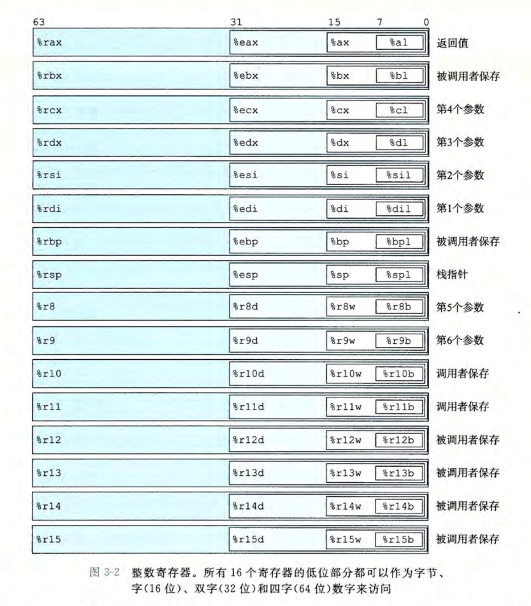
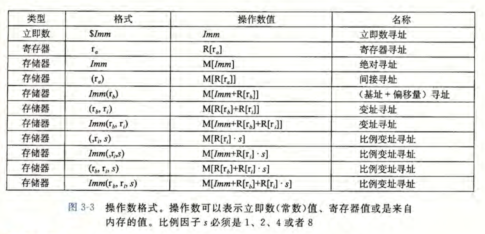
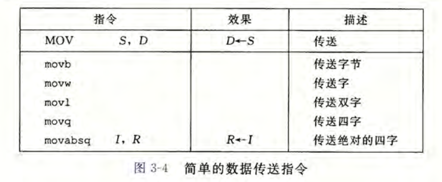
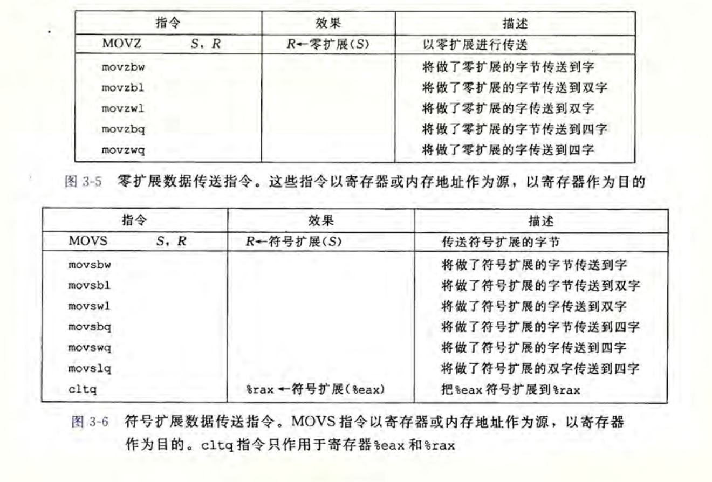
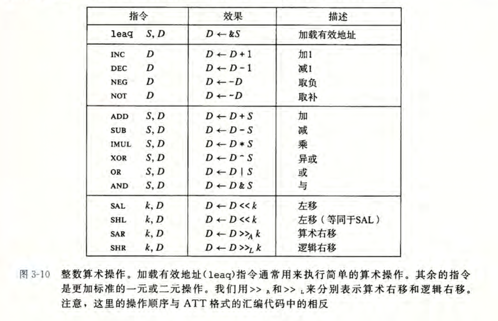
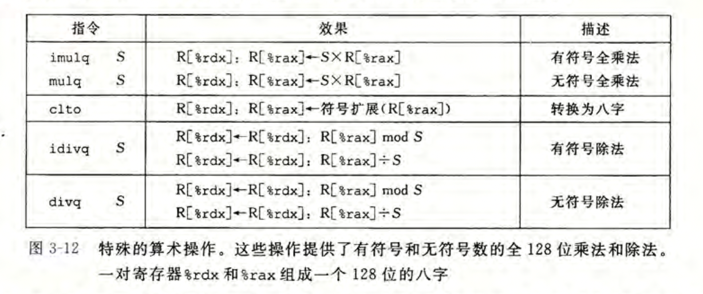
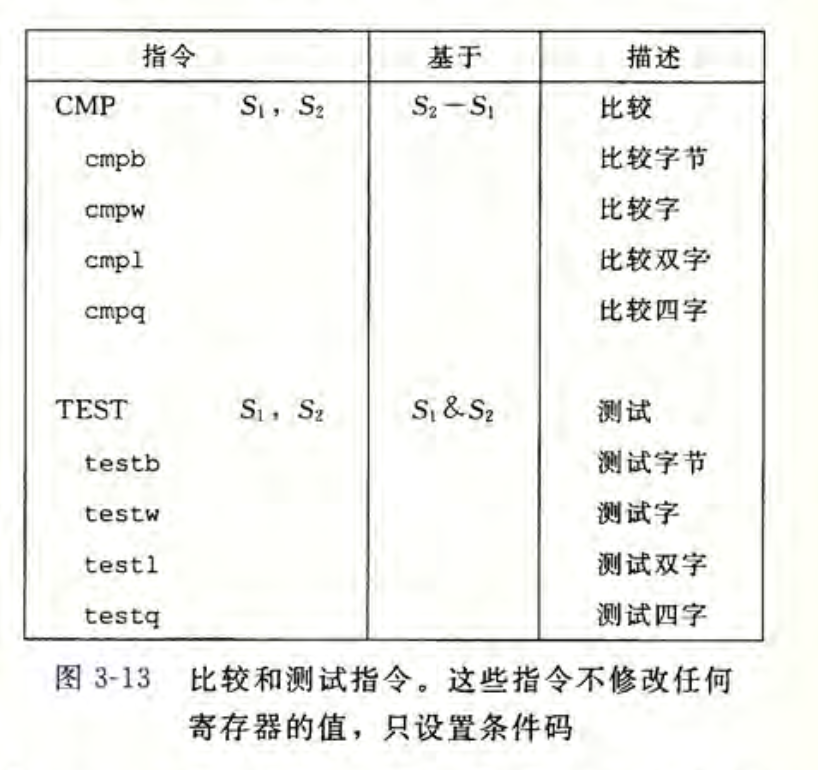
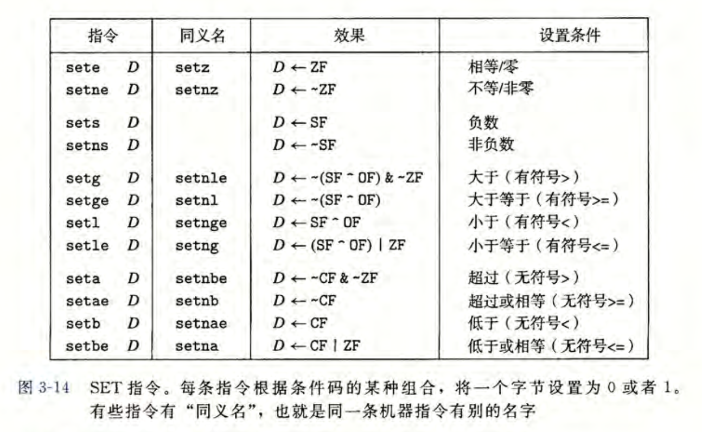
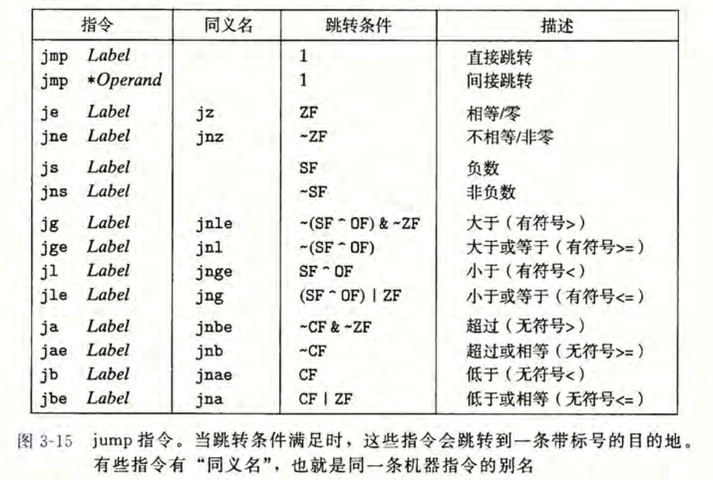
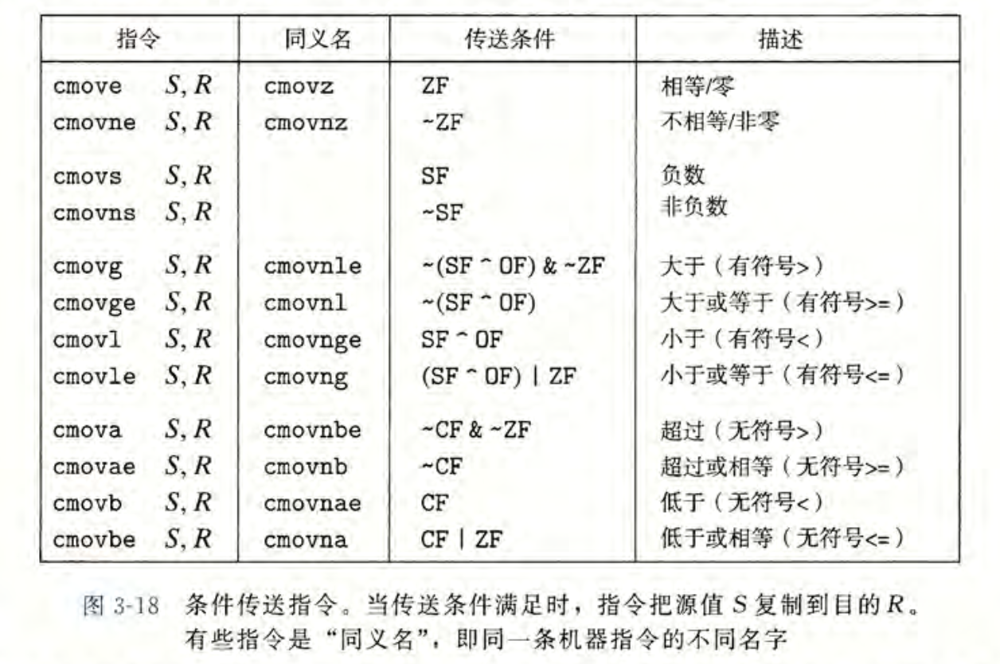

## 1 计算机系统漫游

- 略

## 2 信息的表示和处理

- 无符号数的表示

- 有符号数的补码表示（以 8 位有符号数为例）：

  ```txt
  0000,1010: 即正数 10
  0000,0000: 0 
  0111,1111: 127 (int8_max)
  
  1000,1010: -128 + 10 = -118
  1000,0000: -128 + 0  = -128 (int8_min)
  1111,1111: -128 + 127= -1
  
  int8_t: [-128 ~ 127]
  ```

- 逻辑移位和算术移位

  - 逻辑左移和算术左移无异，舍弃高位，低位填 0。
  - 逻辑右移舍弃低位，高位填 0。
  - 算术右移舍弃低位，高位填充符号位。

- IEEE 浮点数标准

  ```txt
  | 符号位 (s) | 阶码 (exp) | 底数 (frac) |
  
  float:  s(1bit) + exp(8bit) + frac(23bit)
  double: s(1bit) + exp(11bit) + frac(52bit)
  ```

  - 底数真实值为 1 + frac

    ```txt
    例如一个 float 数 的 frac = 110,0000,0000,0000,0000,0000
    则底数真值为: 1 + 0.75 = 1.75
    ```

  - 阶码采用移码表示：E = 原码值 - bias。( bias = 2^(k-1) - 1，k 为阶码占用的位数 )。

    - 对于 float：k = 8，bias = 127，E = 原码值 - 127。
    - 对于 double：k = 11，bias = 1023，E = 原码值 - 1023。

  - 规格化数

    - 阶码的所有位不全为 0 而且也不全为 1 时，按移码方式计算指数的实际值。按 1 + frac 计算底数。
    - 易知规格化 float 阶码取值范围为：[-126, 127]。

  - 非规格化数

    - 阶码全0，此时不按移码方式计算指数的实际值，直接认为指数实际值 = 1 - bias。底数直接认为是 frac，不再加 1。
    - 非规格化数的存在确保了浮点数可以表示 0。

  - 特殊值：

    - 阶码为全 1，frac 为全 0 时，表示无穷（是正无穷还是负无穷取决于符号位）。
    - 阶码为全 1，frac 不全为 0 时，表示 NaN。

## 3 程序的机器级表示

- 寄存器

  - 程序计数器（PC）：x86-64 中表示为 %rip。
  - 通用寄存器（X）：16 个。
  - 条件码寄存器：实现条件变化如 if else 等。
  - 向量寄存器：存放一个或多个整数或浮点数值。

- gcc -S 生成汇编，objdump -d 生成反汇编。

- x86-64 汇编指令是不定长的（1-16 字节不等）。

- 汇编中所有以 "." 开头的行都是指导汇编器和链接器工作的伪指令，通常可以忽略。

- AT&T 和 Intel 汇编代码格式

  - Intel 代码省略了指示大小的后缀，例如 mov 而非 movq。
  - Intel 代码省略寄存器名字前的 '%'，例如 rbx 而非 %rbx。
  - Intel 代码用不同的方式来描述内存中的位置，例如 `QWORD PTR [rbx]` 而非 `(%rbx)`。
  - Intel 代码列出操作数的顺序于 AT&T 相反。
  	- 例如 Intel：mov rax, rbx 指存储 rbx 的值到 rax 中。
  	- 例如 AT&T：movq %rax, %rbx 指存储 rax 的值到 rbx 中。

- gcc 内嵌汇编：使用 asm 伪指令。

- 字节 (1 byte)，字 (2 byte)，双字 (4 byte)，四字 (8 byte)。

- x86-64 架构里，指针占 8 字节，但实际使用目前仅使用 6 个字节。高两字节置为 0。

- 通用寄存器组

  

- 寻址模式

  

- mov 指令

  - x86-64 规定 mov 指令不能两个操作数都指向内存。
  - mov 指令只会更新操作数指定的那些寄存器字节或内存位置。唯一的例外是 movl 指令以寄存器作为目的时，它会把该寄存器的高位 4 字节设置为 0。
  - 任何为寄存器生成 32 位值的指令都会把该寄存器的高位部分置成 0（例如 movl，movzbl，movsbl 等）。
  - movq 虽可传四字，但一旦要传立即数，则只能传32位补码表示的立即数，随后把它符号拓展到64位。
  - movabsq 可以直接传64位的立即数，但是它只能以寄存器作为目的地。
  - 决定 mov 使用哪个后缀的是寄存器的大小，当两边操作的都是寄存器时，若大小不同，必须用 movz 系列或 movs 系列指令，当两边操作的是立即数和内存时，可以以立即数大小为准。
  - 不能将大寄存器的值 mov 到小寄存器中。
  - 当想将小的数据复制到大的目的地时，可以用 movz 或 movs，前者代表用0填充高字节，后者代表用符号填充高字节，后面还要加上两种转换数据的大小，比如 movzbw (字节->字，0填充)，movswq (字->四字，符号填充)，还有一种 cltq 指令，特指 %eax->%rax 的符号拓展转换，等价于 movslq %eax,%rax。
  - movz 和 movs 系列指令的源可以是寄存器或内存，目的必须是寄存器。
  - 不存在 movzlq，因为这个操作可以直接使用 movl 指令实现。
  - c 语言类型转换时，若为向上扩展，右边补充符号位，若为向下截断，仅保留低字节部分即可。
    - 有符号类型向上拓展使用 movs 系列指令。
    - 无符号类型向上拓展使用 movz 系列指令。
    - 向下截断示例：int 转 uint16_t，只保留 int 的最后两个字节，然后将这两个字节按照 uint16_t 解释即可。

  

  

- 压入和弹出栈数据：注意 x86_64 栈向下增长

  

- 算术和逻辑操作

  - 除 leaq 外，其他指令都有 b w l q 四个版本。
  - leaq 指令使用：例如，如果寄存器 `%rdx` 的值为 x，那么指令 leaq 7(%rdx, %rdx, 4), %rax 将设置寄存器 `%rax` 的值为 5x + 7。
  - leaq 目的操作数必须是一个寄存器。源操作数是一个地址，但注意 leaq 并不引用该地址的值，而是关注地址本身。
  - 下图第二组是一元操作，操作数可以是寄存器或内存。
  - 下图第三组是二元操作，源操作数可以是立即数，寄存器或内存，目的操作数可以是寄存器或内存。
  - 如果目的是内存，处理器必须从内存读出值，执行操作，再写回内存。
  - 下图第四组是移位操作，移位量可以是立即数或放在单字节寄存器 `%cl` 中。移位量是由 `%cl` 寄存器的低 m 位决定的，例如 char 类型 m = 7，int 类型 m = 31。目的操作数可以是寄存器或内存。

  

- 特殊的算术操作

  - imulq 指令有两种不同的形式。其中一种，如图 3-10 所示，是 IMUL 指令类中的一 种。这种形式的 imulq 指令是一个“双操作数”乘法指令。它从两个 64 位操作数产生一 个 64 位乘积。
  - 此外，X86-64 指令集还提供了两条不同的“单操作数”乘法指令，以计算两个 64 位值的全 128 位乘积。一个是无符号数乘法(mulq)，而另一个是补码乘法(imulq)。这两 条指令都要求一个参数必须在寄存器 %rax 中，而另一个作为指令的源操作数给出。然后乘积存放在寄存器 `%rdx` (高 64 位)和 `%rax` (低 64 位)中。虽然 imulq 这个名字可以用于两个不同的乘法操作，但是汇编器能够通过计算操作数的数目，分辨出想用哪条指令。
  - 有符号除法指令 idivq 将寄存器 `%rdx` (高 64位) 和 `%rax` (低64位)中的128位数作为被除数，而除数作为指令的操作数给出。指令将商存储在寄存器 `%rax` 中，将余数存储在寄存器 `%rdx` 中。
  - 对于大多数64位除法应用来说，除数也常常是一个64位的值。这个值应该存放在 `%rax` 中 `%rdx` 的位应该设置为全 0(无符号运算)或者 `%rax` 的符号位(有符号运算)。后面这个操作可以用指令 cqto 来完成。

  

- 条件码

  - 条件码寄存器

    - CF：进位标志。可用来检查无符号操作溢出。
    - ZF：零标志。最近的操作结果是 0。
    - SF：符号标志。最近的操作得到的结果是负数。
    - OF：溢出标志。补码运算正溢出或负溢出。

  - leaq 不改变任何条件码，因为它是用于进行地址计算的。

  - 除此之外，3-10 图内所有指令都会设置条件码。

  - 逻辑操作进位和溢出标志会设置为0。

  - 移位操作进位标志将设置为最后一个被移出的位，而溢出标志设置为0。

  - inc 和 dec 指令会设置溢出和零标志，但不改变进位标志。

  - 比较和测试指令：只设置条件码而不改变任何其他寄存器。

    

- set 指令：根据条件码的一些逻辑运算的组合，将一个字节设置为 0 或 1。

  

- 跳转指令：

  - 无条件跳转或根据条件跳转，跳转的目的地址是下一条指令的地址 + 偏移量。
  - 无条件跳转的偏移量可以存储在内存中，条件跳转的偏移量只能是立即数。

  

- 条件传送指令

  - 条件传送指令比条件转移更符合现代处理器的性能特性（指令流水线，分支预测）。
  - 如果分支预测错误的惩罚大于计算两个表达式的消耗，则条件传送更优，否则条件转移更优。
  - 条件传送会计算两个表达式的值，因此类似于 `return (xp ? *xp : 0);` 的表达式会导致空指针异常。

  

- 循环语句：

  - do while 循环

    ```assembly
    loop:
    	body-statement
    	t = test-expr;
    	if (t)
    		goto loop;
    ```

  - while 循环

    ```assembly
    ;method1: jump to middle   (gcc -Og)
    	goto test;
    loop:
    	body-statement
    test:
    	t = test-expr;
    	if (t)
    		goto loop;
    		
    ;method2: guarded-do       (gcc -O1)
    ;利用这种实现策略，编译器常常可以优化初始的测试，例如认为测试条件总是满足。
    t = test-expr;
    if (!t)
    	goto done;
    loop:
    	body-statement
    	t = test-expr;
    	if (t)
    		goto loop;
    done:
    ```

  - for 循环

    ```assembly
    ;format
    ;for (init-expr; test-expr; update-expr)
    ;	body-statement
    
    ;method1: jump to middle
    init-expr;
    goto test;
    loop: 
    	body-statement
    	update-expr;
    test:
    	t = test-expr;
    	if (t)
    		goto loop;
    		
    ;method2: guarded-do
    init-expr;
    t = test-expr;
    if (!t)
    	goto done;
    loop:
    	body-statement
    	update-expr;
    	t = test-expr;
    	if (t)
    		goto loop;
    done:
    ```

  - switch 循环

    ```c
    void switch_eg(long x, long n, long* dest) {
    	long val = x;
    	switch (n) {
    		case 100:
    			val *= 13;
    			break;
    		case 102:
    			val += 10;
      	case 103:
          val += 11;
          break;
        case 104:
        case 106:
          val *= val;
          break;
        default:
          val = 0;
    	}
      *dest = val;
    }
    
    // assembly-like C code
    void switch_eg_impl(long x, long n, long* dest) {
      static void *jt[7] = {&&loc_A, &&loc_def, &&loc_B, &&loc_C, &&loc_D, &&loc_def, &&loc_D};
      unsigned long index = n - 100;
      long val;
      if (index > 6) goto loc_def;
      goto *jt[index];
    loc_A:	/* case 100 */
      val = x * 13;
      goto done;
    loc_B:	/* case 102 */
      x = x + 10;
    loc_C:	/* case 103 */
      val = x + 11;
      goto done;
    loc_D:	/* case 104, 106 */
      val = x * x;
      goto done;
    loc_def:	/* default */
      val = 0;
    done:
      *dest = val;
    }
    ```
    
    ```assembly
    switch_eg:
    	; x in rdi, n in rsi, dest in rdx
    	subq $100, %rsi
    	cmpq $6,   %rsi
    	ja   .L8
    	jmp  *.L4(,%rsi, 8)
    .L3:
    	leaq (%rdi, %rdi, 2), %rax
    	leaq (%rdi, %rax, 4), %rdi
    	jmp  .L2
    .L5:
    	addq $10,  %rdi
    .L6:
    	addq $11,  %rdi
    	jmp  .L2
    .L7:
    	imulq %rdi, %rdi
    	jmp  .L2
    .L8:
    	movl $0,    %edi
    .L2:
    	movq %rdi, (%rdx)
    	ret
    	
    ; jmp table
    .L4:
    	.quad	.L3
    	.quad .L2
    	.quad .L5
    	.quad .L2
    	.quad .L6
    	.quad .L7
    	.quad .L2
    	.quad .L5
    ```

- 过程

  - 运行时栈

  - 通过寄存器最多传6个函数参数，更多的参数则保存在过程的运行时栈栈帧中。

  - 一个过程的栈帧由高地址到低地址依次为：被保存的寄存器，局部变量，调用的子过程的7～n个参数，调用的子过程的返回地址。

  - 叶子过程：不需要栈帧的过程，即所有的局部变量都可以保存在寄存器中，而且该函数不会调用任何其它函数。

  - 转移控制

    | 指令               | 描述             |
    | ------------------ | ---------------- |
    | **call Label**     | 过程调用         |
    | **call \*Operand** | 过程调用         |
    | **ret**            | 从过程调用中返回 |

  - 数据传送

    - 参数的传递，超过6个的部分要通过栈来传递，通过栈传递参数时，所有数据大小都向8的倍数对齐。
    - 参数传递时，第7～n个参数是从栈的低地址向高地址排列的

  - 栈上的局部存储

    - 寄存器不足够存放所有的本地数据。
    - 对一个局部变量使用地址运算符 &，因此必须能够为它产生一个地址。
    - 某些局部变量是数组或结构，因此必须能够通过数组或结构引用被访问到。

  - 寄存器中的局部存储空间

    - 被调用者保存寄存器：当过程P调用过程Q时，Q必须保存这些寄存器的值，保证它们的值在返回到P时与Q被调用时是一样的。过程Q保存一个寄存器的值不变，要么就是根本不去改变它，要么就是把原始值压入栈中，改变寄存器的值，然后在返回前从栈中弹出旧值。因此P的代码能安全地把值存在被调用者保存寄存器中，调用Q，然后继续使用寄存器的值，不用担心值被破坏。
    - 调用者保存寄存器：P调用Q后，调用者保存寄存器中的值可能会被破坏，因此如果P希望保留调用者保存寄存器的值，需要亚栈保存。
    - 被调用者保存寄存器包括：rbx，rbp，r12～r15。
    - 调用者保存寄存器包括：除被调用者保存寄存器以外的寄存器。

  - 递归过程

    ```c
    long rfact(long n) {
      long result;
      if (n <= 1) result = 1;
      else result = n * rfact(n-1);
      return result;
    }
    ```

    ```assembly
    ;long rfact(long n)
    ;n in %rdi
    rfact:
    	pushq %rbx
    	movq  %rdi, %rbx
    	movl  $1,   %eax
    	cmpq  $1,   %rdi
    	jle	 .L35
    	leaq  -1(%rdi), %rdi
    	call  rfact
    	imulq %rbx, %rax
    .L35:
    	popq  %rbx
    	ret
    ```

- 数组的分配和访问，指针运算

- 嵌套的数组（多维数组）

- 定长数组

  以下函数计算 $\sum_{j=0}^Na[i][j]*B[j][k]$

  ```c
  #define N 16
  typedef int fix_matrix[N][N];
  int fix_prod_ele(fix_matrix A, fix_matrix B, long i, long k) {
    long j;
    int result = 0;
    for (j = 0; j < N; j++)
      result += A[i][j] * B[j][k];
   	return result;
  }
  ```

  gcc产生的汇编类似于下面的c代码

  ```c
  int fix_prod_ele_opt(fix_matrix A, fix_matrix B, long i, long k) {
    int *Aptr = &A[i][0];
    int *Bptr = &B[0][k];
    int *Bend = &B[N][k];
    int result = 0;
    do {
      result += *Aptr * *Bptr;
      Aptr++;
      Bptr += N;
    } while (Bptr != Bend);
    return result;
  }
  ```

- 异质的数据结构

  - 结构：字节对齐
  - 联合：共享空间

- 数据对齐：

  - 数组元素按元素类型对齐
  - 结构体中每个成员都需要对齐
  - 对齐伪指令：.align 8（8字节对齐）
  - 栈空间对齐：栈空间以16字节对齐，原因是 Intel 和 AMD 处理器对于有些实现多媒体操作的 SSE 指令，如果栈没有 16 字节对齐，就无法正确执行。较近版本的 x86-64 处理器实现了 AVX 多媒体指令。除了提供 SSE 指令的超集，支持 AVX 的指令并没有强制性对齐要求。

- 在机器级程序中将控制与数据结合起来

  - 理解指针
  - GDB调试

- 内存越界引用和缓冲区溢出

  - gets 和 sprintf 函数等函数的安全问题
  - 缓冲区溢出可能会导致返回地址被覆盖，恶意攻击可以利用这个漏洞让过程返回到攻击代码的地址。
  - 蠕虫和病毒

- 对抗缓冲区溢出攻击

  - 栈随机化：为了在系统中插入攻击代码，攻击者既要插入代码，也要插入指向这段代码的指针，这个指针也是攻击字符串的一部分，产生这个指针需要知道这个字符串放置的栈地址。在过去栈的位置相当固定，因而容易被攻击。栈随机化使得程序开始时，在栈上分配一段0～n字节之间的随机大小的空间。例如使用 alloca 函数在栈上分配空间。程序不使用这段空间，但这使得攻击程序更难确定攻击代码所在的位置。
  - 在Linux中，栈随机化已经成为标准，属于地址空间布局随机化技术（ASLR）的子集。采用 ASLR，每次运行时程序的不同部分，包括程序代码、库代码、栈、全部变量和堆数据，都会被加载到内存的不同区域。
  - 空雪橇操作：nop 指令是一种空指令，除了使得程序计数器加一以外没有其他作用。攻击者在实际的攻击代码前插入很长一段 nop 指令，只要攻击者能够猜中这一段序列中的某一个地址，程序就会经过这个序列，到达攻击代码。例如栈随机化时 n = 2^23，插入 256 个字节的 nop，那么枚举 2^15 = 32768 个起始地址即可破解。
  - 栈破坏检测：栈保护机制（stack protector），思想是在栈帧中任何局部缓冲区与栈状态之间存储一个特殊的金丝雀值，金丝雀值在程序每次运行时随机产生，在恢复寄存器状态和从函数返回前，程序检查这个金丝雀值是否被该函数的某个操作或者该函数调用的某个函数的某个操作改变了，如果是的，那么程序异常终止。
  - gcc 栈保护机制有关选项：-fstack-protector，-fno-stack-protector。
  - 限制可执行代码区域：NX（No-Execute，不执行）位，将读和执行访问模式分开，有了这个特性，栈可以被标记为可读和可写，但是不可执行，而检查页是否可执行由硬件完成，效率上没有损失。

- 支持变长栈帧：alloca 函数

- 浮点代码

